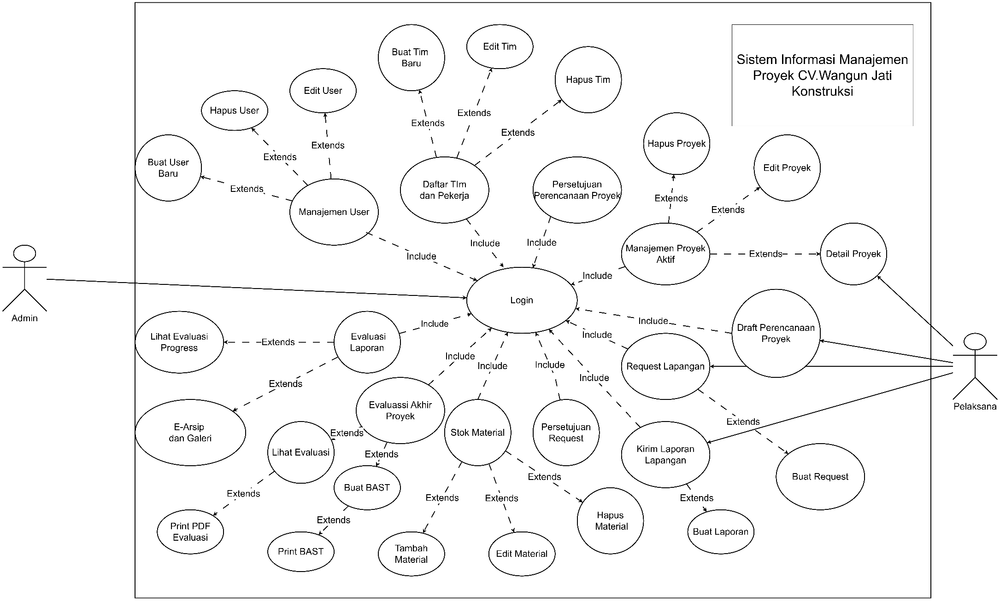
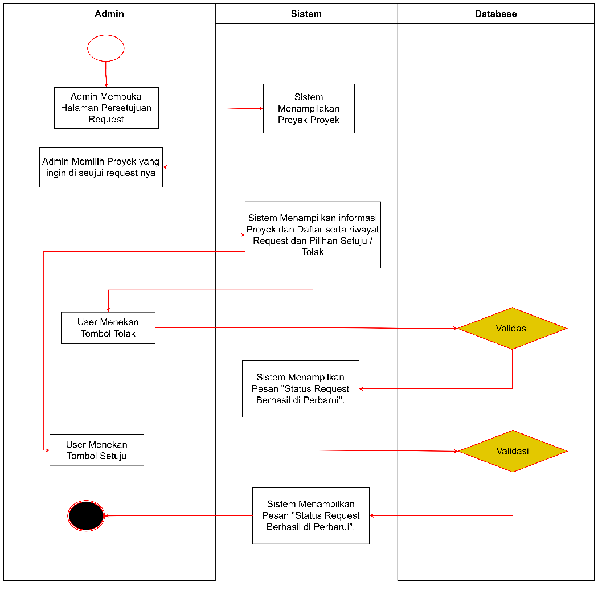
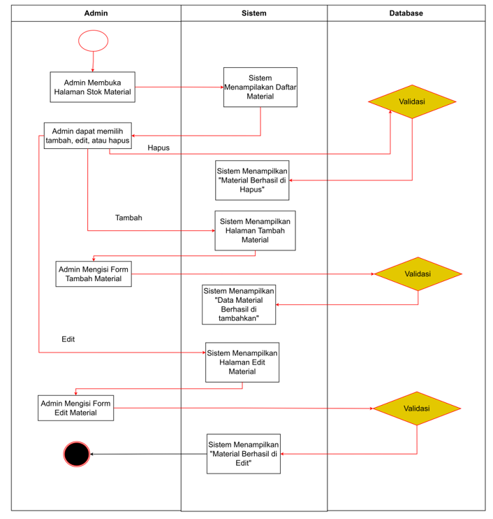
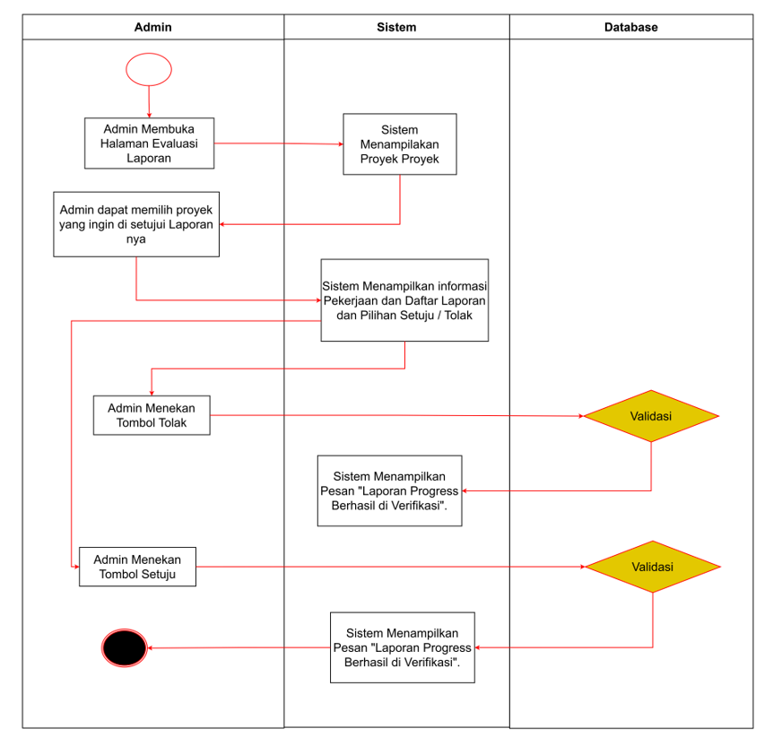
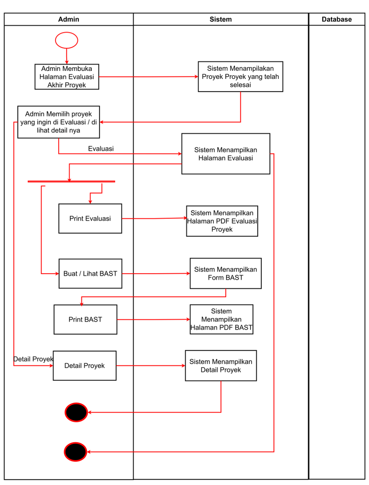
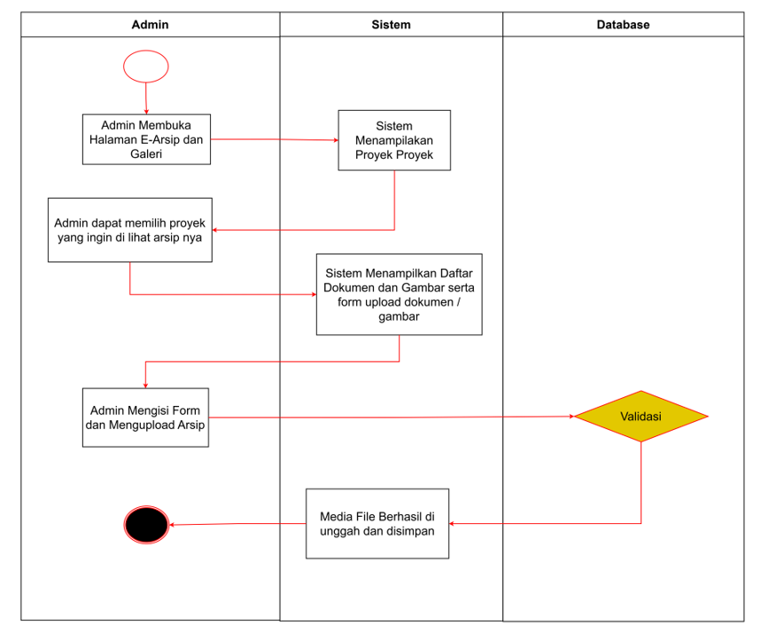
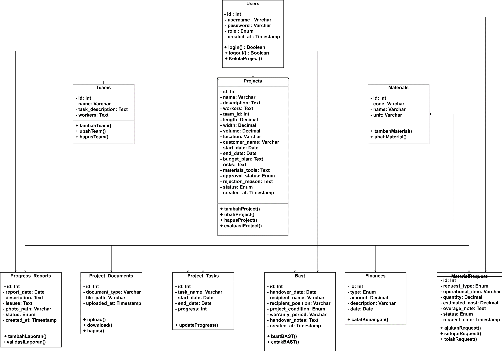
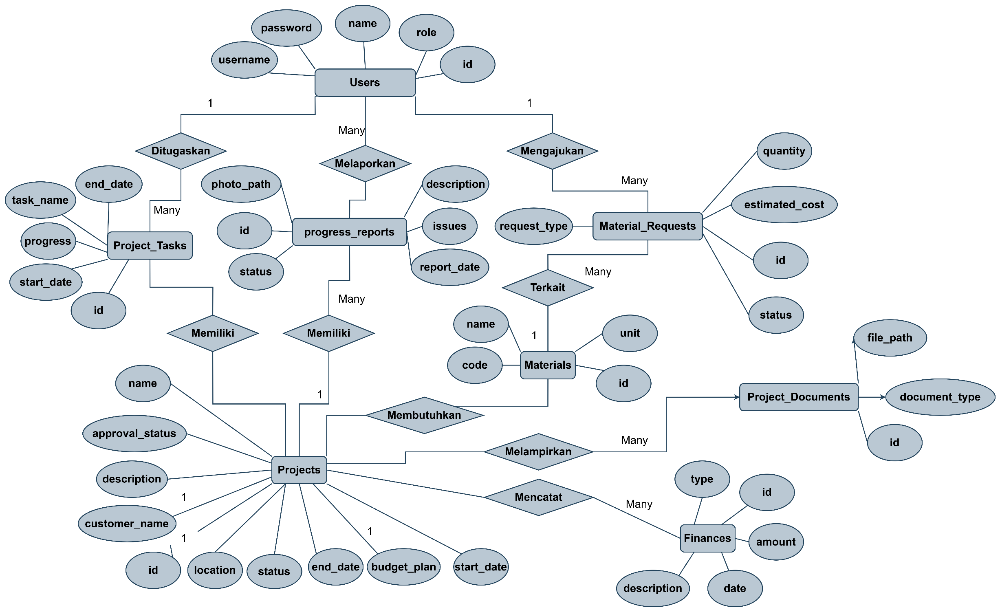

BAB IV
 HASIL PENELITIAN DAN PEMBAHASAN
4.2 Perancangan Sistem
Tahap perancangan sistem merupakan pijakan krusial dalam proses pengembangan Sistem Informasi Manajemen Proyek pada CV. Wangun Jati Konstruksi. Mengacu pada metode Waterfall yang digunakan, tahapan ini memetakan seluruh kebutuhan  manajemen proyek dan operasional proyek ke dalam bentuk rancangan visual teknis. Rancangan ini meliputi Use Case Diagram, Activity Diagram, Sequence Diagram, serta Class Diagram guna memastikan sistem berbasis web yang dibangun dapat diimplementasikan dengan struktur yang tepat dan terarah.

4.2.1 Use Case Diagram
Use Case Diagram disusun untuk memvisualisasikan skenario interaksi langsung antara pengguna dengan sistem manajemen proyek. Pemodelan ini secara spesifik memetakan aktor-aktor yang terlibat—yakni Admin dan Karyawan—sekaligus mempertegas batasan hak akses serta fungsi-fungsi operasional apa saja yang dapat mereka jalankan di dalam aplikasi.

    a. Use Case Diagram Sistem Informasi Manajemen Proyek CV. Wangun Jati Konstruksi
    
    Gambar 4. Use Case Diagram Sistem Manajemen Proyek CV. Wangun Jati Konstruksi
    Tabel 7.Use Case Narratif Sistem Informasi Manajemen Proyek  CV. Wangun Jati Konstruksi
1. LOGIN
Tujuan
Melakukan Login ke Sistem
Deskripsi
Sistem ini memungkinkan Aktor untuk masuk dan mengakses dashboard Sistem Informasi Manajemen Proyek CV. Wangun Jati Konstruksi sesuai hak akses role masing-masing (Admin atau Pelaksana).
Aktor
Admin, Pelaksana
Skenario Utama
Kondisi Awal
Aktor sudah mengakses halaman login website sistem.
Aksi Aktor
Reaksi Sistem
1. Aktor memasukkan username dan password, lalu menekan tombol "Login Sistem".
2. Sistem memvalidasi kesesuaian username dan password pada database.
 
3. Sistem menyimpan data sesi pengguna (identitas dan role) ke dalam session.
 
4. Sistem mengarahkan aktor ke halaman dashboard sesuai role-nya. Admin diarahkan ke /admin/dashboard.php, Pelaksana diarahkan ke /worker/dashboard.php.
Kondisi Akhir
Aktor berhasil masuk dan dapat mengakses dashboard serta fitur sistem sesuai dengan perannya.
 
 
2. DRAFT PERENCANAAN PROYEK 
Tujuan
Membuat Draft Perencanaan Proyek Baru
Deskripsi
Sistem memungkinkan Admin atau Pelaksana untuk menyusun rancangan proyek baru meliputi informasi umum proyek (termasuk data konsumen), dimensi bangunan, jadwal pelaksanaan, pemilihan tim kerja, rancangan RAB Operasional, RAB Material (dengan harga satuan dan total), timeline pekerjaan, analisis risiko dan mitigasi, serta kebutuhan material dan alat. Draft yang disimpan akan otomatis masuk antrian persetujuan Admin.
Aktor
Admin, Pelaksana
Skenario Utama
Kondisi Awal
Aktor sudah login dan membuka menu "Perencanaan Proyek" (Draft Perencanaan Proyek) pada Step 2 - Perencanaan.
Aksi Aktor
Reaksi Sistem
1. Aktor mengisi formulir informasi umum proyek: Nama Proyek, Nama Konsumen/Pemilik, dan Deskripsi & Ruang Lingkup pekerjaan.
2. Sistem menampilkan formulir multi-section yang harus diisi secara bertahap.
3. Aktor mengisi data lokasi dan dimensi bangunan: Lokasi Proyek, Panjang (m), Lebar (m), dan Volume (m3).
4. Sistem menerima input data lokasi dan dimensi.
5. Aktor mengisi jadwal pelaksanaan: Estimasi Tanggal Mulai dan Estimasi Tanggal Selesai.
6. Sistem menerima input tanggal.
7. Aktor memilih Tim Kerja dari dropdown daftar tim yang tersedia di database.
8. Sistem menampilkan daftar tim kerja dari tabel teams untuk dipilih.
9. Aktor menambahkan item Rancangan RAB Operasional: Rincian item biaya (Nama) dan Estimasi nominal (Rp). Aktor dapat menambah beberapa baris dengan tombol "Tambah Baris".
10. Sistem menyediakan input baris dinamis (JavaScript) untuk RAB Operasional. Setiap baris terdiri dari Nama Item dan Nominal (Rp).
11. Aktor menambahkan item Timeline Pekerjaan: Nama Pekerjaan, Tanggal Mulai, dan Tanggal Selesai.
12. Sistem menyediakan input baris dinamis untuk timeline. Setiap baris terdiri dari Nama Pekerjaan, Tanggal Mulai, dan Tanggal Selesai.
13. Aktor menambahkan Risiko dan Mitigasi: Risiko potensial beserta rencana mitigasinya.
14. Sistem menerima input data risiko dan mitigasi.
15. Aktor menambahkan Kebutuhan Material dan Alat: Pilih Material dari master material (dropdown), Jumlah (qty), Harga Satuan (Rp), dan sistem menghitung Total otomatis.
16. Sistem menampilkan dropdown material dari tabel master materials dan menghitung total biaya material per item (qty x harga satuan) secara otomatis.
17. Aktor menekan tombol "Simpan Perencanaan Proyek".
18. Sistem menyimpan seluruh data perencanaan ke database (tabel projects) dengan status "planning" dan approval_status "pending".
 
19. Sistem secara otomatis menyinkronkan data RAB Operasional ke tabel finances sebagai record budget.
 
20. Sistem secara otomatis menghitung total estimasi material dan menyimpannya ke tabel finances sebagai record budget terpisah.
 
21. Sistem secara otomatis menyinkronkan timeline pekerjaan ke tabel project_tasks dengan progress awal 0%.
 
22. Sistem mengarahkan aktor ke halaman Detail Proyek yang baru disimpan.
Kondisi Akhir
Draft perencanaan proyek berhasil tersimpan dengan status "Menunggu Persetujuan" dan masuk antrian review Admin.
 
 
3. PERSETUJUAN PERENCANAAN
Tujuan
Menyetujui atau Menolak Draft Perencanaan Proyek
Deskripsi
Sistem memungkinkan Admin untuk me-review draft perencanaan proyek yang diajukan, lalu menyetujui (ACC) atau menolak draft tersebut. Jika ditolak, Admin wajib memasukkan alasan penolakan. Proyek yang disetujui otomatis masuk ke Manajemen Proyek Aktif.
Aktor
Admin
Skenario Utama
Kondisi Awal
Admin sudah login dan membuka menu "Persetujuan Perencanaan" pada Step 2 - Perencanaan.
Aksi Aktor
Reaksi Sistem
1. Admin melihat daftar draft proyek yang berstatus "Menunggu Persetujuan".
2. Sistem menampilkan tabel draft proyek meliputi: Nama Proyek, Tanggal Diajukan, dan Tim Bertugas.
3. Admin menekan tombol "Review" untuk melihat detail rancangan proyek.
4. Sistem menampilkan halaman detail/edit proyek lengkap (RAB, Timeline, Risiko, Material) dengan banner peringatan status 'Menunggu Persetujuan' beserta tombol 'Setujui Draft' dan 'Tolak Draft'.
5a. Admin menekan tombol "Setujui Draft" dan mengonfirmasi keputusan.
6a. Sistem mengubah approval_status menjadi "approved". Proyek otomatis muncul di halaman Manajemen Proyek Aktif.
5b. Admin menekan tombol "Tolak Draft".
6b. Sistem menampilkan prompt untuk memasukkan alasan penolakan (wajib). Setelah diisi, sistem mengubah approval_status menjadi "rejected" dan menyimpan alasan penolakan.
 
7. Sistem mengarahkan admin kembali ke halaman Persetujuan Perencanaan.
Kondisi Akhir
Draft perencanaan berhasil disetujui (masuk proyek aktif) atau ditolak (dengan alasan penolakan tersimpan).
 
 
4. MANAJEMEN PROYEK AKTIF
Tujuan
Mengelola Proyek yang Sudah Disetujui
Deskripsi
Sistem menampilkan daftar proyek aktif yang sudah disetujui. Admin dapat melihat detail, mengedit (ubah informasi umum, ubah status, tambah task timeline, update progres task, tambah pencatatan finansial), menghapus proyek, dan mencetak laporan PDF. Pelaksana hanya dapat melihat detail proyek (read-only) dan mencetak laporan PDF. Halaman detail menampilkan: Informasi Umum, Progres Keseluruhan (dengan indikator tahap saat ini), RAB Estimasi, Risiko & Mitigasi, Timeline Pekerjaan (dengan tombol tandai selesai untuk Admin), Tabel Keuangan (RAB vs Realita Pengeluaran dengan ringkasan selisih), Riwayat Laporan Lapangan, dan Riwayat Permintaan Material.
Aktor
Admin (akses penuh), Pelaksana (hanya baca & cetak PDF)
Skenario Utama
Kondisi Awal
Aktor sudah login dan membuka menu "Manajemen Proyek Aktif" pada Step 2 - Perencanaan.
Aksi Aktor
Reaksi Sistem
1. Aktor melihat daftar proyek aktif.
2. Sistem menampilkan tabel proyek: Nomor, Nama Proyek, Status (Perencanaan/Berjalan/Selesai), RAB vs Pengeluaran, dan tombol Aksi.
 
3. Jika role Admin: Sistem menampilkan 3 tombol aksi (Detail, Edit, Hapus). Jika role Pelaksana: Sistem hanya menampilkan tombol Detail.
4a. Aktor menekan tombol "Detail" (ikon Mata).
5a. Sistem menampilkan halaman detail proyek (mode baca): Info Umum (Konsumen, Lokasi, Dimensi, Tim), Progres Keseluruhan dengan indikator tahap saat ini, RAB Estimasi, Risiko & Mitigasi, Timeline Pekerjaan (dengan tombol selesai/reset untuk Admin), Keuangan (tabel RAB vs Realita), Riwayat Laporan Lapangan, dan Riwayat Permintaan Material.
4b. Admin menekan tombol "Edit" (ikon Pena).
5b. Sistem menampilkan halaman edit proyek: Form edit Nama, Deskripsi, dan Tanggal. Ubah status proyek (Perencanaan/Berjalan/Selesai). Tambah task baru (modal), Update progres task (%). Tambah pencatatan finansial baru berupa RAB/Anggaran Masuk atau Pengeluaran Aktual (modal).
4c. Admin menekan tombol "Hapus" (ikon Tong Sampah).
5c. Sistem menampilkan dialog konfirmasi. Jika dikonfirmasi, sistem menghapus proyek beserta seluruh data terkait secara permanen.
6. Aktor menekan tombol "Cetak Laporan PDF" di halaman detail.
7. Sistem membuka halaman cetak (tab baru) berisi laporan lengkap proyek yang siap dicetak atau disimpan sebagai PDF.
Kondisi Akhir
Aktor berhasil melihat, mengedit, menghapus, atau mencetak laporan proyek sesuai hak aksesnya.
 
 
5. DAFTAR TIM DAN PEKERJA
Tujuan
Mengelola Data Tim Kerja dan Daftar Pekerja
Deskripsi
Sistem memungkinkan Admin untuk membuat, mengedit, dan menghapus tim kerja beserta daftar anggota dan jabatan masing-masing pekerja di dalam tim. Menu ini hanya dapat diakses oleh Admin. Pelaksana tidak memiliki akses ke menu ini.
Aktor
Admin
Skenario Utama
Kondisi Awal
Admin sudah login dan membuka menu "Daftar Tim & Pekerja" pada Step 1 - Inisiasi.
Aksi Aktor
Reaksi Sistem
1. Admin melihat daftar tim yang tersedia.
2. Sistem menampilkan kartu-kartu tim berisi: Nama Tim, Deskripsi Tugas/Tanggung Jawab, dan Daftar Anggota beserta jabatan masing-masing.
3. Admin menekan tombol "Buat Tim Baru".
4. Sistem menampilkan formulir: Nama Tim, Tugas/Tanggung Jawab, serta kolom dinamis untuk menambah Nama Pekerja dan Jabatan.
5. Admin mengisi formulir dan menekan "Simpan Tim".
6. Sistem menyimpan data tim beserta daftar anggota ke database (tabel teams dan team_workers).
7. Admin menekan menu "Edit Tim" pada kartu tim tertentu.
8. Sistem menampilkan formulir edit dengan data yang sudah terisi sebelumnya.
9. Admin mengubah data dan menekan "Update Tim".
10. Sistem memperbarui data tim di database.
11. Admin menekan menu "Hapus Tim" pada kartu tim tertentu.
12. Sistem menampilkan dialog konfirmasi. Jika dikonfirmasi, data tim dihapus dari database.
Kondisi Akhir
Data tim berhasil dibuat, diubah, atau dihapus sesuai aksi yang dilakukan Admin.
 
 
6. MANAJEMEN USER
Tujuan
Mengelola Akun Pengguna Sistem
Deskripsi
Sistem memungkinkan Admin untuk menambahkan, mengedit, dan menghapus akun pengguna sistem. Role yang tersedia adalah Admin dan Pelaksana. Menu ini hanya dapat diakses oleh Admin.
Aktor
Admin
Skenario Utama
Kondisi Awal
Admin sudah login dan membuka menu "Manajemen User" pada Step 1 - Inisiasi.
Aksi Aktor
Reaksi Sistem
1. Admin melihat daftar seluruh pengguna.
2. Sistem menampilkan tabel pengguna: Nama Lengkap, Username, Role, dan tombol Aksi (Edit/Hapus).
3. Admin menekan tombol "User Baru".
4. Sistem menampilkan formulir: Nama Lengkap, Username, Password, dan pilih Role (Admin atau Pelaksana).
5. Admin mengisi formulir dan menekan "Simpan User".
6. Sistem memvalidasi bahwa username belum digunakan. Jika valid, password dienkripsi (hash) dan data disimpan ke database.
7. Admin menekan tombol "Edit" pada pengguna tertentu.
8. Sistem menampilkan formulir edit dengan data yang sudah terisi. Kolom password dapat dikosongkan jika tidak ingin diubah.
9. Admin mengubah data dan menekan "Update User".
10. Sistem memperbarui data pengguna di database.
11. Admin menekan tombol "Hapus" pada pengguna lain (bukan akun sendiri).
12. Sistem menampilkan dialog konfirmasi. Jika dikonfirmasi, data pengguna dihapus dari database.
Kondisi Akhir
Data pengguna berhasil ditambah, diubah, atau dihapus.
 
 
7. REQUEST LAPANGAN
Tujuan
Mengajukan Permintaan Material atau Operasional dari Gudang/Keuangan
Deskripsi
Sistem memungkinkan Admin dan Pelaksana untuk membuat permintaan dari dua tipe: (A) REQUEST MATERIAL - untuk kebutuhan material proyek dari gudang (pilih dari master material), atau (B) REQUEST OPERASIONAL/NON-MATERIAL - untuk kebutuhan operasional atau gaji (pilih dari item RAB operasional proyek). Sistem menampilkan informasi RAB proyek secara real-time (Total RAB, Sudah Di-Request, Sisa Anggaran, Progress Bar), rincian RAB Operasional, rincian RAB Material, serta tabel referensi kebutuhan material dari perencanaan (Kebutuhan RAB vs Sisa Tersedia). Jika jumlah request material melebihi kuota RAB, sistem menampilkan peringatan over budget dan mewajibkan aktor mengisi catatan alasan pembengkakan.
Aktor
Admin, Pelaksana
Skenario Utama
Kondisi Awal
Aktor sudah login dan membuka menu "Request Lapangan" pada Step 3 - Eksekusi.
Aksi Aktor
Reaksi Sistem
1. Aktor melihat daftar proyek aktif untuk dipilih.
2. Sistem menampilkan daftar proyek yang berstatus aktif dan sudah disetujui (status != completed, approval_status = approved).
3. Aktor memilih proyek dan melihat riwayat permintaan sebelumnya.
4. Sistem menampilkan halaman riwayat request proyek tersebut: Ringkasan RAB, Referensi Kebutuhan Material dari Perencanaan (Kebutuhan RAB, Sudah Di-ACC, Sisa, Status: Terpenuhi/Sebagian/Belum), dan daftar request beserta statusnya (Menunggu, Disetujui, atau Ditolak).
5. Aktor menekan tombol "Buat Request Baru".
6. Sistem menampilkan formulir request dengan dua panel: PANEL KIRI (Form): Proyek Tujuan (dropdown), Tipe Request (radio: Kebutuhan Material / Operasional Non-Material), dan kolom input sesuai tipe. PANEL KANAN (Referensi): Info RAB Proyek (Total RAB, Sudah Di-Request, Sisa, Progress Bar), Rincian RAB Operasional, Rincian RAB Material, dan Tabel Kebutuhan Material dari Perencanaan (Kebutuhan vs Sisa Tersedia).
7a. Jika Tipe = Material: Aktor memilih Jenis Material dari dropdown master material, mengisi Jumlah (Qty) dan Estimasi Dana (Rp).
8a. Sistem menampilkan dropdown material dari tabel master materials. Jika jumlah qty melebihi sisa kebutuhan RAB, sistem menampilkan peringatan "Over Budget" dan mewajibkan pengisian catatan alasan pembengkakan.
7b. Jika Tipe = Operasional: Aktor memilih Item Operasional dari dropdown RAB proyek terpilih, dan mengisi Estimasi Dana (Rp). Kolom Jumlah (Qty) disembunyikan.
8b. Sistem mengisi dropdown Item Operasional secara dinamis dari data RAB operasional proyek yang dipilih.
9. Aktor menekan tombol "Kirim Request ke Gudang".
10. Sistem menyimpan data permintaan ke tabel material_requests dengan status "pending", request_type (material/operasional), dan mencatat identitas pemohon (worker_id dari session).
 
11. Sistem mengarahkan aktor ke halaman riwayat permintaan proyek tersebut.
Kondisi Akhir
Permintaan (material atau operasional) berhasil diajukan dan menunggu persetujuan Admin.
 
 
8. PERSETUJUAN REQUEST
Tujuan
Menyetujui atau Menolak Permintaan Material dan Operasional
Deskripsi
Sistem memungkinkan Admin untuk melihat seluruh permintaan material dan operasional dari pelaksana lapangan, kemudian menyetujui (ACC) atau menolak. Halaman ini menampilkan Ringkasan RAB Proyek (Total RAB, Disetujui, Menunggu, Total Request, Sisa, Progress Bar), Referensi Kebutuhan Material (Kebutuhan RAB, Sudah Di-ACC, Status: Terpenuhi/Sebagian/Belum), dan Tabel Daftar Request Masuk (Material & Non-Material). Saat request disetujui, sistem otomatis mencatat pengeluaran aktual ke tabel keuangan (finances).
Aktor
Admin
Skenario Utama
Kondisi Awal
Admin sudah login dan membuka menu "Persetujuan Request" pada Step 3 - Eksekusi.
Aksi Aktor
Reaksi Sistem
1. Admin melihat daftar proyek aktif.
2. Sistem menampilkan tabel proyek aktif dengan kolom: Nama Proyek, Lokasi, Status, dan tombol "Buka Daftar Request".
3. Admin menekan tombol "Buka Daftar Request" pada proyek tertentu.
4. Sistem menampilkan halaman persetujuan request untuk proyek tersebut yang terdiri dari: (A) Panel Ringkasan RAB - menampilkan rincian item RAB, Total RAB, jumlah Disetujui (Rp), Menunggu (Rp), Total Request, Progress Bar, dan Sisa Anggaran. (B) Tabel Referensi Kebutuhan Material - menampilkan Kebutuhan dari RAB, Sudah Di-ACC (qty), dan Status pemenuhan (Terpenuhi/Sebagian/Belum). (C) Tabel Daftar Request Masuk (Material & Non-Material) - menampilkan Waktu, Pemohon, Detail (dengan label tipe: Material/Barang atau Non-Material/Operasional), Estimasi Pengeluaran, Status, dan tombol Tindakan.
5a. Admin menekan tombol "Setuju" pada permintaan berstatus Menunggu.
6a. Sistem mengubah status menjadi "Disetujui" (approved). Sistem secara OTOMATIS mencatat pengeluaran aktual ke tabel finances: Jika tipe Material, deskripsi = "Pencairan Request Lapangan: [Kode] NamaMaterial (Qty)". Jika tipe Operasional, deskripsi = "Pencairan Operasional/Gaji: NamaItem".
5b. Admin menekan tombol "Tolak" pada permintaan berstatus Menunggu.
6b. Sistem mengubah status menjadi "Ditolak" (rejected). Tidak ada pencatatan ke keuangan.
 
7. Sistem memperbarui halaman dan menampilkan status terbaru setiap request.
Kondisi Akhir
Permintaan material/operasional berhasil disetujui (otomatis tercatat sebagai pengeluaran aktual di keuangan) atau ditolak oleh Admin.
 
 
9. STOK MATERIAL
Tujuan
Mengelola Data Master Material Gudang
Deskripsi
Sistem memungkinkan Admin untuk menambahkan dan mengedit data master material yang tersedia di gudang. Data ini digunakan sebagai referensi saat pelaksana membuat request material dan saat perencanaan proyek.
Aktor
Admin
Skenario Utama
Kondisi Awal
Admin sudah login dan membuka menu "Stok Material" pada Step 3 - Eksekusi.
Aksi Aktor
Reaksi Sistem
1. Admin melihat daftar seluruh material.
2. Sistem menampilkan tabel material: Kode Material, Nama Barang, Satuan (unit), dan tombol Aksi (Edit).
3. Admin menekan tombol "Tambah Material".
4. Sistem menampilkan formulir: Kode Material, Nama Barang, dan Satuan (Unit).
5. Admin mengisi formulir dan menekan "Simpan".
6. Sistem menyimpan data material baru ke tabel materials di database.
7. Admin menekan tombol "Edit" pada material tertentu.
8. Sistem menampilkan formulir edit dengan data yang sudah terisi.
9. Admin mengubah data dan menekan "Update".
10. Sistem memperbarui data material di database.
Kondisi Akhir
Data master material berhasil ditambah atau diperbarui.
 
 
10. KIRIM LAPORAN LAPANGAN
Tujuan
Mengirimkan Laporan Progres Harian dari Lapangan
Deskripsi
Sistem memungkinkan Admin dan Pelaksana untuk membuat laporan progres pekerjaan harian beserta foto dokumentasi. Laporan ini akan masuk ke antrian evaluasi Admin di menu Evaluasi Laporan.
Aktor
Admin, Pelaksana
Skenario Utama
Kondisi Awal
Aktor sudah login dan membuka menu "Kirim Laporan Lapangan" pada Step 3 - Eksekusi.
Aksi Aktor
Reaksi Sistem
1. Aktor melihat daftar proyek aktif.
2. Sistem menampilkan daftar proyek yang berstatus aktif dan sudah disetujui.
3. Aktor memilih proyek dan melihat riwayat laporan sebelumnya.
4. Sistem menampilkan riwayat laporan beserta statusnya (Menunggu, Di-ACC, Ditolak).
5. Aktor menekan tombol "Buat Laporan Baru".
6. Sistem menampilkan formulir: Pilih Proyek Pekerjaan (dropdown), Tanggal Lapangan (default hari ini), Deskripsi Pekerjaan Selesai Hari Ini (wajib), Kendala/Isu Lapangan (opsional), dan Upload Foto Dokumentasi/Bukti (opsional, format JPG/PNG).
7. Aktor mengisi formulir laporan harian.
8. Sistem menerima input data laporan.
9. Aktor mengunggah foto dokumentasi (opsional).
10. Sistem menyimpan file foto ke direktori server: uploads/projects/{project_id}/progress/{timestamp}_{filename}.
11. Aktor menekan tombol "Kirim Laporan".
12. Sistem menyimpan data laporan ke tabel progress_reports dengan status "pending" dan mencatat identitas pelapor (worker_id dari session).
 
13. Sistem mengarahkan aktor ke halaman riwayat laporan proyek tersebut.
Kondisi Akhir
Laporan lapangan berhasil terkirim dan menunggu evaluasi Admin.
 
 
11. EVALUASI LAPORAN
Tujuan
Mengevaluasi dan Menyetujui atau Menolak Laporan Lapangan
Deskripsi
Sistem memungkinkan Admin untuk melihat, mengevaluasi, dan memberikan keputusan (ACC atau Tolak) terhadap laporan progres harian yang dikirimkan oleh pelaksana lapangan. Menu ini hanya dapat diakses oleh Admin (Pelaksana tidak memiliki akses ke menu Pemantauan - Step 4).
Aktor
Admin
Skenario Utama
Kondisi Awal
Admin sudah login dan membuka menu "Evaluasi Laporan" pada Step 4 - Pemantauan.
Aksi Aktor
Reaksi Sistem
1. Admin melihat daftar proyek aktif untuk dipilih.
2. Sistem menampilkan tabel proyek aktif dengan kolom: Nama Proyek (dengan badge Status), Lokasi, Pelanggan, dan tombol "Lihat Evaluasi Progress".
3. Admin menekan tombol "Lihat Evaluasi Progress" pada proyek tertentu.
4. Sistem menampilkan seluruh laporan untuk proyek tersebut: Tanggal, Nama Pelapor, Deskripsi Pekerjaan, Kendala, Foto Dokumentasi (jika ada), Status, dan tombol Aksi.
5. Admin melihat detail laporan dan foto dokumentasi.
6. Sistem menampilkan informasi lengkap laporan beserta tampilan foto (jika ada).
7a. Admin menekan tombol "ACC" pada laporan tertentu.
8a. Sistem mengubah status laporan menjadi "approved" (Disetujui).
7b. Admin menekan tombol "Tolak" pada laporan tertentu.
8b. Sistem mengubah status laporan menjadi "rejected" (Ditolak).
 
9. Sistem memperbarui halaman dan menampilkan status terbaru.
Kondisi Akhir
Laporan lapangan berhasil dievaluasi (disetujui atau ditolak) oleh Admin.
 
 
12. E-ARSIP DAN GALERI DOKUMENTASI
Tujuan
Mengelola Arsip Dokumen dan Galeri Foto Proyek
Deskripsi
Sistem memungkinkan Admin untuk melihat arsip dokumen proyek dan galeri foto yang dikumpulkan secara otomatis dari laporan lapangan yang sudah disetujui (ACC). Admin juga dapat mengunggah dokumen tambahan ke proyek tertentu. Menu ini hanya dapat diakses oleh Admin (Pelaksana tidak memiliki akses ke menu Pemantauan - Step 4).
Aktor
Admin
Skenario Utama
Kondisi Awal
Admin sudah login dan membuka menu "E-Arsip & Galeri Dokumentasi" pada Step 4 - Pemantauan.
Aksi Aktor
Reaksi Sistem
1. Admin melihat daftar proyek.
2. Sistem menampilkan tabel proyek dengan tombol "Buka Arsip".
3. Admin menekan tombol "Buka Arsip" pada proyek tertentu.
4. Sistem menampilkan halaman arsip proyek yang terdiri dari dua tab: Tab Dokumen (daftar file yang diunggah manual) dan Tab Galeri Foto (foto dari laporan lapangan yang sudah disetujui/ACC).
5a. Admin menekan tombol "Upload Dokumen Baru" di Tab Dokumen.
6a. Sistem menampilkan dialog upload file. Admin memilih file dan sistem menyimpannya ke server.
5b. Admin menekan Tab Galeri Foto.
6b. Sistem menampilkan semua foto dokumentasi dari laporan lapangan yang berstatus approved untuk proyek tersebut secara otomatis.
Kondisi Akhir
Admin berhasil melihat arsip dokumen dan galeri foto proyek, serta mengunggah dokumen tambahan jika diperlukan.
 
 
13. EVALUASI AKHIR PROYEK
Tujuan
Melakukan Evaluasi Komprehensif Terhadap Proyek yang Telah Selesai
Deskripsi
Sistem memungkinkan Admin untuk melakukan evaluasi akhir terhadap proyek yang telah berstatus selesai. Evaluasi ditampilkan dalam bentuk dashboard yang mencakup: 4 Score Cards (Progres Fisik - lingkaran persentase, Anggaran - Hemat/Over Budget dengan selisih, Durasi - Tepat Waktu/Terlambat, Status BAST - Sudah/Belum), Tabel Perbandingan RAB dan Realita Keseluruhan (item RAB vs pengeluaran aktual dengan total biaya material), Tabel Perbandingan Material Rencana vs Realisasi (nama material, kebutuhan RAB qty, realisasi di-ACC qty, total biaya aktual), Catatan Over Budget (jika ada request yang melebihi kuota RAB), Rekapitulasi Timeline Pekerjaan (semua task dengan status), dan Ringkasan Aktivitas Proyek (jumlah laporan dan total request). Menu ini hanya dapat diakses oleh Admin melalui Step 5 - Penutupan. Pelaksana tidak memiliki akses.
Aktor
Admin
Skenario Utama
Kondisi Awal
Admin sudah login dan membuka menu "Evaluasi Akhir Proyek" pada Step 5 - Penutupan. Terdapat proyek berstatus selesai.
Aksi Aktor
Reaksi Sistem
1. Admin melihat daftar proyek yang berstatus selesai.
2. Sistem menampilkan tabel proyek selesai: Nama Proyek, Status (Selesai), RAB vs Pengeluaran, dan tombol Evaluasi.
3. Admin menekan tombol "Evaluasi" pada proyek tertentu.
4. Sistem menampilkan dashboard evaluasi akhir yang terdiri dari: (A) 4 Score Cards: Progres Fisik (lingkaran persentase, jumlah task selesai/total), Anggaran (Hemat/Over Budget, RAB vs Aktual, Selisih), Durasi (Tepat Waktu/Terlambat, rencana hari, periode), Status Serah Terima (BAST Dibuat/Belum Ada, dengan link ke halaman BAST). (B) Tabel RAB dan Realita Keseluruhan. (C) Tabel Perbandingan Material Rencana vs Realisasi (Nama, Kebutuhan RAB, Realisasi ACC, Total Biaya Realisasi). (D) Catatan Over Budget jika ada request dengan overage_note. (E) Rekapitulasi Timeline Pekerjaan (semua task, progres, tanggal). (F) Ringkasan Aktivitas (jumlah laporan total & disetujui).
5a. Admin menekan tombol "Cetak PDF".
6a. Sistem membuka halaman cetak dalam tab baru berisi laporan evaluasi akhir yang siap dicetak atau disimpan sebagai file PDF.
5b. Admin menekan tombol "Buat BAST" (jika belum ada BAST) atau "Lihat BAST" (jika sudah ada).
6b. Sistem mengarahkan admin ke halaman formulir Berita Acara Serah Terima (BAST).
Kondisi Akhir
Admin berhasil melihat evaluasi akhir proyek secara komprehensif, mencetak laporan PDF, atau mengakses halaman BAST.
 
 
14. BAST (BERITA ACARA SERAH TERIMA)
Tujuan
Membuat Dokumen Berita Acara Serah Terima Proyek
Deskripsi
Sistem memungkinkan Admin untuk membuat dan mengelola dokumen BAST sebagai bukti resmi serah terima pekerjaan dari CV. Wangun Jati Konstruksi (Pihak Pertama: Direktur Fajar Hadi Wibowo, di-hardcode di sistem) kepada pemilik/konsumen proyek (Pihak Kedua, otomatis ditarik dari data customer_name di perencanaan). Halaman BAST menampilkan panel kiri berisi Ringkasan Proyek dan panel kanan berisi formulir/data BAST. Menu BAST diakses dari dalam halaman Evaluasi Akhir Proyek. Saat BAST disimpan, status proyek otomatis diubah menjadi 'completed'.
Aktor
Admin
Skenario Utama
Kondisi Awal
Admin sudah login, membuka halaman Evaluasi Akhir Proyek, dan menekan tombol "Buat BAST" atau "Lihat BAST".
Aksi Aktor
Reaksi Sistem
1. Admin mengakses halaman BAST dari halaman Evaluasi Akhir Proyek.
2. Sistem menampilkan halaman BAST dengan dua panel: PANEL KIRI - Ringkasan Proyek berisi: Konsumen/Pemilik, Lokasi, Periode, Tim Pelaksana, Progres Fisik (progress bar), dan RAB vs Aktual. PANEL KANAN - Formulir Serah Terima (jika BAST belum ada) atau data BAST yang sudah disimpan (jika sudah ada).
3. Admin mengisi formulir BAST: Tanggal Serah Terima (date picker), Kondisi Pekerjaan (dropdown: Baik/Cukup/Kurang), Nama Penerima (otomatis terisi dari data konsumen), Jabatan Penerima, Masa Garansi (dalam bulan), dan Catatan Serah Terima (textarea).
4. Sistem menampilkan formulir dengan Nama Penerima yang otomatis terisi dari field customer_name di data perencanaan proyek.
5. Admin menekan tombol "Simpan & Tandai Proyek Selesai".
6. Sistem menyimpan data BAST ke tabel bast di database (INSERT jika baru, UPDATE jika sudah ada) dan mengubah status proyek menjadi "completed" di tabel projects.
 
7. Sistem menampilkan notifikasi "Berita Acara Serah Terima berhasil disimpan. Proyek ditandai sebagai Selesai".
8. Admin menekan tombol "Cetak BAST" (hanya muncul jika BAST sudah disimpan).
9. Sistem membuka halaman cetak BAST dalam tab baru berisi dokumen resmi lengkap: Kop surat CV. Wangun Jati Konstruksi, Pihak Pertama (Direktur: Fajar Hadi Wibowo - hardcoded), Pihak Kedua (Nama & Jabatan Penerima dari data BAST), Detail proyek (Nama, Lokasi, Periode, Tim), Kondisi serah terima, Masa garansi, dan Catatan.
Kondisi Akhir
BAST berhasil disimpan, proyek ditandai selesai, dan dokumen BAST dapat dicetak sebagai PDF.
4.2.2 Activity Diagram
Activity diagram digunakan untuk menggambarkan alur kerja suatu sistem. Diagram tersebut menunjukkan pergerakan dari satu aktivitas ke aktivitas yang lain atau dari aktivitas ke kondisi tertentu.

        a. Activity Diagram Login

Gambar 5.Activity Diagram Login

Admin / Pelaksana membuka halaman login. Sistem akan menampilkan form login dan Admin / Pelaksana dapat meberikan / memasukan data login nya seperti username dan password yang telah terdaftar di database sistem. Setelah mengisi form tersebut, sistem akan menghubungkan ke database untuk memvalidasi data. Jika validasi tidak berhasil seperti username atau password salah, maka sistem akan menampilkan pesan error dan menampilkan halaman login kembali untuk admin / pelaksana memperbaiki username dan password. Setelah validasi berhasil, sistem akan mengarahkan user ke dashboard.

        b. Activity Diagram Dashboard Pelaksana

Gambar 6. Activity Diagram Dashboard Pelaksana

Setelah Pelaksana berhasil login ke dalam sistem . Sistem akan menampilkan halaman dashboard Pelaksana dimana sistem akan menampilkan pesan sambutan kepada pelaksana yakni “Halo , (Nama Pelaksana)” serta sistem akan menampilkan 2 tombol bagi pelaksana yakni tombol Lapor Progress dan Request Lapangan . informasi informasi seperti total proyek , proyek berjalan , dan total pengguna serta sistem akan menampilkan ringkasan proyek terbaru atau list proyek terbaru.
        c. Activity Diagram Dashboard Admin

Gambar 7. Activity Diagram Dashboard Admin

Setelah Admin berhasil login ke dalam sistem . Sistem akan menampilkan halaman dashboard admin dimana sistem akan menampilkan informasi informasi seperti total proyek , proyek berjalan , dan total pengguna serta sistem akan menampilkan ringkasan proyek terbaru atau list proyek terbaru .

        d. Activity Diagram Daftar Tim & Pekerja

Gambar 8.Activity Diagram Daftar Tim & Pekerja
Pada halaman daftar tim dan pekerja admin akan di tampilkan dengan pilihan opsi untuk menghapus , mengedit, dan menambah tim & pekerja baru. Jika admin memilih untuk menambah tim dan pekerja baru maka admin akan di arahkan ke menu form untuk mengisi detail tim dan pekerja maka selesai , lalu jika admin memilih untuk mengedit tim & pekerja admin akan di arahkan ke halaman form edit untuk mengedit detail detail seperti nama tim , nama nama pekerja , dan role nya , terakhir jika admin memilih untuk menghapus tim dan pekerja maka tim dan pekerja akan hilang terhapus.

        e. Activity Diagram Manajemen User

Gambar 9.Activity Diagram Manajemen User
Pada halaman Manajemen User admin akan di tampilkan dengan pilihan opsi untuk menghapus , mengedit, dan menambah user. Dimana jika admin memilih untuk membuat user baru maka admin akan di arahkan ke menu form untuk mengisi detail user nya seperti nama , username , password , dan role , lalu jika admin memilih untuk mengedit maka admin akan di arahkan ke halaman form edit untuk mengedit detail user nya seperti nama , username , password , dan role , terakhir jika admin memilih untuk menghapus user maka nanti user tersebut akan terhapus.

        f. Activity Diagram Draft Perencanaan

Gambar 10. Activity Diagram Draft Perencanaan
Pada halaman draft perencanaan sistem akan menampilkan form perencanaan proyek yang isi nya kurang lebih seperti : nama , lokasi , waktu , timeline , ukuran , rab proyek , dst. Lalu nanatinya admin atau pelaksana akan mengisi detail form tersebut lalu jika sudah disimpan maka sistem akan menampilkan pesan bahwa draft menunggu persetujuan admin.

        g. Activity Diagram Persetujuan Perencanaan
Saat admin memasuki halaman persetujuan perencanaan , Sistem akan menampilkan list draft perencanaan dan juga Riwayat persetujuan lalu admin akan di berikan 3 opsi pada halaman ini yakni pertama review jika admin mengklik nya maka akan di arahkan ke halaman detail perencanaan proyek tersebut , Lalu kedua yakni tolak jika tombol tolak di pencet maka sistem akan memberikan pop up menanyakan alasan penolakan proyek tersebut dan admin harus mengisi nya agar penolakan sukses , dan yang terakhir adalah ACC jika admin mengklik tombol ACC maka perencanaan proyek berhasil di acc dan data perencanaan proyek tersebut akan masuk ke manajemen proyek aktif / data otomatis terupdate.

Gambar 11.Activity Diagram Persetujuan Perencanaan

        h. Activity Diagram Manajemen Proyek Aktif
Pada Halaman Manajemen Proyek Aktif , Sistem akan menampilkan list list proyek dan lalu admin akan di berikan 3 opsi pada halaman ini yakni pertama detail jika admin mengklik nya maka sistem akan mengarahkan ke halaman detail perproyek tersebut , Lalu kedua yakni opsi hapus proyek jika admin melakuan opsi ini maka sistem akan otomatis menghapus proyek dari daftar proyek di manajemen proyek dan yang terakhir adalah edit proyek maka nanti sistem akan mengarahkan admin ke dalam proyek tersbut yang nantinya informasi terkait proyek tersebut bisa di ubah mulai dari nama , tanggal , hingga status dan terakhir timeline pekerjaan nya jika sudah maka sistem akan memberikan pesan bahwa pengeditan berhasil di lakukan lalu data akan terupdate.

Gambar 12. Activity Diagram Manajemen Proyek aktif

        i. Activity Diagram Request Lapangan
Pada Menu Request Lapangan , Sistem akan menampilkan list proyek yang bisa Admin / Pelaksana pilih untuk melakukan request baru dan jika sudah memilih maka sistem akan mengarahkan ke halaman form request baru dimana Admin / Pelaksana dapat melakukan request material atau non material / operasional lalu jika form sudah di isi dan ternyata material yang di request melebihi RAB maka akan muncul form memo dimana admin atau pelakasana di haruskan mengisi alasan mengapa request material melebihi dari RAB jika sudah di kirim maka akan muncul pesan “Request Lapangan Berhasil di kirim ke gudang” , tetapi jika request tidak melebihi RAB maka tidak muncul memo dan langung muncul pesan bahwa  “Request Lapangan Berhasil di kirim ke gudang” yang artinya proses request sukses.

Gambar 13. Activity Diagram Request Lapangan

        j. Activity Diagram Persetujuan Request 
Lalu pada halaman persetujuan request , Sistem akan menampilkan list proyek dan lalu admin bisa memilih salah satu proyek yang ingin di setujui request nya jika sudah maka sistem akan menampilkan informasi proyek dan juga daftar request dari lapangan , setelah itu admin bisa melakukan tolak request dan juga setuju request . Jika admin memilih tolak maka nanti request tersebut akan di tolak dan sistem akan memberikan pesan bahwa aksi tolak tersebut berhasil atau status request berhasil di perbarui menjadi di tolak tetapi jika user memilih untuk setuju request maka sistem akan menampilkan pesan bahwa aksi setuju berhasil dan status request kini berubah menjadi di setujui.

Gambar 14. Activity Diagram Persetujuan Request

        k. Activity Diagram  Stok Material

Gambar 15. Activity Diagram Stok Material
Pada halaman Stok Material admin akan di tampilkan dengan pilihan opsi untuk menghapus , mengedit, dan menambah tipe material. Dimana jika admin memilih untuk membuat tipe material baru maka admin akan di arahkan ke menu form untuk mengisi detail material nya seperti kode material , nama material , satuan unit material tersebut, Lalu jika admin memilih untuk mengedit maka admin akan di arahkan ke halaman form edit untuk mengedit detail material nya seperti kode material , nama material , dan satuan unit material terakhir jika admin memilih untuk menghapus tipe material maka nanti material tersebut akan terhapus.

        l. Activity Diagram Kirim Laporan Lapangan
Pada Menu Kirim Laporan Lapangan , Sistem akan menampilkan list atau daftar dafar proyek yang bisa Admin / Pelaksana pilih untuk melakukan pelaporan dan jika sudah memilih maka sistem akan mengarahkan ke halaman buat laporan dimana Admin / Pelaksana dapat melakukan pelaporan lapangan dan mengisi nya lalu jika sudah selesai dan di kirim maka sistem akan muncul pesan “Laporan Progress Berhasil di simpan” yang artinya proses pelaporan sudah berhasil.

Gambar 16. Activity Diagram Kirim Laporan Lapangan

        m. Activity Diagram Evaluasi Laporan

Gambar 17.Activity Diagram Evaluasi Laporan
Pada halaman Evaluasi Laporan , Sistem akan menampilkan list proyek dan lalu admin bisa memilih salah satu proyek dari proyek yang tertera yang ingin di setujui laporan lapanganya jika sudah memilih salah satu maka sistem akan menampilkan informasi progress dan juga timeline pekerjaan serta daftar laporan proyek di lapangan , setelah itu admin bisa melakukan tolak laporan dan juga setuju laporan . Jika admin memilih tolak maka nanti laporan tersebut status nya di ubah dari menunggu menjadi di tolak dan sistem akan memberikan pesan bahwa aksi tolak tersebut berhasil  seperti “Laporan Progress Berhasil di verifiikasi dan lalu pesan yang sama juga muncul jika user memilih untuk setuju request maka sistem akan menampilkan pesan bahwa aksi setuju berhasil dan status laporan kini berubah menjadi di setujui

        n. Activity Diagram Evaluasi Akhir Proyek

Gambar 18. Activity Diagram Evaluasi Akhir Proyek

        o. Activity Diagram E-Arsip dan Galeri
Pada Halaman E-Arsip dan Galeri , Sistem akan memunculkan tampilan proyek proyek dimana admin nantinya bisa memilih salah satu dari banyak list proyek jika sudah memilih salah satu sistem nantinya akan mengarahkan admin ke halaman dimana akan di tampilkan nya daftar dokumen serta gambar terkait proyek tersebut serta form upload yang admin bisa gunakan untuk mengupload dokumen dokumen atau gambar gambar proyek jika user memilih untuk mengupload akan di haruskan mengisi form upload yang isinya adalah Nama Dokumen / foto dan lalu form untuk upload file nya dan jika sudah maka admin tinggal klik tombol upload file dan akan muncul pesan Media File Berhasil di unggah dan disimpan yang artinya berhasil

Gambar 19. Activity Diagram E-Arsip dan Galeri

4.2.3 Class Diagram
Untuk memodelkan kerangka statis sistem, digunakan Class Diagram yang mencakup definisi kelas, atribut, dan fungsi. Melalui diagram ini, pembagian peran tiap kelas serta mekanisme interaksi antar objek dapat tergambar dengan jelas.
Diagram ini merepresentasikan berbagai kelas utama dalam sistem informasi manajemen proyek konstruksi WangunJati, beserta atribut dan metode yang dimiliki oleh masing-masing kelas. Di antaranya terdapat kelas User, yang merepresentasikan peran pengguna dalam sistem (seperti admin dan pelaksana), yang memiliki atribut seperti username, password, dan role, serta metode seperti login(), logout(), dan kemampuan untuk mengelola proyek. Kelas-kelas lain yang terintegrasi di dalam pengelolaan sistem ini mencakup Team, Project, ProjectDocument, ProjectTask, ProgressReport, Material, MaterialRequest, Finance, dan Bast, yang masing-masing memiliki atribut dasar sesuai kebutuhan data operasional (seperti id, nama, status, tanggal, dan deskripsi) serta metode fungsional spesifik seperti tambahProject(), validasiLaporan(), ajukanRequest(), catatKeuangan(), hingga buatBAST(). Relasi antar kelas dijelaskan melalui jalur asosiasi, seperti hubungan antara User dengan entitas-entitas yang dikelola atau diproses (misalnya tugas, laporan progres, dan permintaan material), serta keterkaitan struktural antara entitas induk Project dengan rincian komponen di dalamnya (seperti dokumen, keuangan, dan serah terima/BAST). Dengan class diagram ini, pengembang dapat memahami bagaimana data saling berhubungan dalam sistem, serta bagaimana tanggung jawab fungsional dan operasional dibagi antar komponen aplikasi untuk mengawal kelancaran alur manajemen proyek dari tahap perencanaan hingga penutupan.

4.2.4 ERD
ERD (Entity Relationship Diagram)Diagram ini memberikan gambaran bagaimana data dihasilkan, disimpan, dan diakses dalam sistem, sekaligus menunjukkan keterkaitan antar tabel yang akan membentuk basis data relasional. Dengan menggunakan ERD, perancang sistem dapat memastikan integritas data, menghindari redundansi, dan menyusun desain database yang efisien serta mudah diimplementasikan.
ERD di dalam sistem WangunJati mencerminkan tata logis dari database yang diterapkan untuk mengatur data manajemen proyek konstruksi, baik oleh admin (web backend) maupun pelaksana lapangan (web frontend). ERD ini menggambarkan sejumlah entitas utama, karakteristik yang mereka miliki, serta keterkaitan di antara entitas yang membentuk basis data relasional. Entitas kunci yang ada dalam ERD meliputi Users, Projects, Project Tasks, Progress Reports, Material Requests, Materials, Finances, dan Project Documents. Setiap entitas dilengkapi dengan atribut penting seperti id, nama, deskripsi, tanggal, serta atribut spesifik sesuai dengan jenis datanya. Sebagai contoh, entitas Users memiliki atribut id, name, username, password, dan role, yang berfungsi untuk mengatur hak akses dan identifikasi pengguna dalam sistem.
Relasi antar entitas ditunjukkan melalui hubungan yang jelas, contohnya Users terhubung dengan Project Tasks melalui relasi Ditugaskan, yang menggambarkan penugasan pelaksana ke setiap tahapan proyek. Users juga terhubung dengan Progress Reports melalui relasi Melaporkan, yang merepresentasikan aktivitas pelaporan kemajuan proyek di lapangan. Selain itu, Users terhubung dengan Material Requests melalui relasi Mengajukan, yang menunjukkan pengajuan kebutuhan material maupun operasional oleh pelaksana. Seluruh entitas operasional ini (Project Tasks, Progress Reports, dan Material Requests) terhubung ke entitas Projects melalui relasi Memiliki dan Membutuhkan, menunjukkan bahwa setiap data operasional selalu terkait dengan satu proyek tertentu. Material Requests terhubung dengan Materials melalui relasi Terkait untuk mengidentifikasi jenis material yang diminta. Projects terhubung dengan Finances melalui relasi Mencatat yang merepresentasikan pencatatan anggaran dan realisasi biaya proyek, serta dengan Project Documents melalui relasi Melampirkan yang mewakili penyimpanan dokumen-dokumen pendukung proyek. Dengan adanya ERD ini, pengembang dapat memahami bagaimana data saling terhubung dan bagaimana informasi bergerak dalam sistem. ERD memiliki peran penting dalam memastikan bahwa desain basis data dapat menjaga integritas data, mencegah duplikasi, serta mempermudah implementasi dan pemeliharaan aplikasi manajemen proyek konstruksi WangunJati secara menyeluruh.

Gambar 21. ERD Diagram