**TUGAS AKHIR I**

**PENERAPAN TEKNIK _QUERY FILTERING ELOQUENT_ UNTUK PENYELESAIAN MASALAH _CONSTRAINT SATISFACTION_ DALAM PENJADWALAN OTOMATIS LABORATORIUM KOMPUTER**

Diajukan untuk memenuhi salah satu syarat  
Mengerjakan dan menempuh Tugas Akhir II

![][image1]

**Disusun Oleh:**  
 **Nama : Dimas Daffa Ernanda**  
 **NIM : A11.2022.14079**  
 **Program Studi : Teknik Informatika**

**FAKULTAS ILMU KOMPUTER**  
**UNIVERSITAS DIAN NUSWANTORO**  
**SEMARANG**  
**2025**

# **DAFTAR ISI** {#daftar-isi}

[DAFTAR ISI ii](#daftar-isi)

[DAFTAR GAMBAR iii](#daftar-gambar)

[BAB I PENDAHULUAN 4](#bab-i)

[1.1 Latar Belakang 4](#latar-belakang)

[1.2 Rumusan Masalah 4](#rumusan-masalah)

[1.3 Batasan Masalah 5](#batasan-masalah)

[1.4 Tujuan Penelitian 5](#tujuan-penelitian)

[1.5 Manfaat Penelitian 6](#manfaat-penelitian)

[BAB II LANDASAN TEORI 7](#bab-ii)

[2.1 Tinjauan Studi 7](#tinjauan-studi)

[2.2 Tinjauan Pustaka 7](#tinjauan-pustaka)

[2.2.1. Penulisan Tabel dan Gambar 7](#heading=h.3rdcrjn)

[2.3 Kerangka Pemikiran 8](#heading=h.26in1rg)

[BAB III METODE PENELITIAN 10](#bab-iii-metode-penelitian)

[3.1 Metode Pengumpulan Data 10](#gambaran-umum)

[3.2 Analisis Data 10](#metode-pengembangan-sistem)

[3.3 Metode yang Diusulkan 10](#heading)

[3.4 Metode Pengujian 10](#metode-pengujian)

[DAFTAR PUSTAKA 11](#heading-1)

1. # **DAFTAR GAMBAR** {#daftar-gambar}

**BAB I**  
**LANDASAN TEORI**

1. ## **Latar Belakang** {#latar-belakang}

Di era digital saat ini, perkembangan teknologi informasi telah menjadi pendorong fundamental dalam modernisasi operasional perguruan tinggi. Institusi pendidikan, khususnya Laboratorium Komputer Fakultas Ilmu Komputer di Universitas Dian Nuswantoro (UDINUS), sangat bergantung pada ketersediaan infrastruktur vital seperti laboratorium komputer untuk menunjang kegiatan belajar-mengajar praktikum.  
Meski begitu, efisiensi operasional laboratorium tidak hanya bergantung pada ketersediaan perangkat keras. Salah satu tantangan administratif paling kompleks yang dihadapi adalah proses penjadwalan. Proses ini krusial untuk memastikan utilisasi aset laboratorium yang maksimal dan berjalannya kegiatan akademik tanpa hambatan.  
Saat ini, proses alokasi jadwal praktikum di Laboratorium Komputer Fakultas Ilmu Komputer UDINUS masih mengandalkan koordinasi manual dan verifikasi menggunakan spreadsheet. Administrator harus secara cermat dan manual memeriksa setiap permintaan penjadwalan terhadap berbagai batasan (constraints) yang kompleks. Sistem manual ini menyebabkan beberapa masalah inti.  
Administrator harus secara bersamaan memvalidasi setidaknya empat constraints utama: (1) ketersediaan software spesifik yang dibutuhkan mata kuliah, (2) kapasitas laboratorium yang harus mencukupi jumlah mahasiswa, (3) jadwal harus berada dalam jam operasional, dan (4) yang paling rumit, memastikan tidak adanya tumpang tindih (time overlap) dengan jadwal lain yang sudah ada. Ketergantungan pada proses manual ini sangat padat karya, memakan waktu, dan sangat rentan terhadap human error, yang dapat mengakibatkan terjadinya bentrokan jadwal atau alokasi laboratorium yang tidak sesuai spesifikasi.  
Karena hal tersebut, dibutuhkan sebuah inovasi untuk mentransformasi proses ini. Solusi yang diusulkan adalah pembangunan fitur penjadwalan otomatis yang terintegrasi di dalam sebuah platform terpusat, yaitu Sistem Informasi Operasional Laboratorium Komputer (SIOPAL). Dengan adanya platform digital ini, proses verifikasi constraints yang kompleks dapat diautomatisasi.  
Beberapa penelitian sebelumnya telah menunjukkan urgensi digitalisasi dalam manajemen laboratorium. Penelitian oleh (Mulyono, 2022\) tentang pembangunan sistem informasi manajemen penjadwalan membuktikan bahwa sistem terkomputerisasi dapat memudahkan pengelolaan dan penjadwalan penggunaan laboratorium. Secara akademis, masalah ini dikenal luas sebagai Constraint Satisfaction Problem (CSP), yaitu masalah pencarian solusi yang harus memenuhi semua batasan. Pendekatan lain seperti penggunaan Algoritma Genetika sering diusulkan untuk mencari solusi jadwal yang paling optimal, namun seringkali memiliki kompleksitas implementasi yang tinggi.  
Berbeda dengan pendekatan heuristik, penelitian ini mengusulkan solusi pragmatis yang terintegrasi erat dengan framework SIOPAL (Laravel), yaitu penerapan teknik query filtering Eloquent. Pendekatan ini memodelkan setiap constraint sebagai filter query berlapis. Keunggulan metode ini adalah efisiensinya dalam menemukan slot yang 100% valid (satisficing) secara real-time. Namun, teknik ini memiliki tantangan performa seperti N+1 Problem (Alif Fadhlan Syah Harahap, 2022). Oleh karena itu, penerapan optimasi query seperti Eager Loading menjadi krusial untuk menjamin performa sistem (Apriza & Sutabri, 2025).  
Untuk mengelola pengembangan fitur yang kompleks ini secara efisien dan terukur, diperlukan metodologi pengembangan sistem yang mampu menghasilkan produk berkualitas dalam waktu yang relatif singkat. Penelitian ini akan mengadopsi metodologi Rapid Application Development (RAD). Metode RAD dipilih karena pendekatan ini menekankan pada siklus pengembangan yang singkat dan penggunaan prototipe untuk mendapatkan umpan balik pengguna secara cepat, sehingga sangat efektif untuk memastikan fitur yang dibangun sesuai dengan kebutuhan spesifik administrator dan dapat diimplementasikan segera (Lukman Santoso & Juni Amanullah, 2022).  
Oleh karena itu, penelitian ini berfokus pada perancangan, implementasi, dan pengujian fitur penjadwalan otomatis di dalam SIOPAL. Penelitian ini akan menerapkan metode RAD untuk mengelola proses pengembangan, dan secara teknis akan menerapkan algoritma query filtering Eloquent untuk menyelesaikan Constraint Satisfaction Problem (CSP) penjadwalan laboratorium secara efisien.

2. ## **Rumusan Masalah** {#rumusan-masalah}

Berdasarkan latar belakang yang telah dijelaskan sebelumnya, permasalahan yang dirumuskan dalam penelitian ini antara lain:

1. Bagaimana menerapkan metode _Rapid Application Development_ untuk mengelola proses pengembangan fitur penjadwalan otomatis pada SIOPAL?
2. Bagaimana merancang arsitektur data dan model Eloquent untuk merepresentasikan secara akurat empat constraints utama (ketersediaan software, kapasitas lab, jam operasional, dan jadwal eksisting)?
3. Bagaimana mengimplementasikan algoritma query filtering Eloquent yang berlapis untuk secara efisien menyaring dan mengidentifikasi slot waktu yang tersedia tanpa tumpang tindih (time overlap)?
4. Bagaimana menguji fungsionalitas fitur penjadwalan otomatis menggunakan Black Box Testing untuk memvalidasi pemenuhan constraints, serta mengukur tingkat penerimaan administrator terhadap sistem melalui User Acceptance Testing (UAT)? 3. ## **Batasan Masalah** {#batasan-masalah}

Adapun batasan masalah dari penelitian ini antara lain :

1. Fokus Implementasi: Penelitian ini berfokus pada perancangan dan implementasi algoritma pencarian slot jadwal otomatis dengan menggunakan teknik query filtering Eloquent di dalam framework Laravel pada sistem SIOPAL.
2. Lingkup Sistem: Fitur penjadwalan otomatis ini diimplementasikan sebagai alat bantu untuk administrator di dalam panel admin SIOPAL, bukan sebagai antarmuka penjadwalan mandiri untuk pengguna umum (dosen/mahasiswa).
3. Constraints Utama: Constraints (batasan) yang menjadi fokus utama dalam penyelesaian masalah Constraint Satisfaction adalah:
    - Ketersediaan Perangkat Lunak (Software): Laboratorium yang direkomendasikan harus memiliki semua software yang dibutuhkan oleh mata kuliah.
    - Ketersediaan Waktu: Slot waktu yang direkomendasikan harus kosong dan tidak tumpang tindih dengan jadwal lain yang sudah ada di laboratorium dan hari yang sama.
    - Jam Operasional: Slot waktu yang direkomendasikan harus berada dalam rentang jam operasional laboratorium.
    - Kapasitas Laboratorium: Laboratorium yang direkomendasikan harus memiliki kapasitas (jumlah PC) yang mencukupi atau lebih besar dari jumlah mahasiswa yang mengambil mata kuliah tersebut.
4. Constraints yang diabaikan: Penelitian ini tidak mempertimbangkan constraints lain yang lebih kompleks seperti konflik jadwal dosen (jika dosen mengajar di tempat lain pada waktu yang sama). Fokus utama adalah menemukan slot yang memenuhi syarat (satisficing), bukan mencari slot yang paling optimal.
5. Sumber data: Data master seperti daftar laboratorium, kapasitas PC, daftar software yang terinstal, mata kuliah, SKS, jumlah mahasiswa, dan kebutuhan software per mata kuliah diasumsikan sudah tersedia dan dikelola melalui fitur lain di dalam SIOPAL.
6. Output fitur: Keluaran dari fitur penjadwalan otomatis ini adalah daftar rekomendasi slot waktu yang tersedia (laboratorium, hari, jam mulai, jam selesai) yang disajikan kepada administrator, bukan pembuatan jadwal lengkap untuk satu semester secara otomatis. 4. ## **Tujuan Penelitian** {#tujuan-penelitian}

Berdasarkan rumusan masalah sebelumnya, maka tujuan penelitian yang ingin dicapai antara lain:

1. Menerapkan metode _Rapid Application Development_ dalam manajemen proyek untuk memastikan pengembangan fitur penjadwalan otomatis berjalan terstruktur, adaptif, dan sesuai dengan kebutuhan administrator.
2. Menghasilkan rancangan arsitektur data dan model Eloquent yang mampu memodelkan empat constraints utama penjadwalan laboratorium.
3. Mengimplementasikan algoritma query filtering Eloquent pada framework Laravel untuk menyelesaikan Constraint Satisfaction Problem (CSP) dan menghasilkan daftar rekomendasi slot waktu yang valid.
4. Memvalidasi fungsionalitas fitur penjadwalan otomatis melalui pengujian black box untuk menjamin akurasi dan keandalan sistem sebelum diimplementasikan. 5. ## **Manfaat Penelitian** {#manfaat-penelitian}

Adapun manfaat yang diharapkan dari penelitian ini adalah sebagai berikut:

1. **Bagi Administrator Laboratorium :**
1. Meningkatkan efisiensi secara signifikan dalam proses penjadwalan mata kuliah praktikum, dengan mengotomatiskan pencarian slot yang rumit.
1. Meminimalkan risiko human error (seperti tumpang tindih jadwal, salah alokasi lab, atau kapasitas tidak mencukupi) yang sering terjadi pada penjadwalan manual.
1. Mempercepat proses penyusunan jadwal laboratorium, sehingga administrator dapat lebih fokus pada tugas operasional dan pemeliharaan lainnya.
1. **Bagi Laboratorium Komputer UDINUS:**
1. Mendukung optimalisasi utilisasi aset laboratorium (ruangan, PC, dan software) dengan mempermudah pengisian slot-slot waktu yang kosong secara efektif.
1. Meningkatkan kualitas layanan administrasi akademik, khususnya dalam hal penyediaan jadwal praktikum yang akurat dan tepat waktu bagi dosen dan mahasiswa.

1. **Bagi Bidang Ilmu Pengetahuan:**
1. Memberikan studi kasus praktis tentang penerapan teknik Constraint Satisfaction Problem (CSP) untuk masalah penjadwalan di dunia nyata.
1. Menjadi referensi teknis mengenai implementasi teknik query filtering Eloquent yang canggih pada framework Laravel untuk menyelesaikan masalah logis yang kompleks, di luar operasi CRUD standar.

**BAB II**  
**LANDASAN TEORI**

1. ## **Tinjauan Studi** {#tinjauan-studi}

Pengembangan sistem informasi untuk manajemen fasilitas akademik, khususnya laboratorium komputer, telah menjadi fokus dalam berbagai penelitian guna mengatasi inefisiensi yang timbul dari proses manual. Tinjauan terhadap beberapa studi terdahulu memperlihatkan adanya upaya berkelanjutan untuk memodernisasi proses penjadwalan dan pengelolaan data, mulai dari digitalisasi proses hingga penerapan algoritma yang kompleks untuk menangani batasan (constraints) jadwal.  
Penelitian yang dilakukan oleh (Mulyono, 2022\) pada Poltekkes Kemenkes Jambi menyoroti masalah pengelolaan laboratorium yang masih mengandalkan cara manual. Penelitian ini berhasil merancang sistem informasi berbasis Laravel yang menggantikan proses manual tersebut, membuktikan bahwa digitalisasi mampu meminimalisir kesalahan pencatatan dan meningkatkan efisiensi manajemen laboratorium secara signifikan. Namun, penelitian ini lebih berfokus pada manajemen administratif umum dan belum mendalami otomatisasi penyelesaian konflik jadwal yang rumit.  
Terkait dengan kompleksitas penyusunan jadwal, penelitian oleh (Wulandari et al., 2022\) menawarkan pendekatan algoritma untuk menyelesaikan masalah bentrok jadwal. Menggunakan modifikasi Algoritma Backtracking, penelitian ini berhasil menemukan solusi penjadwalan mata kuliah yang valid dengan mengeliminasi kemungkinan yang tidak memenuhi syarat pada pohon pencarian. Studi ini menegaskan bahwa masalah penjadwalan merupakan Constraint Satisfaction Problem (CSP) yang membutuhkan logika penyelesaian yang ketat agar tidak terjadi tumpang tindih.  
Di sisi lain, aspek performa teknis dalam pengembangan sistem berbasis framework juga menjadi perhatian utama. Penelitian (Alif Fadhlan Syah Harahap, 2022\) menyoroti masalah efisiensi query data relasional yang dikenal sebagai N+1 Problem pada aplikasi berbasis Laravel. Studi ini membuktikan bahwa penggunaan teknik Eager Loading jauh lebih unggul dibandingkan Lazy Loading untuk menangani data dalam jumlah besar, dengan waktu pemrosesan yang stabil di bawah 200 milidetik. Temuan ini diperkuat oleh studi pustaka (Apriza & Sutabri, 2025\) yang menekankan bahwa optimalisasi query adalah kunci untuk menjaga responsivitas sistem basis data modern.  
Selain aspek teknis, metodologi pengembangan juga memegang peranan penting dalam keberhasilan implementasi sistem. Penelitian oleh (Lukman Santoso & Juni Amanullah, 2022\) mendemonstrasikan efektivitas metode Rapid Application Development (RAD) dalam pengembangan sistem informasi akademik berbasis website. Studi ini menunjukkan bahwa pendekatan RAD, yang menekankan pada siklus pengembangan singkat dan penggunaan prototipe (prototyping), sangat efektif untuk menghasilkan sistem yang akurat, transparan, dan dapat segera diimplementasikan untuk mengatasi masalah manajemen data akademik yang mendesak.  
Dari kelima studi di atas, dapat disimpulkan bahwa meskipun sistem manajemen laboratorium dan algoritma penjadwalan telah banyak diteliti, masih terdapat celah untuk mengembangkan solusi yang tidak hanya otomatis tetapi juga efisien secara komputasi tanpa kompleksitas algoritma heuristik yang berat. Penelitian ini akan mengisi celah tersebut dengan membangun fitur penjadwalan otomatis pada SIOPAL yang menerapkan teknik Query Filtering Eloquent. Pendekatan ini mengadopsi efisiensi Eager Loading untuk performa, serta menggunakan metode pengembangan Rapid Application Development (RAD) untuk memastikan sistem yang dihasilkan dapat dibangun dengan cepat dan sesuai kebutuhan administrator melalui validasi desain berbasis prototipe.

Tabel 1\. _State-of-the-art_

| No  | Judul                                                                                                                                                   | Masalah                                                                                                                                                                                                                                                                                 | Metode                                                                       | Hasil                                                                                                                                                                                                                                                                                                                                                                                                        |
| :-: | ------------------------------------------------------------------------------------------------------------------------------------------------------- | --------------------------------------------------------------------------------------------------------------------------------------------------------------------------------------------------------------------------------------------------------------------------------------- | ---------------------------------------------------------------------------- | ------------------------------------------------------------------------------------------------------------------------------------------------------------------------------------------------------------------------------------------------------------------------------------------------------------------------------------------------------------------------------------------------------------ |
|  1  | Pengembangan Sistem Informasi Akademik Berbasis Website Menggunakan Metode Rapid Application Development (RAD) (Lukman Santoso & Juni Amanullah, 2022\) | Manajemen data akademik yang tidak terpusat (decentralized) menyebabkan tingginya redundansi data dan inkonsistensi informasi. Ketiadaan integrasi sistem mengakibatkan latensi dalam pemrosesan data serta minimnya transparansi data secara real-time bagi para pemangku kepentingan. | Rapid Application Development                                                | Implementasi sistem informasi berbasis web yang melakukan sentralisasi basis data untuk menjamin integritas data dan mengeliminasi redundansi. Sistem menyediakan antarmuka (interface) yang terstruktur untuk memfasilitasi aksesibilitas informasi secara real-time dan transparan.                                                                                                                        |
|  2  | Penjadwalan Mata Kuliah dengan Modifikasi Algoritma Runut-Balik (Backtracking)(Wulandari et al., 2022\)                                                 | Kesulitan dalam menyusun jadwal mata kuliah (termasuk praktikum di lab) yang kompleks agar memenuhi berbagai _constraints_ (batasan) dan tidak adanya bentrok.                                                                                                                          | Algoritma Backtracking (Runut-Balik)                                         | Algoritma _Backtracking_ yang dimodifikasi berhasil menemukan solusi penjadwalan yang valid dengan cara melakukan eliminasi pada pohon pencarian yang tidak akan menghasilkan solusi, sehingga prosesnya efektif.                                                                                                                                                                                            |
|  3  | Analisis Perbandingan Algoritma Lazy Loading dan Eager Loading pada Framework Laravel (Alif Fadhlan Syah Harahap, 2022\)                                | Aplikasi web yang mengelola data dalam jumlah besar (big data) sering mengalami masalah waktu pemanggilan data yang lama. Hal ini disebabkan oleh proses query data yang tidak efisien, sehingga dapat mengganggu fokus dan produktivitas pengguna.                                     | Penelitian Kualitatif dengan desain Studi Kasus dan analisis Kuantitatif.    | Eager Loading terbukti secara signifikan lebih unggul untuk kasus penggunaan big data. Algoritma ini memiliki waktu pemrosesan yang sangat cepat dan stabil (di bawah 200 milidetik), dengan jumlah query yang konstan (hanya 4 query) terlepas dari banyaknya data. Sebaliknya,  Lazy Loading menunjukkan peningkatan waktu dan jumlah query yang linier seiring bertambahnya data, sehingga tidak efisien. |
|  4  | Implementasi Metode Agile dan Framework Laravel pada Pengembangan Sistem Informasi Bimbingan Skripsi Berbasis Web (Rahman et al., 2024\)                | Proses bimbingan skripsi konvensional (tatap muka dan dokumen cetak) dinilai tidak efisien dan sulit diakses riwayatnya.                                                                                                                                                                | Agile, dengan jenis Penelitian Terapan (_Applied Research_).                 | Sistem informasi bimbingan skripsi berhasil dikembangkan dengan Laravel, dan semua fiturnya berjalan sesuai spesifikasi berdasarkan pengujian _black box_.                                                                                                                                                                                                                                                   |
|  5  | Tantangan dan Solusi Pengelolaan Basis Data: Dari Keamanan Hingga Optimalisasi Query (Apriza & Sutabri, 2025\)                                          | Pengelolaan basis data modern menghadapi tantangan keamanan, inefisiensi pemrosesan data, dan performa _query_ yang kurang optimal.                                                                                                                                                     | Studi Pustaka (_Literature Review_) dengan pendekatan kualitatif deskriptif. | Sistem basis data yang tangguh dapat dicapai dengan mengintegrasikan tiga aspek: keamanan (enkripsi), efisiensi (_indexing_), dan optimalisasi _query_ (algoritma heuristik).                                                                                                                                                                                                                                |

2. ## **Tinjauan Pustaka** {#tinjauan-pustaka}
    1. ### **_Rapid Application Development_**

Menurut Besin dalam jurnalnya, Metode Rapid Application Development (RAD) adalah model proses pengembangan perangkat lunak yang menekankan pada siklus pengembangan yang singkat. Pendekatan ini memungkinkan tim pengembang untuk menciptakan sistem fungsional utuh dalam periode waktu yang sangat pendek melalui penggunaan komponen berbasis komponen (Besin, 2023).  
Adapun tahapan-tahapan dalam metode RAD adalah sebagai berikut: :

1. **_Business Modelling_**: Tahap ini bertujuan untuk memetakan aliran informasi dalam organisasi untuk menjawab pertanyaan-pertanyaan operasional. Proses ini meliputi identifikasi informasi apa yang mengendalikan proses bisnis, informasi apa yang dihasilkan, siapa yang memproses informasi tersebut, ke mana informasi itu pergi, dan siapa yang memprosesnya. Pada tahap ini, batasan dan tujuan dari sistem penjadwalan laboratorium didefinisikan berdasarkan kebutuhan operasional di lapangan.
2. **_Data Modelling_**: Pada tahap ini, aliran informasi yang telah didefinisikan pada tahap business modelling disaring dan diubah menjadi sekumpulan objek data yang dibutuhkan untuk menopang bisnis. Karakteristik atau atribut dari masing-masing objek data diidentifikasi, dan hubungan (relasi) antar objek data tersebut didefinisikan secara jelas untuk membentuk struktur basis data yang kuat.
3. **_Process Modelling_**: Objek data yang telah didefinisikan pada tahap data modelling kemudian ditransformasikan untuk mencapai aliran informasi yang diperlukan bagi implementasi fungsi bisnis. Deskripsi pemrosesan dibuat untuk menambah, memodifikasi, menghapus, atau mengambil kembali (retrieve) objek data. Tahap ini memastikan bahwa logika penjadwalan dan manipulasi data inventaris berjalan sesuai aturan sistem.
4. **_Application Generation_**: RAD menekankan pada penggunaan kembali (reuse) komponen perangkat lunak yang sudah ada atau penciptaan komponen yang dapat digunakan kembali. Pada tahap ini, alat bantu (automated tools) dan framework (seperti Laravel dan Filament) digunakan untuk memfasilitasi konstruksi perangkat lunak. Tujuannya adalah untuk mempercepat proses pembuatan fitur tanpa harus menulis keseluruhan kode dari awal.
5. **_Testing and Turnover_**: Karena proses RAD menekankan pada pemakaian kembali komponen yang telah ada, banyak komponen program yang mungkin telah teruji. Namun, komponen baru harus diuji secara menyeluruh. Tahap ini melibatkan pengujian fungsionalitas sistem (seperti Black Box Testing) untuk memastikan logika filtering berjalan benar, serta pelatihan kepada pengguna (administrator) agar sistem dapat segera diimplementasikan secara produktif menggantikan sistem lama.

![][image2]

Gambar 1\. Tahapan Rapid Application Development

2. ### **Website**

Menurut Nurlailah & Wardani, website didefinisikan sebagai salah satu aplikasi yang berisi dokumen multimedia berupa teks, gambar, suara, animasi, dan video yang menggunakan protokol HTTP dan dapat diakses melalui perangkat lunak browser. Fungsi utama website menurut jurnal ini meliputi media promosi, pemasaran, penyediaan informasi, pendidikan, dan komunikasi. Website berperan sebagai wadah penyampaian informasi yang efektif dan dapat menjangkau khalayak luas, sehingga membantu dalam mempromosikan produk atau layanan dengan cara yang lebih efisien dan terstruktur. Selain itu, website juga diuraikan sebagai sarana media informasi yang menggabungkan berbagai unsur komunikasi seperti teks, gambar, dan multimedia lainnya untuk memberikan pesan yang bermakna dan bermanfaat bagi pengguna, serta mampu mendukung proses pengambilan keputusan (Nurlailah & Wardani, 2023).

3. ### **Database**

Menurut Fahzirah & Nasution dalam jurnalnya, database adalah kumpulan data yang disusun secara sistematis dan disimpan secara digital untuk memudahkan pengelolaan dan akses data. Database terdiri dari model data, skema, dan bahasa kueri yang memungkinkan interaksi terhadap data tersebut, serta dikelola oleh Sistem Manajemen Basis Data (DBMS) yang menjaga integritas, keamanan, dan performa. Menurut jurnal ini, database berfungsi sebagai alat penting untuk meningkatkan efisiensi operasional, mengurangi redundansi data, dan menjaga konsistensi serta keamanan informasi dalam organisasi. Selain itu, database memungkinkan analisis data yang lebih baik, mendukung pengambilan keputusan yang tepat waktu dan membantu meningkatkan produktivitas serta kualitas layanan perusahaan. Manfaat lain yang juga ditekankan adalah kemudahan akses bagi banyak pengguna secara bersamaan dan perlindungan data melalui pengaturan hak akses (Fahzirah & Nasution, 2024).

4. ### **Sistem Informasi**

Menurut Ridwan dalam bukunya, sistem informasi berperan penting dalam mendukung operasi, manajemen, dan pengambilan keputusan di dalam organisasi dengan menyediakan informasi yang tepat, akurat, dan relevan. Sistem ini membantu meningkatkan efisiensi operasional dengan menyediakan akses cepat dan mudah ke data, sehingga kegiatan rutin dapat berjalan lebih lancar dan terkontrol. Di sisi manajemen, sistem informasi memungkinkan pemantauan yang lebih baik terhadap aktivitas organisasi, membantu perencanaan serta pengendalian strategi secara tepat waktu.  
Selain itu, dalam konteks pengambilan keputusan, sistem informasi memberikan dukungan dengan menyediakan data analitis yang komprehensif sehingga pimpinan dapat membuat keputusan berdasarkan dasar informasi yang valid dan terkini. Dengan informasi yang akurat dan tepat waktu, risiko pengambilan keputusan yang salah dapat diminimalisir, dan respons organisasi terhadap perubahan lingkungan bisnis menjadi lebih cepat dan adaptif. Hal ini pada akhirnya memperkuat daya saing organisasi melalui pengelolaan sumber daya yang lebih efektif dan inovasi yang lebih terencana (Ridwan et al., 2021).

5. ### **Laravel**

Menurut Wahyudi dalam jurnalnya, Laravel adalah kerangka kerja (framework) berbasis PHP yang bersifat open source dan dirancang untuk mempermudah pengembangan aplikasi web dengan menggunakan pola desain Model-View-Controller (MVC). Laravel menyediakan berbagai fitur unggulan seperti routing, middleware, template engine Blade, dan sistem migrasi database yang membuat pengembangan aplikasi lebih terstruktur, efisien, dan mudah dipelihara.  
Laravel membantu developer dengan menyediakan sintaks yang elegan dan fleksibel, sehingga memungkinkan fokus pada logika bisnis aplikasi tanpa harus khawatir dengan detail teknis rumit. Framework ini didukung oleh komunitas yang aktif serta dokumentasi lengkap, yang mempercepat proses pengembangan serta memudahkan integrasi dengan berbagai layanan pihak ketiga. Dengan demikian, Laravel menjadi pilihan populer bagi banyak pengembang aplikasi web di Indonesia (F. Wahyudi et al., 2022).

6. ### **Eloquent ORM**

Menurut Kurniawan dalam jurnalnya, penerapan Laravel Eloquent ORM pada pengembangan aplikasi e-commerce di PT Bale Lab Indonesia, Eloquent ORM adalah sebuah pendekatan active record dalam pemrograman yang memungkinkan pengelolaan dan manipulasi data database melalui kelas-kelas PHP secara langsung tanpa menulis query SQL secara eksplisit. Dengan Eloquent, data dalam tabel database dapat diakses dan diolah seperti objek PHP, sehingga proses pengembangan aplikasi menjadi lebih efisien dan mudah dipelihara.  
Lebih lanjut, Eloquent ORM memudahkan hubungan antar tabel database melalui relasi yang didefinisikan dalam model, serta menyediakan berbagai metode untuk operasi CRUD yang intuitif dan fleksibel. Pendekatan ini sangat membantu dalam membangun aplikasi yang kompleks dengan basis data relasional, serta meningkatkan produktivitas pengembang karena mengurangi tingkat kompleksitas dan potensi kesalahan dalam penulisan query (Kurniawan, 2022).

7. ### **Query Filtering**

Menurut Akhdani & Wijayanto dalam jurnalnya yang membahas teknik query filtering dalam Eloquent ORM Laravel, query filtering merupakan teknik untuk memfilter data dari database dengan memanfaatkan metode bawaan Eloquent yang mudah dan efisien. Teknik ini menggunakan berbagai metode seperti where, orWhere, whereBetween, dan whereIn, yang memungkinkan developer membatasi data yang diambil sesuai kondisi tertentu tanpa perlu menulis query SQL secara manual.  
Selain itu, Eloquent ORM juga mendukung metode chaining, sehingga filter dapat dikombinasikan secara dinamis dan kompleks dalam satu query. Teknik ini mempermudah pembuatan query yang bersih dan mudah dipahami, serta meningkatkan keamanan dengan menghindari risiko injeksi SQL. Pendekatan filter ini sangat sesuai untuk aplikasi dengan kebutuhan pengambilan data yang fleksibel dan variatif, sehingga pengelolaan data menjadi lebih efektif dan efisien dalam pengembangan aplikasi berbasis Laravel (Akhdani & Wijayanto, 2022).

8. ### **Query Chaining**

Menurut Akhdani & Wijayanto dalam jurnalnya, query chaining adalah cara membangun query dengan menyambungkan beberapa metode pemfilteran (misalnya where, whereBetween, whereIn, atau orWhere) secara berurutan pada satu objek query. Pendekatan ini memungkinkan pembentukan filter yang kompleks dengan sintaks yang ekspresif dan mudah dibaca. Manfaat utamanya adalah ekspresi filter yang modular dan dinamis sehingga kondisi query bisa dipakai ulang, peningkatan keamanan lewat binding parameter otomatis yang mengurangi risiko injeksi SQL, dan keterbacaan kode yang lebih baik. Praktik terbaik dalam penerapannya adalah dengan memanfaatkan query scopes untuk mengenkapsulasi filter umum dan mengkombinasikannya dengan eager loading untuk menghindari N+1 problem saat mengambil relasi data. Pada akhirnya, penerapan teknik query chaining pada Eloquent mempermudah pembuatan lapisan abstraksi data yang fleksibel, sehingga pengembang bisa menyesuaikan pemanfaatan data dengan kebutuhan bisnis secara iteratif tanpa mengorbankan keamanan atau performa (Akhdani & Wijayanto, 2022).

9. ### **N+1 Problem**

Menurut Lubis dalam jurnalnya, N+1 Problem pada Laravel merupakan masalah performa yang sering terjadi saat menggunakan Eloquent ORM untuk relasi antar tabel, di mana query database dilakukan berulang kali untuk mengambil data setiap relasi sehingga jumlah query menjadi sangat banyak dan membebani server database. Permasalahan ini biasanya muncul ketika developer menggunakan lazy loading, yang menyebabkan aplikasi mengirim satu query utama untuk mengambil data induk dan query tambahan untuk setiap data relasi. Menurut penjelasan dalam jurnal tersebut, solusi yang efektif adalah menerapkan teknik eager loading menggunakan metode ‘with()’ pada Eloquent agar seluruh data relasi diambil sekaligus, sehingga jumlah query dapat diminimalisir dan performa aplikasi meningkat secara signifikan. Pendekatan ini sangat membantu khususnya dalam aplikasi yang memiliki data relasi kompleks dan volume data besar, karena dapat mencegah terjadinya bottleneck pada sistem (Lubis et al., 2023).

10. ### **Eager Loading**

Menurut Krisna dalam jurnalnya, eager loading dijelaskan sebagai teknik pemuatan data dalam framework Laravel yang bertujuan untuk meningkatkan performa aplikasi web. Menurut jurnal ini, eager loading bekerja dengan mengambil seluruh data relasi yang diperlukan secara sekaligus dalam satu query database menggunakan metode ‘with()’. Hal ini berbeda dengan lazy loading yang hanya memuat data saat dibutuhkan, sehingga dapat menimbulkan masalah N+1 query yang mengurangi performa aplikasi. Dari hasil pengujian menggunakan Apache Benchmark, eager loading lebih unggul terutama pada kondisi concurrent connection yang tinggi, karena mampu mengurangi jumlah query dan memanfaatkan cache sehingga waktu respons aplikasi menjadi lebih cepat dan transfer rate lebih stabil. Jurnal ini menegaskan bahwa penerapan eager loading sangat cocok untuk aplikasi dengan trafik tinggi dan kompleksitas data relasi yang besar guna menjaga efisiensi dan responsivitas aplikasi (Krisna et al., 2024).

11. ### **Filament**

Menurut Wijanarko dalam jurnalnya, Filament didefinisikan sebagai kerangka kerja panel admin dalam ekosistem Laravel yang berfungsi untuk menyederhanakan proses konstruksi dan manajemen formulir aplikasi secara efisien. Dalam jurnal ini dijelaskan bahwa Filament Form Builder menyediakan fitur otomatisasi yang membantu mempercepat proses pembangunan antarmuka pengguna tanpa harus menulis kode HTML dan validasi secara manual. Selain itu, Filament juga mengintegrasikan validasi data secara otomatis dengan mekanisme validasi Laravel yang lebih aman dan mudah digunakan dibandingkan dengan validasi manual menggunakan native PHP. Alat ini juga menggunakan Tailwind CSS untuk memastikan tampilan formulir yang responsif dan modern, serta mendukung efisiensi dalam pengembangan dengan mengurangi jumlah kode yang harus ditulis dan memudahkan pemeliharaan aplikasi. Oleh karena itu, penggunaan Filament sangat dianjurkan untuk meningkatkan produktivitas dan kualitas pengembangan aplikasi Laravel, khususnya dalam hal pembuatan formulir yang kompleks (Wijanarko, 2025).

12. ### **UML (Unified Modeling Language)**

Menurut Narulita dalam jurnalnya, UML (Unified Modelling Language) adalah bahasa visual yang digunakan untuk memaparkan dan merancang sistem, khususnya dalam pengembangan perangkat lunak berorientasi objek. UML berfungsi sebagai alat standarisasi dalam pembuatan rancangan sistem yang dapat berupa representasi visual dari berbagai proses dan aktivitas yang ada dalam suatu organisasi atau sistem. UML terdiri dari beberapa jenis diagram, seperti use case diagram, activity diagram, dan sequence diagram, yang membantu dalam menggambarkan kebutuhan pengguna, alur kerja sistem, serta interaksi antar komponen dalam sistem itu sendiri. Dengan menggunakan UML, pengembang dapat memberikan gambaran yang jelas dan terpadu mengenai sistem, memudahkan komunikasi antara pengembang dan pengguna, serta menyusun dokumentasi yang baik untuk proses pengembangan lebih lanjut (Narulita et al., 2024).  
UML menyediakan serangkaian diagram seperti use case, class, activity, dan sequence yang memiliki kegunaan unik masing-masing. Kombinasi penggunaan diagram-diagram tersebut bertujuan untuk menyusun rancangan sistem yang kuat dan sistematis.

1. Use Case Diagram

Menurut Setiyani dalam jurnalnya, Use case dapat didefinisikan sebagai representasi fungsional sistem yang mengilustrasikan interaksi antara aktor (pengguna atau sistem eksternal) dengan sistem guna mencapai tujuan tertentu. Dalam suatu penelitian, use case dirancang dalam format tabel terstruktur, mencakup elemen seperti identifikasi use case, deskripsi, dan skenario utama. Struktur ini kemudian menjadi dasar untuk mengidentifikasi metode dan memperkaya diagram kelas UML melalui analisis. Tabel ini secara efektif memfasilitasi pemetaan kebutuhan fungsional seperti pendaftaran pengguna atau proses transaksi ke dalam elemen model sistem secara dinamis (Setiyani, 2021).  
Sementara itu, pendekatan lain mendefinisikan use case sebagai bagian dari spesifikasi bahasa alami yang lebih luas, di mana kebutuhan sistem dijelaskan dalam bentuk teks bebas. Metode ini dapat menggabungkan klasifikasi berbasis pembelajaran mesin dan pola linguistik untuk mengidentifikasi kelas, atribut, dan relasi, yang kemudian secara otomatis disusun menjadi diagram UML. Kedua pendekatan tersebut sama-sama menekankan fungsi use case sebagai penghubung antara perspektif pengguna (domain expert) dan representasi teknis (model UML), meskipun terdapat perbedaan dalam formalitas input dan metodologi ekstraksi informasinya.

Tabel 1\. Simbol Use Case Diagram

| Simbol | Nama         | Keterangan                                                                     |
| :----: | ------------ | ------------------------------------------------------------------------------ |
|        | Aktor        | Entitas luar (manusia atau sistem) yang berinteraksi dengan sistem.            |
|        | Use case     | Fungsionalitas atau layanan spesifik yang disediakan oleh sistem.              |
|        | Association  | Garis penghubung komunikasi antara aktor dengan use case.                      |
|        | Generalisasi | Hubungan pewarisan dari elemen yang lebih umum ke elemen spesifik.             |
|        | Include      | Relasi wajib di mana sebuah use case membutuhkan use case lain untuk berjalan. |
|        | Extend       | Relasi tambahan opsional yang hanya berjalan pada kondisi tertentu.            |

2. Activity Diagram

Menurut Sandfreni dalam jurnalnya, Activity diagram merupakan sebuah teknik visual yang digunakan untuk memodelkan logika prosedural, proses bisnis, dan aliran kerja. Diagram ini memiliki kemiripan dengan flowchart karena keduanya menunjukkan urutan tahapan, titik pengambilan keputusan, dan pencabangan alur. Diagram ini sangat efektif dalam menunjukkan operasi sebuah objek serta keseluruhan proses bisnis (Sandfreni et al., 2021).  
Tabel 2\. Simbol Activity Diagram

|   Simbol    |         Nama         | Keterangan                                                               |
| :---------: | :------------------: | ------------------------------------------------------------------------ |
| ![][image3] |     Status Awal      | Titik dimulainya sebuah alur aktivitas dalam sistem.                     |
| ![][image4] |      Aktivitas       | Tindakan atau proses kerja yang dieksekusi oleh sistem.                  |
| ![][image5] | Percabangan/Decision | Titik pemilihan keputusan yang memecah alur menjadi beberapa cabang.     |
| ![][image6] |  Penggabungan/Join   | Titik pertemuan beberapa alur aktivitas paralel menjadi satu aliran.     |
| ![][image7] |     Status Akhir     | Penanda bahwa seluruh rangkaian proses telah selesai.                    |
| ![][image8] |       Swimlane       | Area pengelompokan aktivitas berdasarkan peran atau penanggung jawabnya. |

3. Class Diagram

Menurut Ramdany dalam jurnalnya, Class Diagram adalah representasi visual yang menunjukkan struktur statis sebuah sistem dengan menampilkan kelas-kelasnya, atribut (data), metode (perilaku), dan hubungan antar kelas tersebut. Diagram ini menggunakan notasi standar dalam Unified Modeling Language (UML) dan berfungsi sebagai cetak biru untuk memodelkan data, struktur, serta relasi dalam sistem perangkat lunak maupun analisis bisnis (Ramdany et al., 2024).  
Tabel 3\. Simbol Class Diagram

|    Simbol    |      Nama      | Keterangan                                                                                                                    |
| :----------: | :------------: | ----------------------------------------------------------------------------------------------------------------------------- |
| ![][image9]  |     Class      | Cetak biru objek yang memuat nama, atribut data, dan operasinya.                                                              |
| ![][image10] |   Interface    | Kumpulan operasi abstrak yang wajib diimplementasikan oleh kelas lain.                                                        |
| ![][image11] |  Association   | Koneksi struktural yang menghubungkan dua kelas berbeda.                                                                      |
| ![][image12] |  Realization   | Hubungan implementasi di mana sebuah kelas mewujudkan atau merealisasikan fungsi kontrak yang didefinisikan oleh _interface_. |
| ![][image13] | Generalization | Pewarisan sifat (inheritance) dari kelas induk ke kelas anak.                                                                 |
| ![][image14] |   Dependency   | Relasi ketergantungan di mana perubahan satu kelas mempengaruhi kelas lain.                                                   |
|              |  Aggregation   | Hubungan "bagian dari" yang tidak terikat penuh (objek bisa berdiri sendiri).                                                 |

4. Sequence Diagram

Menurut Wayahdi & Ruziq dalam jurnalnya, Sequence diagram adalah salah satu diagram UML yang menggambarkan bagaimana objek berinteraksi dan bertukar pesan dari waktu ke waktu (over time). Diagram ini menjelaskan secara detail sistem dengan menampilkan interaksi antar objek serta hubungan antar objek dalam konteks aktivitas tertentu. Tujuan utama dari sequence diagram adalah untuk menunjukkan bagaimana objek saling berkolaborasi dalam menjalankan fungsi tertentu, merepresentasikan alur kontrol dan komunikasi dalam suatu proses secara intuitif. Dalam konteks penelitian ini, sequence diagram digunakan untuk memodelkan proses pendaftaran anggota baru, mulai dari penginputan data, verifikasi data, hingga notifikasi hasil pendaftaran. Diagram ini sangat membantu dalam memperjelas interaksi antar bagian sistem yang berperan sehingga memudahkan komunikasi antara pengembang dan stakeholder serta mempermudah pengembangan aplikasi selanjutnya (Wayahdi & Ruziq, 2023).  
Tabel 4\. Simbol Sequence Diagram

|    Simbol    |      Nama      | Keterangan                                                           |
| :----------: | :------------: | -------------------------------------------------------------------- |
| ![][image15] | Entitiy Class  | Kelas yang bertugas menyimpan data atau informasi dalam sistem.      |
| ![][image16] | Boundary Class | Kelas perantara interaksi antara pengguna (luar) dan sistem (dalam). |
| ![][image17] | Control Class  | Kelas yang menangani logika bisnis dan mengontrol alur kerja.        |
| ![][image18] |   Recursive    | Operasi atau pesan yang dikirimkan objek kepada dirinya sendiri.     |
| ![][image19] |   Activation   | Penanda durasi waktu saat objek sedang aktif memproses tugas.        |
| ![][image20] |   Life Line    | Garis vertikal yang menunjukkan masa hidup objek selama interaksi.   |

13. ### **UAT (User Acceptance Testing)**

Menurut Wahyudi dalam jurnalnya, User Acceptance Testing (UAT) adalah proses pengujian yang dilakukan secara langsung oleh pengguna sistem untuk memastikan bahwa sistem yang dikembangkan memang sesuai dengan kebutuhan mereka dan dapat membantu mereka menjalankan aktivitas secara optimal. Hasil dari pengujian ini berfungsi sebagai bukti bahwa sistem benar-benar bermanfaat bagi pengguna, tidak sekadar memenuhi spesifikasi teknis saja. Pengujian UAT mencakup berbagai fitur seperti registrasi, login, penambahan pesanan, deposit, pengiriman tiket, serta penilaian dari segi desain, layanan, dan efisiensi sistem melalui kuesioner yang diberikan kepada pengguna agar diperoleh umpan balik terkait kepuasan penggunaan dan fungsionalitas sistem. Dengan dilakukannya UAT, sistem diklaim telah lolos uji dari sisi pengguna sehingga layak digunakan dalam aktivitas sehari-hari dan sesuai dengan kebutuhan riil di lapangan (I. Wahyudi et al., 2023).  
Cara melakukan Pengujian User Acceptance Testing (UAT) adalah dengan menggunakan kuesioner dengan skala Likert untuk mengukur tingkat penerimaan pengguna. Untuk itu maka Persentase hasil dari kuesioner bisa dihitung menggunakan rumus berikut:

P=SSkor Ideal100% (1)

P adalah nilai persentase, S adalah total frekuensi jawaban dikalikan skor masing-masing jawaban, dan Skor Ideal adalah skor tertinggi dikalikan jumlah ideal sampel (Aliyah et al., 2025).  
Tabel 5\. Nilai Skor UAT

| Skala | Keterangan          | Skor |
| ----- | ------------------- | ---- |
| SS    | Sangat Setuju       | 5    |
| S     | Setuju              | 4    |
| CS    | Cukup Setuju        | 3    |
| TS    | Tidak Setuju        | 2    |
| STS   | Sangat Tidak Setuju | 1    |

Sumber : (Aliyah et al., 2025\)

14. ### **Black Box Testing**

Menurut Wahyudi dalam jurnalnya, Black Box Testing adalah teknik pengujian yang dilakukan dengan cara memeriksa fungsionalitas sistem berdasarkan input dan output tanpa mengetahui bagian dalam kode program atau struktur internal sistem. Pengujian ini berfokus pada bagaimana fitur-fitur seperti login, registrasi, penambahan pesanan, deposit, dan pengiriman tiket dapat berjalan sesuai yang diharapkan oleh pengguna, dengan mengecek apakah data yang dimasukkan menghasilkan keluaran yang benar sesuai kebutuhan yang telah ditentukan pada form dan text box yang disediakan. Black Box Testing digunakan untuk memastikan bahwa setiap layanan dan proses dalam sistem bekerja dengan baik dari sudut pandang pengguna, sehingga dapat membantu evaluasi kualitas dan kelengkapan sistem secara menyeluruh (I. Wahyudi et al., 2023).

3. ## **Kerangka Pemikiran**

Kerangka pemikiran yang diterapkan dalam penelitian ini adalah sebagai berikut:

Tabel 6\. Kerangka Pemikiran

| Masalah                                                                                                                                                                                                                                                                                                              |                                                       |                                       |
| -------------------------------------------------------------------------------------------------------------------------------------------------------------------------------------------------------------------------------------------------------------------------------------------------------------------- | ----------------------------------------------------- | ------------------------------------- |
| Proses penjadwalan laboratorium di Fakultas Ilmu Komputer UDINUS masih dilakukan secara manual menggunakan _spreadsheet_, yang tidak efisien dan rentan terhadap _human error_ saat memvalidasi batasan (_constraints_) yang kompleks seperti ketersediaan _software_, kapasitas ruangan, dan tumpang tindih jadwal. |                                                       |                                       |
| Tujuan                                                                                                                                                                                                                                                                                                               |                                                       |                                       |
| Menerapkan teknik _Query Filtering Eloquent_ pada framework Laravel untuk mengotomatisasi pencarian slot waktu yang valid (menyelesaikan _Constraint Satisfaction Problem_), serta merancang arsitektur data yang akurat guna meningkatkan efisiensi dan akurasi penjadwalan.                                        |                                                       |                                       |
| Eksperimen/Analisis                                                                                                                                                                                                                                                                                                  |                                                       |                                       |
| Tools                                                                                                                                                                                                                                                                                                                | Data                                                  | Metode                                |
| Laravel, MySQL, Visual Studio Code, Draw.io, Firefox, Laptop                                                                                                                                                                                                                                                         | Data Inventaris Internal Laboratorium Komputer UDINUS | UML & _Rapid Application Development_ |
| Pengujian                                                                                                                                                                                                                                                                                                            |                                                       |                                       |
| User Acceptance Testing (UAT) & Black Box Testing                                                                                                                                                                                                                                                                    |                                                       |                                       |
| Hasil                                                                                                                                                                                                                                                                                                                |                                                       |                                       |
| Fitur penjadwalan otomatis yang terintegrasi dalam SIOPAL yang mampu memberikan rekomendasi slot waktu (Laboratorium, Hari, Jam) yang valid dan bebas bentrok (_conflict-free_) kepada administrator.                                                                                                                |                                                       |                                       |

# **BAB III** **METODE PENELITIAN** {#bab-iii-metode-penelitian}

1. ## **Gambaran Umum** {#gambaran-umum}

Fakultas Ilmu Komputer Universitas Dian Nuswantoro (UDINUS) memiliki fasilitas laboratorium komputer yang vital untuk menunjang kegiatan praktikum ribuan mahasiswa setiap semesternya. Pengelolaan aset ini melibatkan spesifikasi perangkat keras dan lunak yang beragam sesuai kebutuhan kurikulum. Namun, dalam kegiatan operasionalnya, proses penjadwalan penggunaan laboratorium saat ini masih berjalan secara konvensional. Administrator harus melakukan rekapitulasi dan verifikasi jadwal secara manual menggunakan spreadsheet, sebuah proses yang rumit karena harus mencocokkan berbagai batasan (constraints) seperti kapasitas ruangan, ketersediaan software, dan anti-bentrok waktu satu per satu, sehingga sangat rentan terhadap kesalahan manusia (human error) dan ketidakefisienan waktu.  
Untuk mengatasi kendala administratif tersebut, pengembangan Sistem Informasi Operasional Laboratorium Komputer menjadi solusi yang sangat diperlukan. Sistem ini dirancang untuk mendigitalisasi manajemen laboratorium dengan fokus utama pada fitur penjadwalan otomatis. Dengan menerapkan teknik komputasi untuk menyelesaikan masalah Constraint Satisfaction, sistem ini diharapkan mampu menggantikan verifikasi manual yang lambat, memastikan setiap slot jadwal yang dihasilkan akurat, bebas tumpang tindih, dan sesuai dengan kebutuhan spesifikasi mata kuliah secara efisien.

2. ## **Instrumen Penelitian**

Instrumen penelitian merupakan instrumen atau perangkat yang digunakan oleh peneliti dalam kegiatan penelitian. Instrumen ini dirancang untuk menghasilkan data yang tepat. Dalam penelitian ini, instrumen yang digunakan terdiri dari perangkat lunak (software) dan perangkat keras (hardware).

1. Perangkat Keras (Hardware)

- Processor: Ryzen 5 Pro 5650u with Radeon Vega 7
- Memory : Ram 24GB
- Storage : SSD 512GB

2. Perangkat Lunak (Software)
    - Visual Studio Code Editor kode sumber yang digunakan untuk penulisan dan debugging program secara efisien
    - Apache perangkat lunak web server yang menyediakan lingkungan localhost untuk pengembangan dan pengujian aplikasi.
    - MySQL sistem Manajemen Basis Data Relasional (RDBMS) untuk penyimpanan dan pengelolaan data yang terstruktur.
    - Firefox Browser untuk mengakses sistem serta menguji fungsionalitas dan antarmuka pengguna
    - Filament Tool pembangun panel admin (admin panel builder) pada Laravel untuk mempercepat perancangan antarmuka yang responsif
    - Draw.io perangkat lunak pemodelan visual untuk merancang diagram UML (Unified Modeling Language) sistem
    3. ## **Metode Pengumpulan Data**

Untuk memperoleh data dan informasi yang diperlukan dalam penyusunan penelitian ini, penulis menggunakan beberapa metode pengumpulan data sebagai berikut:

1. Wawancara

Metode wawancara dilakukan melalui proses tanya jawab secara langsung dengan pihak yang berwenang, dalam hal ini adalah Administrator atau Koordinator Laboratorium Komputer. Wawancara ini bertujuan untuk menggali informasi mendalam mengenai aturan bisnis (business rules) dan batasan (constraints) yang harus dipenuhi dalam penjadwalan. Berikut adalah beberapa contoh pertanyaan wawancara yang diajukan oleh pengembang kepada narasumber:

- Bagaimana alur prosedur penerimaan permintaan jadwal praktikum dari dosen atau program studi saat ini?
- Apakah ada batasan kapasitas spesifik untuk setiap laboratorium yang tidak boleh dilanggar?
- Bagaimana cara memastikan bahwa mata kuliah yang membutuhkan software berat (misal: Adobe Premiere Pro) ditempatkan di laboratorium dengan spesifikasi PC yang sesuai?
- Bagaimana aturan jam operasional laboratorium? (Misal: Jam buka, jam tutup, dan durasi per sesi praktikum)
- Seberapa sering terjadi bentrokan jadwal (double booking) dengan sistem manual saat ini?
- Fitur prioritas apa yang paling dibutuhkan administrator untuk membantu mempercepat proses verifikasi jadwal?

2. Studi Pustaka

Metode pengumpulan data ini dilakukan dengan cara mencari, mempelajari, dan mengumpulkan referensi-referensi yang relevan dengan topik penelitian. Sumber data diperoleh dari buku, jurnal ilmiah, prosiding, serta artikel internet terpercaya. Topik yang dipelajari meliputi teori tentang Constraint Satisfaction Problem (CSP), teknik optimasi query pada framework Laravel (seperti Eloquent Filtering dan Eager Loading), metodologi pengembangan _Rapid Application Development_, serta konsep pengujian perangkat lunak. Studi pustaka ini digunakan sebagai landasan teori dan acuan dalam merancang algoritma dan menulis laporan tugas akhir.

4. ## **Metode Pengembangan Sistem** {#metode-pengembangan-sistem}

Penelitian ini menerapkan metode Rapid Application Development (RAD) dalam pengembangan sistem. Menurut (Lukman Santoso & Juni Amanullah, 2022), RAD merupakan metode pengembangan perangkat lunak sekuensial linier yang menekankan pada siklus pengembangan yang sangat singkat, di mana sistem dapat diselesaikan dalam kurun waktu 30 hingga 90 hari. Metode ini dipilih karena memprioritaskan kecepatan waktu pengerjaan dan memungkinkan keterlibatan aktif pengguna sebagai pengambil keputusan di setiap tahapan, sehingga sangat sesuai untuk pembangunan fitur penjadwalan otomatis yang membutuhkan solusi cepat dan presisi sesuai kebutuhan operasional administrator.  
Adapun alur tahapan pengembangan sistem menggunakan metode _Rapid Application Development_ (RAD) dalam penelitian ini merujuk pada Gambar 1\. Penjelasan rinci mengenai kegiatan yang dilakukan pada setiap tahapan tersebut adalah sebagai berikut:

1. ### Business Modelling

Tahap ini berfokus pada pemetaan aliran informasi dan identifikasi masalah operasional di lingkungan Laboratorium Komputer UDINUS. Melalui wawancara dengan administrator, peneliti mengidentifikasi kendala pada sistem penjadwalan manual yang masih menggunakan spreadsheet, serta mendefinisikan aturan bisnis (business rules) utama yang selanjutnya diterjemahkan menjadi batasan krusial (constraints) sistem. Batasan tersebut meliputi ketersediaan software spesifik, kapasitas ruangan yang memadai, kesesuaian jam operasional, serta logika pengecekan untuk mencegah tumpang tindih waktu.  
Berdasarkan hasil wawancara mengenai kebutuhan data operasional, ditetapkan bahwa sistem memerlukan input parameter yang presisi, meliputi: nama prodi, nama mata kuliah, bobot SKS (yang akan dikonversi sistem menjadi durasi jam selesai), software yang digunakan, dan waktu sesinya. Data masukan tersebut selanjutnya dirancang untuk melalui proses normalisasi guna menyamakan format data sebelum divalidasi terhadap basis data inventaris. Proses ini menghasilkan output akhir berupa daftar rekomendasi slot waktu yang valid, yang menyajikan informasi spesifik mengenai Nama Laboratorium, Hari, dan Rentang Waktu (Jam Mulai hingga Jam Selesai) yang telah terverifikasi bebas dari konflik jadwal.

2. ### Data Modelling

Berdasarkan kebutuhan informasi yang diperoleh dari tahap sebelumnya, peneliti merancang struktur basis data untuk mendukung fitur penjadwalan. Kegiatan ini meliputi identifikasi entitas utama seperti Laboratorium, Mata Kuliah, Software, dan Jadwal, serta mendefinisikan relasi antar entitas tersebut menggunakan Entity Relationship Diagram (ERD). Peneliti juga menentukan atribut spesifik yang krusial bagi algoritma filtering, seperti atribut kapasitas pada tabel laboratorium dan rentang waktu pada tabel jadwal, untuk memastikan integritas data saat diproses oleh sistem.

3. ### Process Modelling

Pada tahap ini, objek data yang telah didefinisikan ditransformasikan ke dalam alur logika sistem yang fungsional. Peneliti merancang Use Case Diagram untuk memetakan interaksi pengguna, serta Activity dan Sequence Diagram untuk menggambarkan logika algoritma _Query Filtering_ Eloquent. Perancangan ini mendetailkan bagaimana sistem menerima input kebutuhan praktikum, menyaring laboratorium yang tidak memenuhi syarat, hingga menghasilkan rekomendasi slot waktu yang valid.

Secara khusus, algoritma penjadwalan otomatis dirancang menggunakan pendekatan **enam tahap _filtering_ berurutan** yang mengadopsi prinsip _Constraint Satisfaction Problem_ (CSP). Setiap tahap merepresentasikan satu _constraint_ yang harus dipenuhi, dan output dari satu tahap menjadi input bagi tahap berikutnya — menyerupai teknik _constraint propagation_ dalam CSP. Gambar X mengilustrasikan diagram alur enam tahap _Eloquent Query Filtering_ tersebut.

_[Catatan: Diagram alur di bawah ini ditulis dalam format deskriptif dan perlu dikonversi ke diagram visual (flowchart) menggunakan Draw.io untuk keperluan dokumen akhir skripsi]_

```
Alur Diagram Eloquent Query Filtering:

📥 INPUT (Mata Kuliah, SKS, Dosen, Jumlah Siswa, Sesi Waktu)
    │
    ▼
STEP 1: Filter Kapasitas Lab
    │  Eloquent where('is_active', true)->where('pc_siap', '>=', jumlah_siswa)
    │  → Menghasilkan: n lab aktif dengan kapasitas mencukupi
    ▼
STEP 2: Filter Software Requirements
    │  Eloquent whereHas('software', ..., '>=', requiredCount)
    │  → Menghasilkan: n lab yang memiliki semua software
    ▼
STEP 3: Deteksi Konflik Jadwal
    │  Eloquent where('laboratorium_id', ...)->where('day', ...)
    │  + PHP loop: cek slot berturutan kosong
    │  → Menghasilkan: slot-slot yang tidak bentrok
    ▼
STEP 4: Filter Sesi Waktu
    │  Collection filter(): start_time dalam range sesi
    │  → Menghasilkan: slot dalam rentang sesi yang dipilih
    ▼
STEP 5: Filter Break Times
    │  Collection filter(): overlap detection dengan jam istirahat
    │  → Menghasilkan: slot yang tidak melewati break
    ▼
STEP 6: Sorting Prioritas Lab
    │  Collection sortByDesc(): lab prioritas prodi di atas
    │  → Menghasilkan: daftar rekomendasi terurut
    ▼
📤 OUTPUT (Daftar Rekomendasi per Hari: Lab + Waktu + Status Priority)
```

Gambar X\. Diagram Alur Enam Tahap _Eloquent Query Filtering_ untuk Penjadwalan Otomatis

Berdasarkan diagram pada Gambar X, keenam tahap _filtering_ tersebut diklasifikasikan ke dalam dua lapisan pemrosesan berdasarkan teknik yang digunakan, sebagaimana ditunjukkan pada Tabel 6.

Tabel 6\. Klasifikasi Teknik _Filtering_ per Tahap

| Tahap  | _Constraint_            | Teknik                                        | Lapisan           |
| :----: | ----------------------- | --------------------------------------------- | ----------------- |
| Step 1 | Kapasitas Lab           | Eloquent `where()`                            | Basis Data (SQL)  |
| Step 2 | Ketersediaan _Software_ | Eloquent `whereHas()` + Collection `filter()` | Basis Data + PHP  |
| Step 3 | Konflik Jadwal          | Eloquent `where()` + PHP _loop_               | Basis Data + PHP  |
| Step 4 | Sesi Waktu              | Collection `filter()`                         | PHP (_in-memory_) |
| Step 5 | _Break Times_           | Collection `filter()`                         | PHP (_in-memory_) |
| Step 6 | Prioritas Lab           | Collection `sortByDesc()`                     | PHP (_in-memory_) |

Pemisahan ke dalam dua lapisan ini dirancang berdasarkan pertimbangan performa. _Constraint_ yang bersifat statis dan dapat dievaluasi langsung pada basis data (kapasitas dan _software_) difilter menggunakan Eloquent Query Builder pada lapisan SQL, sehingga jumlah data yang perlu diproses di sisi aplikasi sudah berkurang secara signifikan. Sementara itu, _constraint_ yang bersifat dinamis dan memerlukan kalkulasi waktu (sesi, _break times_, konflik) difilter menggunakan Laravel Collection pada lapisan PHP.

Selanjutnya, pemetaan antara enam tahap _filtering_ tersebut dengan komponen formal _Constraint Satisfaction Problem_ (CSP) dirancang sebagaimana ditunjukkan pada Tabel 6a.

Tabel 6a\. Pemetaan Komponen CSP ke Implementasi Sistem

| Komponen CSP     | Implementasi pada SIOPAL                               |
| ---------------- | ------------------------------------------------------ |
| **Variabel**     | Jadwal (kombinasi laboratorium + hari + slot waktu)    |
| **Domain**       | Semua kemungkinan kombinasi laboratorium × hari × slot |
| **_Constraint_** | Enam tahap _filtering_ pada Gambar X                   |
| **Solusi**       | _Assignment_ yang memenuhi **seluruh** _constraint_    |

Teknik CSP yang diterapkan dalam perancangan algoritma ini meliputi: (1) **_Forward Checking_**, di mana setiap _constraint_ langsung mengeliminasi kandidat yang tidak valid; (2) **_Constraint Propagation_**, di mana output satu tahap menjadi input tahap berikutnya sehingga domain solusi terus menyusut; dan (3) **_Heuristic Ordering_**, di mana mata kuliah dengan SKS tinggi diproses terlebih dahulu pada metode _import_ massal karena lebih sulit ditempatkan.

4. ### Application Generation

Tahap ini merupakan fase konstruksi di mana rancangan sistem diimplementasikan ke dalam kode program (coding). Peneliti membangun sistem menggunakan framework Laravel sebagai back-end dan Filament untuk antarmuka panel admin. Fokus utama pada tahap ini adalah penulisan kode untuk menerapkan teknik Query Filtering Eloquent dan optimasi Eager Loading. Logika Constraint Satisfaction diterjemahkan ke dalam sintaks query yang mampu menangani pencarian jadwal otomatis secara efisien.

5. ### Testing and Turnover

Tahap terakhir melibatkan pengujian menyeluruh untuk memvalidasi akurasi sistem sebelum diserahterimakan. Peneliti melakukan Black Box Testing dengan berbagai skenario uji, termasuk simulasi jadwal bentrok dan kapasitas berlebih, untuk memastikan algoritma filtering berjalan 100% valid sesuai batasan yang ditetapkan. Guna melengkapi validasi teknis tersebut, peneliti melaksanakan User Acceptance Testing (UAT) yang melibatkan laboran (administrator) sebagai penguji utama untuk memastikan sistem mudah digunakan dan sesuai dengan kebutuhan operasional harian. Setelah sistem dipastikan bebas dari kesalahan (bug) dan dinyatakan layak berdasarkan hasil penilaian laboran, fitur rekomendasi jadwal siap diimplementasikan sepenuhnya untuk menggantikan proses manual.

5. ## **Metode Pengujian** {#metode-pengujian}

Tahap pengujian merupakan fase krusial untuk memastikan bahwa sistem yang dibangun telah bebas dari kesalahan logika dan memenuhi kebutuhan pengguna. Dalam penelitian ini, metode pengujian yang diterapkan terdiri dari dua jenis, yaitu Black Box Testing untuk validasi fungsional dan User Acceptance Testing (UAT) untuk validasi penerimaan pengguna.

1. _Black Box Testing_

Pada tahap awal, pengujian dilakukan menggunakan metode _Black Box Testing_. Metode ini berfokus pada pengujian fungsionalitas perangkat lunak tanpa melihat struktur kode internalnya (I. Wahyudi et al., 2023). Dalam konteks penelitian ini, pengujian difokuskan secara spesifik pada logika algoritma _Query Filtering Eloquent_ dalam fitur penjadwalan otomatis.  
Peneliti akan membuat serangkaian skenario uji (_test cases_) yang mencakup berbagai kondisi input, seperti memasukkan mata kuliah dengan kebutuhan _software_ tertentu, jumlah mahasiswa yang melebihi kapasitas, atau jam yang berbenturan dengan jadwal lain. Tujuannya adalah untuk memvalidasi apakah sistem mampu memberikan _output_ rekomendasi slot waktu yang valid dan menolak input yang melanggar batasan (_constraints_) yang telah ditetapkan. Jika hasil keluaran sistem sesuai dengan hasil yang diharapkan, maka logika penjadwalan dinyatakan valid.

2. _User Acceptance Testing_ (UAT)

Setelah sistem dinyatakan valid secara fungsional, tahap selanjutnya adalah User Acceptance Testing (UAT). Pengujian ini dilakukan langsung oleh pengguna akhir, yaitu Administrator Laboratorium Komputer UDINUS, untuk menilai apakah sistem yang dibangun telah sesuai dengan kebutuhan operasional mereka (Aliyah et al., 2025).  
Berdasarkan **Tabel 5**, penelitian ini menetapkan batas minimum keberhasilan penerimaan sistem apabila hasil persentase skor berada pada kategori **'Layak'** atau **'Baik'** (skor \> 61%). Dengan demikian, jika hasil pengujian menunjukkan angka di atas 61% (misalnya 70%), maka fitur penjadwalan otomatis pada Website SIOPAL dinyatakan layak, diterima oleh pengguna, dan siap untuk diimplementasikan.

# **BAB IV** **HASIL PENELITIAN DAN PEMBAHASAN** {#bab-iv}

1. ## **Perancangan Sistem** {#perancangan-sistem}

Tahap perancangan sistem merupakan pijakan krusial dalam proses pengembangan fitur penjadwalan otomatis pada Sistem Informasi Operasional Laboratorium Komputer (SIOPAL). Mengacu pada metode _Rapid Application Development_ (RAD) yang digunakan, tahapan ini memetakan seluruh kebutuhan penjadwalan laboratorium ke dalam bentuk rancangan visual teknis. Rancangan ini meliputi _Use Case Diagram_, _Activity Diagram_, _Sequence Diagram_, _Class Diagram_, serta _Entity Relationship Diagram_ (ERD) guna memastikan sistem yang dibangun dapat diimplementasikan dengan struktur yang tepat dan terarah.

1. ### **_Use Case Diagram_** {#use-case-diagram}

_Use Case Diagram_ disusun untuk memvisualisasikan skenario interaksi langsung antara pengguna dengan sistem penjadwalan otomatis SIOPAL. Pemodelan ini secara spesifik memetakan aktor utama yang terlibat — yakni **Administrator Laboratorium** — sekaligus mempertegas bahwa aktor harus terlebih dahulu melakukan **Login** sebelum mengakses seluruh fitur sistem. _Use case_ Login menjadi _use case_ sentral yang terhubung dengan tujuh _use case_ fungsional melalui relasi `<<include>>`.

Sebelum menyusun _use case_, terlebih dahulu dilakukan identifikasi aturan bisnis (_business rules_) berdasarkan hasil wawancara dengan administrator Laboratorium Komputer Fakultas Ilmu Komputer UDINUS. Aturan-aturan tersebut diterjemahkan menjadi batasan (_constraints_) dalam sistem sebagai berikut:

Tabel 7\. Pemetaan Aturan Bisnis ke _Constraint_ Sistem

| No  | Aturan Bisnis                                                                                               | _Constraint_ Sistem                                                               |   Jenis    |
| :-: | ----------------------------------------------------------------------------------------------------------- | --------------------------------------------------------------------------------- | :--------: |
|  1  | Laboratorium harus memiliki jumlah PC yang mencukupi untuk jumlah mahasiswa                                 | Kapasitas Laboratorium (`pc_siap >= jumlah_siswa`)                                |   Wajib    |
|  2  | Perangkat lunak (_software_) yang dibutuhkan mata kuliah harus tersedia di laboratorium                     | Ketersediaan _Software_ (lab harus memiliki **semua** _software_ yang diperlukan) |   Wajib    |
|  3  | Jadwal baru tidak boleh bertumpang tindih dengan jadwal yang sudah ada pada laboratorium dan hari yang sama | Ketersediaan Waktu / Anti-Bentrok (_time overlap detection_)                      |   Wajib    |
|  4  | Jadwal harus berada dalam rentang jam operasional laboratorium (07:00–21:00)                                | Jam Operasional (_operating hours_)                                               |   Wajib    |
|  5  | Jadwal tidak boleh melewati jam istirahat yang telah ditetapkan                                             | _Break Times_ (istirahat siang, sore, dan malam)                                  |   Wajib    |
|  6  | Jadwal harus sesuai dengan sesi waktu yang dipilih (pagi, siang, atau malam)                                | Sesi Waktu (_session time range_)                                                 |   Wajib    |
|  7  | Laboratorium yang diprioritaskan untuk program studi tertentu harus didahulukan dalam rekomendasi           | Prioritas Lab-Prodi                                                               | Preferensi |
|  8  | Mata kuliah dengan bobot SKS lebih besar diproses terlebih dahulu pada _import_ massal                      | Pengurutan SKS (_SKS-based sorting_)                                              | Preferensi |

Berdasarkan Tabel 7, terdapat enam _constraint_ wajib yang harus dipenuhi oleh setiap jadwal yang dihasilkan sistem, serta dua _constraint_ preferensi yang berfungsi sebagai heuristik untuk meningkatkan kualitas rekomendasi. Kedelapan _constraint_ tersebut menjadi dasar dalam perancangan algoritma _query filtering_ Eloquent.

Selain itu, pada tahap ini juga diidentifikasi bahwa sistem memerlukan dua metode input penjadwalan, yaitu: (1) **input satuan**, di mana administrator memasukkan satu permintaan jadwal secara individual melalui antarmuka _wizard_; dan (2) **_import_ massal**, di mana administrator mengunggah berkas Excel berisi banyak permintaan jadwal sekaligus yang kemudian diproses secara otomatis oleh sistem.

    a. _Use Case Diagram_ Fitur Penjadwalan Otomatis SIOPAL

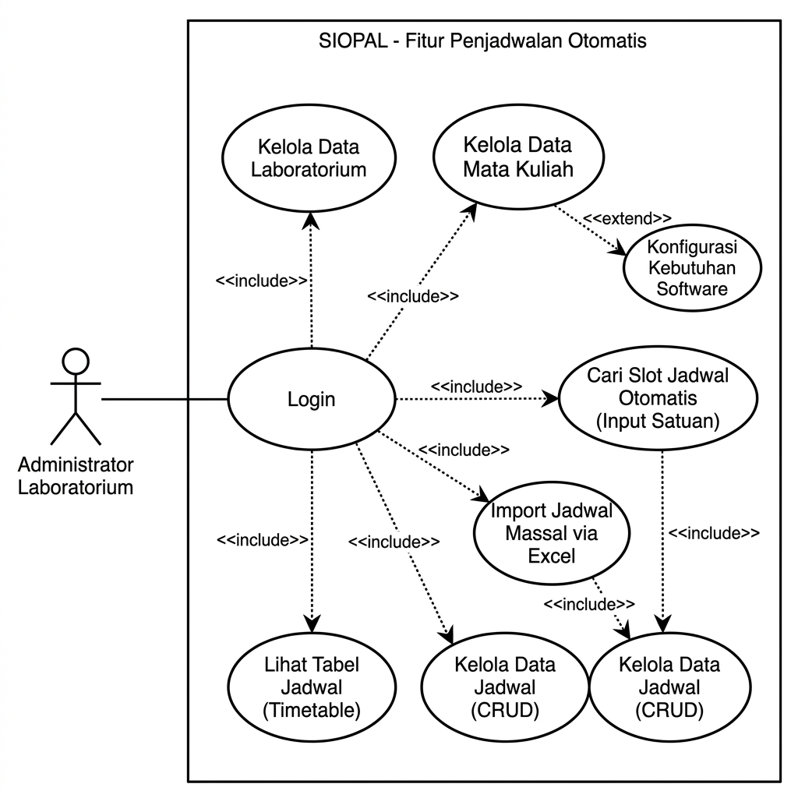

Gambar X\. _Use Case Diagram_ Fitur Penjadwalan Otomatis SIOPAL

Berdasarkan Gambar X, interaksi aktor dengan sistem dijelaskan secara naratif pada tabel-tabel berikut:

Tabel 12a\. _Use Case_ Naratif Fitur Penjadwalan Otomatis SIOPAL

**1. LOGIN**

| Komponen | Keterangan |
| :--- | :--- |
| **Tujuan** | Melakukan _login_ ke dalam sistem SIOPAL |
| **Deskripsi** | Sistem memungkinkan Administrator Laboratorium untuk masuk dan mengakses _dashboard_ serta seluruh fitur penjadwalan otomatis pada sistem SIOPAL. Autentikasi dilakukan menggunakan _email_ dan _password_ yang divalidasi terhadap basis data melalui Laravel Filament Authentication. |
| **Aktor** | Administrator Laboratorium |

| **Skenario Utama** | |
| :--- | :--- |
| **Kondisi Awal** | Aktor sudah mengakses halaman _login_ SIOPAL (`/admin/login`). |

| Aksi Aktor | Reaksi Sistem |
| :--- | :--- |
| 1. Aktor memasukkan _email_ dan _password_, lalu menekan tombol "Masuk". | 2. Sistem memvalidasi kesesuaian _email_ dan _password_ pada tabel `users` di basis data. |
| | 3. Sistem menyimpan data sesi pengguna (_session_) termasuk identitas dan hak akses. |
| | 4. Sistem mengarahkan aktor ke halaman _Dashboard_ (`/admin`). |

| **Kondisi Akhir** | Aktor berhasil masuk dan dapat mengakses _dashboard_ serta seluruh fitur sistem sesuai hak aksesnya. |
| :--- | :--- |

---

**2. KELOLA DATA LABORATORIUM**

| Komponen | Keterangan |
| :--- | :--- |
| **Tujuan** | Mengelola data laboratorium komputer beserta konfigurasi penjadwalan |
| **Deskripsi** | Sistem memungkinkan Administrator untuk menambah, mengubah, dan menghapus data laboratorium. Pengelolaan mencakup informasi dasar (ruang, kapasitas, jumlah PC), pengaturan penjadwalan (status aktif, jam operasional), dan prioritas program studi. Data ini menjadi parameter _constraint_ utama dalam algoritma penjadwalan otomatis. |
| **Aktor** | Administrator Laboratorium |

| **Skenario Utama** | |
| :--- | :--- |
| **Kondisi Awal** | Aktor sudah _login_ dan membuka menu "Master Data" → "Data Laboratorium". |

| Aksi Aktor | Reaksi Sistem |
| :--- | :--- |
| 1. Aktor melihat daftar laboratorium yang tersedia. | 2. Sistem menampilkan tabel laboratorium: Ruang, Kategori, Kapasitas, beserta tombol aksi (Lihat, Ubah, Hapus). |
| 3. Aktor menekan tombol "Tambah Laboratorium". | 4. Sistem menampilkan formulir tiga seksi: "Informasi Dasar" (ruang, kapasitas, PC siap, PC _backup_), "Pengaturan Penjadwalan" (_toggle_ aktif, jam operasional mulai/selesai), dan "Prioritas Program Studi" (_multi-select_). |
| 5. Aktor mengisi formulir dan menekan "Simpan". | 6. Sistem memvalidasi input dan menyimpan data laboratorium ke tabel `laboratoria` beserta relasi prioritas ke tabel `lab_prodi_priority`. |
| | 7. Sistem mengarahkan aktor ke halaman daftar laboratorium dengan notifikasi berhasil. |

| **Kondisi Akhir** | Data laboratorium berhasil ditambah, diubah, atau dihapus. Perubahan konfigurasi akan berpengaruh langsung pada hasil algoritma penjadwalan otomatis. |
| :--- | :--- |

---

**3. KELOLA DATA MATA KULIAH**

| Komponen | Keterangan |
| :--- | :--- |
| **Tujuan** | Mengelola data mata kuliah praktikum beserta kebutuhan _software_ |
| **Deskripsi** | Sistem memungkinkan Administrator untuk menambah, mengubah, dan menghapus data mata kuliah praktikum. Pengelolaan mencakup informasi mata kuliah (kode, nama, SKS, jumlah mahasiswa, program studi) serta konfigurasi kebutuhan _software_ melalui relasi _many-to-many_ (`<<extend>>` Konfigurasi Kebutuhan _Software_). Data kebutuhan _software_ disimpan pada tabel pivot `course_software` dan menjadi parameter kunci pada Step 2 algoritma _Eloquent Query Filtering_. |
| **Aktor** | Administrator Laboratorium |

| **Skenario Utama** | |
| :--- | :--- |
| **Kondisi Awal** | Aktor sudah _login_ dan membuka menu "Master Data" → "Data Mata Kuliah". |

| Aksi Aktor | Reaksi Sistem |
| :--- | :--- |
| 1. Aktor melihat daftar mata kuliah. | 2. Sistem menampilkan tabel mata kuliah: Kode, Nama, Program Studi, SKS, Jumlah Mahasiswa, beserta tombol aksi. |
| 3. Aktor menekan "Tambah Mata Kuliah" atau "Ubah" pada data tertentu. | 4. Sistem menampilkan formulir: Kode Mata Kuliah, Nama, Program Studi (_dropdown_), SKS, Jumlah Mahasiswa, dan _multi-select_ Kebutuhan _Software_. |
| 5. Aktor mengisi formulir, termasuk memilih _software_ yang dibutuhkan, lalu menekan "Simpan". | 6. Sistem menyimpan data mata kuliah ke tabel `courses` dan menyinkronkan kebutuhan _software_ ke tabel pivot `course_software`. |
| | 7. Sistem mengarahkan aktor ke halaman daftar mata kuliah dengan notifikasi berhasil. |

| **Kondisi Akhir** | Data mata kuliah beserta kebutuhan _software_ berhasil tersimpan. Data ini akan digunakan sebagai parameter _constraint_ dalam proses penjadwalan otomatis. |
| :--- | :--- |

---

**4. CARI SLOT JADWAL OTOMATIS (INPUT SATUAN)**

| Komponen | Keterangan |
| :--- | :--- |
| **Tujuan** | Mencari dan menetapkan slot jadwal secara otomatis untuk satu mata kuliah |
| **Deskripsi** | Sistem memungkinkan Administrator untuk memasukkan parameter penjadwalan (program studi, mata kuliah, dosen, jumlah siswa, kelompok, sesi waktu) melalui formulir interaktif. Sistem kemudian menjalankan enam tahap _Eloquent Query Filtering_ untuk menemukan slot jadwal yang valid dan menampilkan hasil dalam bentuk kartu rekomendasi per hari. Pemilihan kartu menghasilkan data jadwal baru yang tersimpan di basis data (`<<include>>` Kelola Data Jadwal). |
| **Aktor** | Administrator Laboratorium |

| **Skenario Utama** | |
| :--- | :--- |
| **Kondisi Awal** | Aktor sudah _login_ dan membuka menu "Penjadwalan" → "Penjadwalan Otomatis". |

| Aksi Aktor | Reaksi Sistem |
| :--- | :--- |
| 1. Aktor memilih Program Studi dari _dropdown_. | 2. Sistem memperbarui daftar Mata Kuliah secara reaktif, menampilkan hanya mata kuliah milik program studi yang dipilih (Livewire `live()`). |
| 3. Aktor memilih Mata Kuliah, Dosen Pengampu, mengisi Jumlah Siswa, Kode Kelompok, dan Sesi Waktu. | 4. Sistem secara otomatis menggabungkan kode prodi dengan kode kelompok (misal "A11.0001") dan menentukan durasi berdasarkan SKS mata kuliah. |
| 5. Aktor menekan tombol "Cari Slot Tersedia". | 6. Sistem menjalankan enam tahap _Eloquent Query Filtering_: (1) Filter lab aktif + kapasitas, (2) Filter ketersediaan _software_, (3) Deteksi konflik slot, (4) Filter sesi waktu, (5) Eliminasi _break times_, (6) Urutkan prioritas lab. |
| | 7. Sistem menampilkan hasil rekomendasi dalam struktur tab per hari (Senin–Jumat). Setiap tab berisi kartu-kartu rekomendasi dengan informasi: nama lab, kapasitas, rentang waktu, dan indikator prioritas (⭐). |
| 8. Aktor memilih salah satu kartu rekomendasi. | 9. Sistem melakukan _double-check_ konflik jadwal untuk mengantisipasi _race condition_. |
| | 10. Jika tidak ada konflik, sistem menyimpan jadwal ke tabel `schedules` dan menampilkan notifikasi "Jadwal berhasil dibuat". |

| **Kondisi Akhir** | Jadwal baru berhasil tersimpan di basis data dengan seluruh _constraint_ terpenuhi (anti-bentrok, ketersediaan _software_, jam operasional, dan _break times_). |
| :--- | :--- |

---

**5. IMPORT JADWAL MASSAL VIA EXCEL**

| Komponen | Keterangan |
| :--- | :--- |
| **Tujuan** | Menempatkan jadwal secara massal dari berkas Excel |
| **Deskripsi** | Sistem memungkinkan Administrator untuk mengunggah berkas Excel berisi daftar mata kuliah beserta jumlah kelompok per sesi. Sistem menjalankan kelas `BulkScheduleImport` yang membaca seluruh baris, mengekspansi menjadi entri individual, mengurutkan berdasarkan SKS menurun, dan menempatkan setiap jadwal menggunakan algoritma _triple nested loop_ (Hari × Slot × Lab). Hasil ditampilkan dalam tabel pratinjau sebelum disimpan ke basis data (`<<include>>` Kelola Data Jadwal). |
| **Aktor** | Administrator Laboratorium |

| **Skenario Utama** | |
| :--- | :--- |
| **Kondisi Awal** | Aktor sudah _login_ dan membuka halaman "Penjadwalan Otomatis", lalu menekan tombol "_Import_ Excel". |

| Aksi Aktor | Reaksi Sistem |
| :--- | :--- |
| 1. Aktor mengunggah berkas Excel dan menekan tombol "Proses". | 2. Sistem membaca seluruh baris Excel (_first pass_), mengekspansi setiap baris menjadi entri jadwal individual (pagi × n + malam × n), dan mengurutkan berdasarkan SKS menurun. |
| | 3. Untuk setiap entri, sistem mencari slot melalui iterasi Hari × Slot × Lab. Slot yang ditemukan ditandai sebagai terpakai secara _in-memory_ untuk mencegah konflik antar entri. |
| | 4. Sistem menampilkan tabel pratinjau dengan status per baris: **OK** (hijau), **Warning** (kuning — data tidak konsisten), atau **Error** (merah — tidak ada slot tersedia). Ringkasan statistik ditampilkan di bagian atas. |
| 5. Aktor meninjau tabel pratinjau dan menekan "Confirm Import". | 6. Sistem menyimpan seluruh jadwal berstatus OK dan Warning ke tabel `schedules`. Jadwal berstatus Error diabaikan. |
| | 7. Sistem menampilkan notifikasi "_Import_ berhasil" beserta jumlah jadwal yang tersimpan. |

| **Kondisi Akhir** | Jadwal massal berhasil ditempatkan dan tersimpan di basis data. Administrator dapat melihat hasilnya di halaman Tabel Jadwal atau Data Jadwal. |
| :--- | :--- |

---

**6. LIHAT TABEL JADWAL (_TIMETABLE_)**

| Komponen | Keterangan |
| :--- | :--- |
| **Tujuan** | Melihat visualisasi jadwal dalam format _grid_ per laboratorium |
| **Deskripsi** | Sistem menampilkan jadwal praktikum dalam format tabel _grid_ dengan sumbu horizontal berupa hari (Senin–Jumat) dan sumbu vertikal berupa slot waktu (07:00–21:00). Administrator dapat memilih laboratorium melalui _dropdown_ dan melakukan _export_ jadwal ke format Excel. |
| **Aktor** | Administrator Laboratorium |

| **Skenario Utama** | |
| :--- | :--- |
| **Kondisi Awal** | Aktor sudah _login_ dan membuka menu "Penjadwalan" → "Tabel Jadwal". |

| Aksi Aktor | Reaksi Sistem |
| :--- | :--- |
| 1. Aktor memilih laboratorium dari _dropdown_. | 2. Sistem menampilkan tabel _grid_ jadwal untuk laboratorium yang dipilih. Slot yang terisi ditandai dengan warna dan menampilkan nama mata kuliah beserta kode kelompok. |
| 3. Aktor menekan tombol "_Export_ Excel". | 4. Sistem menghasilkan berkas Excel yang berisi jadwal seluruh laboratorium (satu _sheet_ per laboratorium) dan mengunduhnya ke perangkat aktor. |

| **Kondisi Akhir** | Aktor dapat melihat visualisasi jadwal per laboratorium dan mengunduh jadwal dalam format Excel. |
| :--- | :--- |

---

**7. KELOLA DATA JADWAL (CRUD)**

| Komponen | Keterangan |
| :--- | :--- |
| **Tujuan** | Mengelola data jadwal secara manual dengan validasi konflik otomatis |
| **Deskripsi** | Sistem memungkinkan Administrator untuk menambah, melihat, mengubah, dan menghapus data jadwal secara manual. Formulir tambah/ubah terintegrasi dengan `SchedulingService` — ketika Administrator memilih laboratorium dan hari, sistem secara otomatis menampilkan hanya slot waktu yang tersedia sehingga mencegah konflik jadwal. Halaman ini juga menyediakan _bulk actions_ untuk menghapus beberapa atau seluruh jadwal sekaligus. |
| **Aktor** | Administrator Laboratorium |

| **Skenario Utama** | |
| :--- | :--- |
| **Kondisi Awal** | Aktor sudah _login_ dan membuka menu "Penjadwalan" → "Jadwal Kuliah". |

| Aksi Aktor | Reaksi Sistem |
| :--- | :--- |
| 1. Aktor melihat daftar seluruh jadwal. | 2. Sistem menampilkan tabel jadwal: Mata Kuliah, Kelompok, Dosen, Laboratorium, Hari, Waktu, Siswa, Sesi, SKS, beserta tombol aksi (Lihat, Ubah, Hapus) dan filter (Laboratorium, Hari, Mata Kuliah, Dosen). |
| 3. Aktor menekan "Tambah Jadwal". | 4. Sistem menampilkan formulir: Program Studi, Mata Kuliah (_reactive dropdown_), Dosen, Kelompok, Jumlah Siswa, Sesi, Laboratorium, Hari, dan Jam Mulai. |
| 5. Aktor memilih Laboratorium dan Hari. | 6. Sistem secara otomatis memfilter dan menampilkan hanya slot waktu yang tersedia (tidak bertabrakan dengan jadwal _existing_) pada _dropdown_ Jam Mulai, beserta informasi jumlah slot tersedia. |
| 7. Aktor memilih Jam Mulai dan menekan "Simpan". | 8. Sistem memvalidasi ulang konflik jadwal. Jika valid, sistem menyimpan jadwal ke tabel `schedules` dengan kalkulasi otomatis `start_time`, `end_time`, dan `duration_slots`. |
| | 9. Sistem mengarahkan aktor ke halaman daftar jadwal dengan notifikasi berhasil. |

| **Kondisi Akhir** | Data jadwal berhasil ditambah, diubah, atau dihapus dengan jaminan tidak terjadi konflik jadwal. |
| :--- | :--- |

2. ### **_Activity Diagram_** {#activity-diagram}

_Activity Diagram_ digunakan untuk menggambarkan alur kerja suatu sistem. Diagram tersebut menunjukkan pergerakan dari satu aktivitas ke aktivitas yang lain atau dari aktivitas ke kondisi tertentu.

    a. _Activity Diagram_ Login

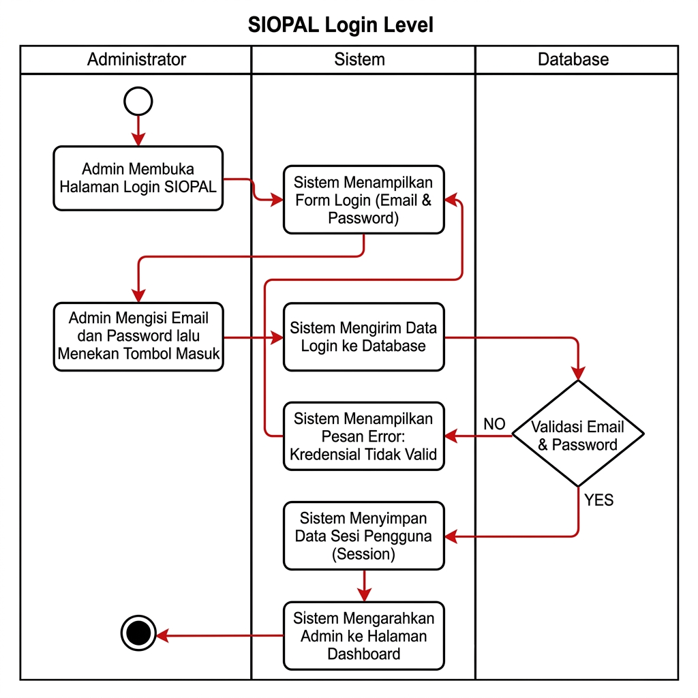

Gambar X\. _Activity Diagram_ Login

Administrator membuka halaman _login_ SIOPAL melalui _browser_. Sistem menampilkan formulir _login_ yang terdiri dari dua _field_ input: _email_ dan _password_. Setelah administrator mengisi kedua _field_ dan menekan tombol "Masuk", sistem memvalidasi kesesuaian _email_ dan _password_ terhadap tabel `users` pada basis data melalui mekanisme autentikasi Laravel Filament. Jika validasi tidak berhasil — misalnya _email_ tidak terdaftar atau _password_ salah — maka sistem menampilkan pesan _error_ "Kredensial tidak valid" dan menampilkan halaman _login_ kembali agar administrator dapat memperbaiki data _login_. Jika validasi berhasil, sistem menyimpan data sesi pengguna (_session_) dan mengarahkan administrator ke halaman _Dashboard_ (`/admin`).

    b. _Activity Diagram_ Kelola Data Laboratorium

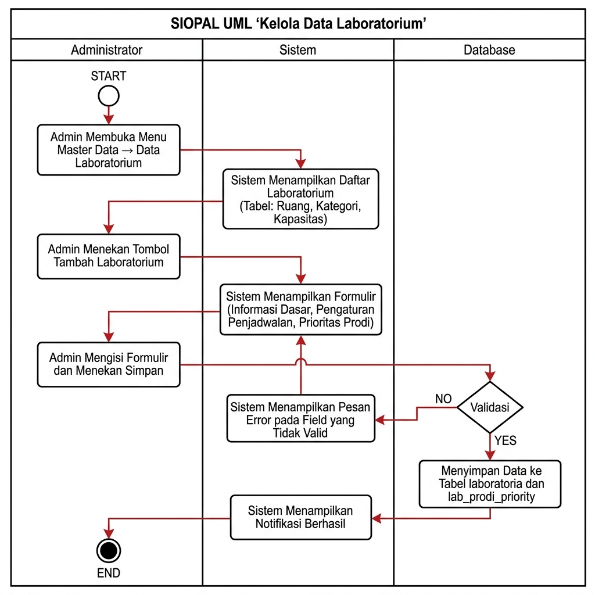

Gambar X\. _Activity Diagram_ Kelola Data Laboratorium

Setelah berhasil _login_, administrator membuka menu "Master Data" → "Data Laboratorium". Sistem menampilkan halaman daftar laboratorium berisi tabel dengan kolom Ruang, Kategori, Kapasitas, serta tombol aksi (Lihat, Ubah, Hapus). Jika administrator ingin menambah data baru, administrator menekan tombol "Tambah Laboratorium" dan sistem menampilkan formulir tiga seksi: "Informasi Dasar" (ruang, kapasitas, PC siap, PC _backup_), "Pengaturan Penjadwalan" (_toggle_ aktif, jam operasional mulai/selesai), dan "Prioritas Program Studi" (_multi-select_). Administrator mengisi seluruh _field_ dan menekan "Simpan". Sistem memvalidasi input — jika validasi gagal, pesan _error_ ditampilkan pada _field_ yang tidak valid. Jika validasi berhasil, sistem menyimpan data laboratorium ke tabel `laboratoria` beserta relasi prioritas ke tabel `lab_prodi_priority`, lalu mengarahkan administrator ke halaman daftar laboratorium dengan notifikasi berhasil. Untuk mengubah data, alur serupa berlaku dengan formulir yang sudah terisi data _existing_. Untuk menghapus, sistem menampilkan konfirmasi dan menghapus data setelah administrator menyetujui.

    c. _Activity Diagram_ Kelola Data Mata Kuliah

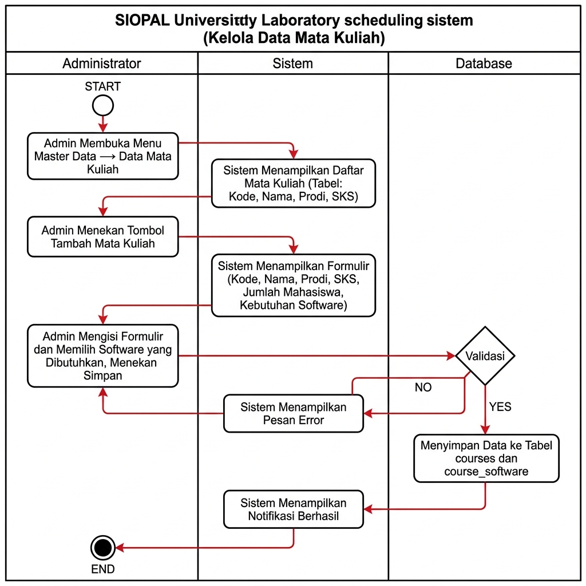

Gambar X\. _Activity Diagram_ Kelola Data Mata Kuliah

Setelah berhasil _login_, administrator membuka menu "Master Data" → "Data Mata Kuliah". Sistem menampilkan halaman daftar mata kuliah berisi tabel dengan kolom Kode, Nama, Program Studi, SKS, Jumlah Mahasiswa, beserta tombol aksi. Jika administrator ingin menambah mata kuliah baru, administrator menekan tombol "Tambah Mata Kuliah" dan sistem menampilkan formulir: Kode Mata Kuliah, Nama, Program Studi (_dropdown_), SKS, Jumlah Mahasiswa, dan _multi-select_ Kebutuhan _Software_. Administrator mengisi seluruh _field_ termasuk memilih _software_ yang dibutuhkan, lalu menekan "Simpan". Sistem memvalidasi input — jika validasi gagal, pesan _error_ ditampilkan. Jika berhasil, sistem menyimpan data mata kuliah ke tabel `courses` dan menyinkronkan kebutuhan _software_ ke tabel pivot `course_software`, lalu mengarahkan administrator ke halaman daftar dengan notifikasi berhasil. Data kebutuhan _software_ yang tersimpan ini menjadi parameter kunci pada Step 2 algoritma _Eloquent Query Filtering_ saat proses penjadwalan otomatis.

    d. _Activity Diagram_ Penjadwalan Otomatis (Input Satuan)

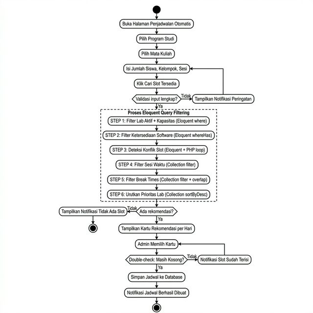

Gambar X\. _Activity Diagram_ Penjadwalan Otomatis (Input Satuan)

Administrator membuka halaman _Schedule Wizard_ setelah berhasil _login_ ke dalam sistem. Sistem menampilkan formulir penjadwalan yang terdiri dari enam _field_ input: Program Studi, Mata Kuliah, Dosen Pengampu, Jumlah Siswa, Kode Kelompok, dan Sesi Waktu. Setelah administrator mengisi seluruh _field_ dan menekan tombol "Cari Slot Tersedia", sistem menjalankan enam tahap _Eloquent Query Filtering_ secara berurutan: (1) filter lab aktif dan kapasitas, (2) filter ketersediaan _software_, (3) deteksi konflik slot, (4) filter sesi waktu, (5) eliminasi _break times_, dan (6) pengurutan prioritas laboratorium. Jika hasil _filtering_ tidak ditemukan slot yang tersedia, sistem menampilkan notifikasi "Tidak ada slot tersedia" dan administrator dapat mengubah parameter pencarian. Jika slot ditemukan, sistem menampilkan hasil rekomendasi dalam bentuk kartu interaktif yang dikelompokkan per hari (Senin–Jumat). Administrator kemudian memilih salah satu kartu rekomendasi. Sebelum menyimpan, sistem melakukan _double-check_ konflik jadwal sebagai pengaman (_safeguard_) terhadap _race condition_. Jika tidak ada konflik, jadwal berhasil disimpan dan sistem menampilkan notifikasi berhasil.

    e. _Activity Diagram_ _Import_ Massal via Excel

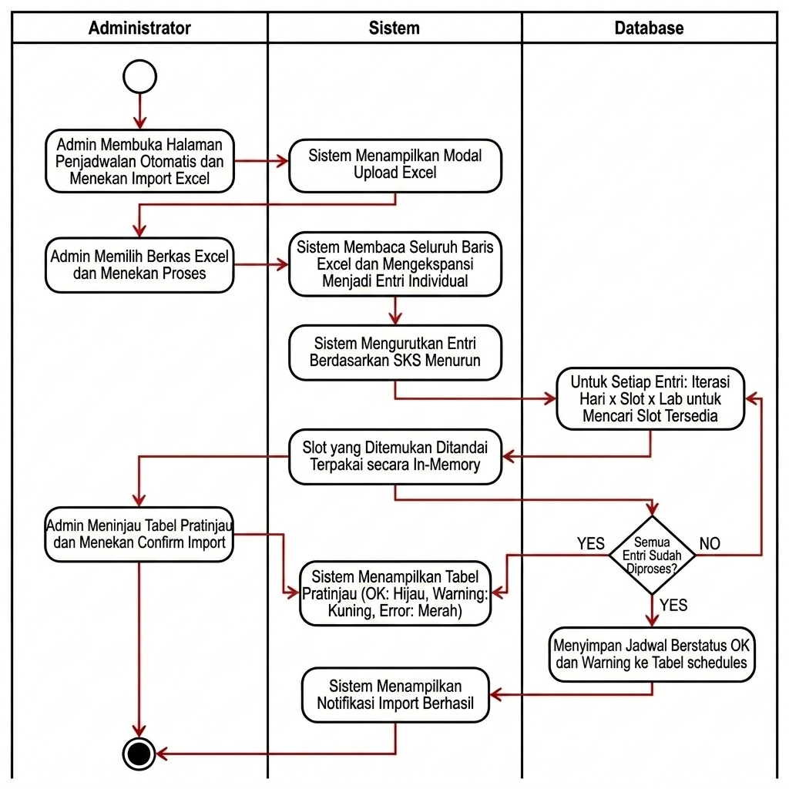

Gambar X\. _Activity Diagram_ Import Massal via Excel

Administrator membuka halaman _Schedule Wizard_ dan menekan tombol "_Import_ Excel". Sistem menampilkan _modal upload_ dan administrator memilih berkas Excel yang berisi daftar mata kuliah beserta jumlah kelompok per sesi. Setelah berkas diunggah, sistem membaca seluruh baris dari berkas Excel (_first pass_), mengekspansi setiap baris menjadi entri jadwal individual berdasarkan jumlah kelompok, dan mengurutkan seluruh entri berdasarkan SKS menurun. Untuk setiap entri, sistem menjalankan algoritma _triple nested loop_ (Hari × Slot × Lab) untuk mencari slot yang tersedia. Slot yang berhasil ditemukan ditandai sebagai terpakai secara _in-memory_ untuk mencegah konflik antar entri. Jika tidak ada slot yang tersedia untuk suatu entri, entri tersebut ditandai dengan status Error. Setelah seluruh entri diproses, sistem menampilkan tabel pratinjau dengan indikator status per baris: OK (hijau), Warning (kuning), atau Error (merah), beserta ringkasan statistik di bagian atas. Administrator meninjau hasil dan menekan "Confirm Import" untuk menyimpan jadwal yang valid ke basis data.

    f. _Activity Diagram_ Lihat Tabel Jadwal (_Timetable_)

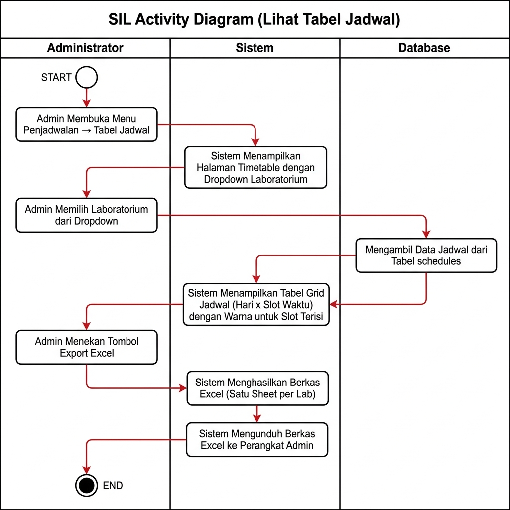

Gambar X\. _Activity Diagram_ Lihat Tabel Jadwal (_Timetable_)

Setelah berhasil _login_, administrator membuka menu "Penjadwalan" → "Tabel Jadwal". Sistem menampilkan halaman _Timetable_ yang berisi _dropdown_ pemilihan laboratorium dan area tabel _grid_. Administrator memilih laboratorium dari _dropdown_ dan sistem menampilkan tabel _grid_ jadwal dengan sumbu horizontal berupa hari (Senin–Jumat) dan sumbu vertikal berupa slot waktu (07:00–21:00). Slot yang telah terisi jadwal ditandai dengan warna dan menampilkan nama mata kuliah beserta kode kelompok. Slot yang kosong ditampilkan tanpa warna. Jika administrator ingin mengekspor jadwal, administrator menekan tombol "_Export_ Excel" dan sistem menghasilkan berkas Excel yang berisi jadwal seluruh laboratorium (satu _sheet_ per laboratorium) kemudian mengunduhnya ke perangkat administrator.

    g. _Activity Diagram_ Kelola Data Jadwal (CRUD)

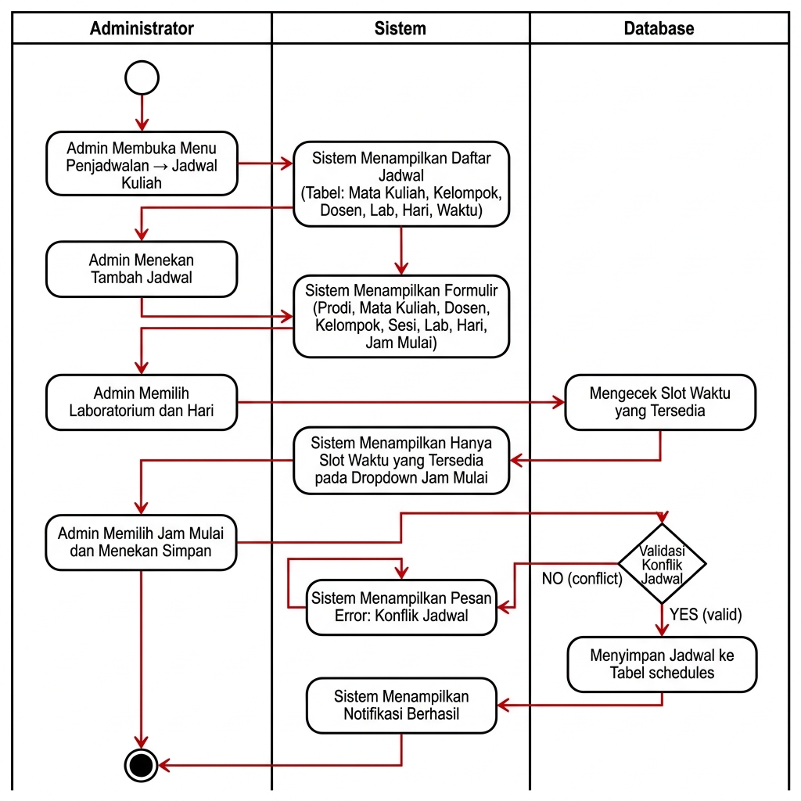

Gambar X\. _Activity Diagram_ Kelola Data Jadwal (CRUD)

Setelah berhasil _login_, administrator membuka menu "Penjadwalan" → "Jadwal Kuliah". Sistem menampilkan halaman daftar jadwal berisi tabel dengan kolom Mata Kuliah, Kelompok, Dosen, Laboratorium, Hari, Waktu, Siswa, Sesi, SKS, beserta tombol aksi (Lihat, Ubah, Hapus) dan _filter_ (Laboratorium, Hari, Mata Kuliah, Dosen). Jika administrator ingin menambah jadwal manual, administrator menekan "Tambah Jadwal" dan sistem menampilkan formulir: Program Studi, Mata Kuliah (_reactive dropdown_), Dosen, Kelompok, Jumlah Siswa, Sesi, Laboratorium, Hari, dan Jam Mulai. Ketika administrator memilih Laboratorium dan Hari, sistem secara otomatis memfilter dan menampilkan hanya slot waktu yang tersedia (tidak bertabrakan dengan jadwal _existing_) pada _dropdown_ Jam Mulai. Administrator memilih Jam Mulai dan menekan "Simpan". Sistem memvalidasi ulang konflik jadwal — jika terjadi konflik, pesan _error_ ditampilkan. Jika valid, sistem menyimpan jadwal ke tabel `schedules` dengan kalkulasi otomatis `start_time`, `end_time`, dan `duration_slots`, lalu mengarahkan administrator ke halaman daftar jadwal dengan notifikasi berhasil. Untuk menghapus jadwal secara massal, administrator dapat memilih beberapa jadwal menggunakan _checkbox_ dan menekan tombol "_Delete All_" untuk menghapus seluruh jadwal sekaligus.

3. ### **_Sequence Diagram_** {#sequence-diagram}

_Sequence Diagram_ digunakan untuk menggambarkan interaksi antar komponen perangkat lunak secara kronologis. Diagram ini menunjukkan urutan pesan (_message_) yang dikirimkan antar objek selama proses penjadwalan otomatis berlangsung.

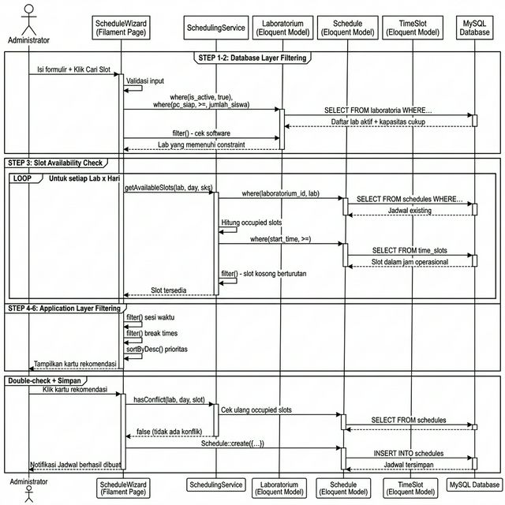

Gambar X\. _Sequence Diagram_ Penjadwalan Otomatis (Input Satuan)

Berdasarkan _Sequence Diagram_ pada Gambar X, proses penjadwalan otomatis melibatkan interaksi antara empat komponen utama: (1) **ScheduleWizard** (Filament Page) sebagai _controller_ yang menerima input dari pengguna dan mengorkestrasi seluruh proses; (2) **SchedulingService** sebagai _service layer_ yang mengenkapsulasi logika deteksi konflik dan kalkulasi slot; (3) **Model-model Eloquent** (Laboratorium, Schedule, TimeSlot) sebagai _data access layer_ yang menerjemahkan operasi bisnis menjadi _query_ SQL; dan (4) **MySQL Database** sebagai penyimpan data persisten. Pola interaksi ini menunjukkan pemisahan tanggung jawab (_Separation of Concerns_) yang jelas: lapisan presentasi tidak melakukan _query_ langsung ke basis data, melainkan mendelegasikan logika bisnis ke _service layer_ yang kemudian menggunakan Eloquent ORM untuk mengakses data.

4. ### **_Class Diagram_** {#class-diagram}

Untuk memodelkan kerangka statis sistem, digunakan _Class Diagram_ yang mencakup definisi kelas, atribut, dan metode. Melalui diagram ini, pembagian peran tiap kelas serta mekanisme interaksi antar objek dapat tergambar dengan jelas.

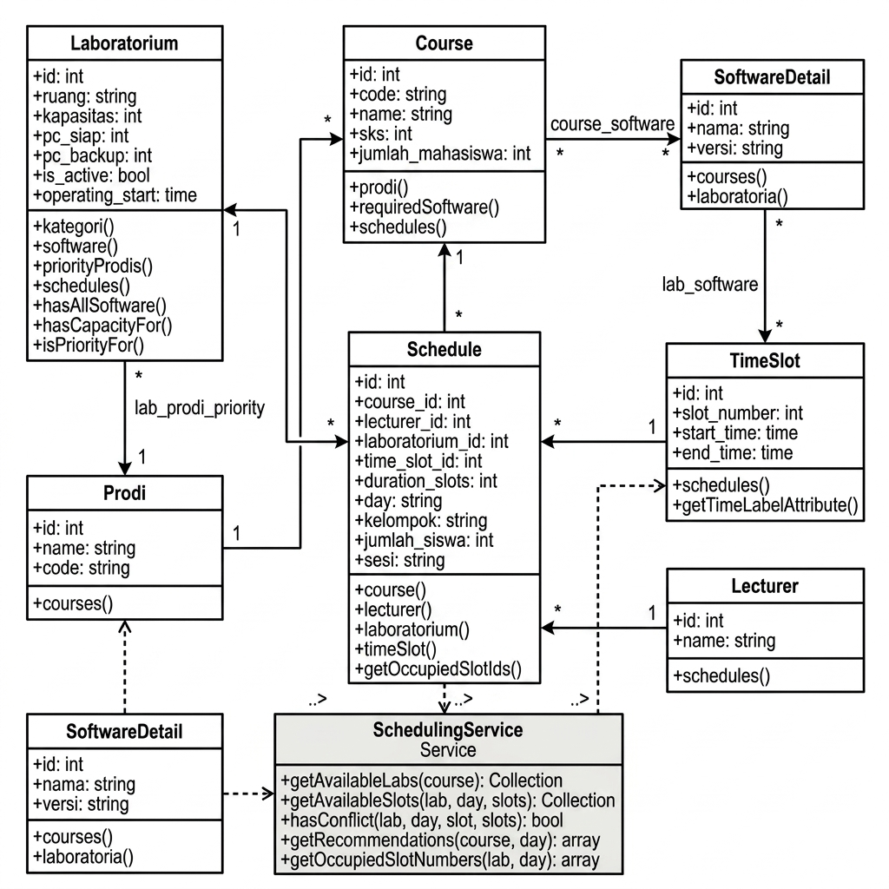

Gambar X\. _Class Diagram_ Sistem Penjadwalan Otomatis SIOPAL

Diagram ini merepresentasikan delapan kelas utama dalam sistem penjadwalan otomatis SIOPAL, beserta atribut dan metode yang dimiliki oleh masing-masing kelas. Tujuh kelas model Eloquent (`Laboratorium`, `Course`, `Schedule`, `TimeSlot`, `Prodi`, `SoftwareDetail`, `Lecturer`) merepresentasikan entitas pada basis data, di mana setiap kelas memiliki atribut yang sesuai dengan kolom tabel dan metode relasi Eloquent (`hasMany()`, `belongsTo()`, `belongsToMany()`) yang mendefinisikan hubungan antar entitas. Kelas `SchedulingService` berfungsi sebagai _service layer_ yang mengenkapsulasi seluruh logika _constraint filtering_ dengan metode utama meliputi: `getAvailableLabs(course)` untuk filter lab berdasarkan kapasitas dan _software_, `getAvailableSlots(lab, day, slots)` untuk filter slot berdasarkan konflik jadwal dan jam operasional, `hasConflict(lab, day, slot, slots)` untuk validasi ulang konflik sebelum penyimpanan, serta `getBreakTimes(sks, sesi)` untuk kalkulasi jam istirahat dinamis. Relasi antar kelas dijelaskan melalui jalur asosiasi, termasuk tiga relasi _many-to-many_ yang direpresentasikan melalui tabel pivot: `course_software` (antara `Course` dan `SoftwareDetail`), `lab_software` (antara `Laboratorium` dan `SoftwareDetail`), dan `lab_prodi_priority` (antara `Laboratorium` dan `Prodi`).

5. ### **ERD (_Entity Relationship Diagram_)** {#erd}

ERD (_Entity Relationship Diagram_) memberikan gambaran bagaimana data dihasilkan, disimpan, dan diakses dalam sistem, sekaligus menunjukkan keterkaitan antar tabel yang membentuk basis data relasional. Dengan menggunakan ERD, perancang sistem dapat memastikan integritas data, menghindari redundansi, dan menyusun desain _database_ yang efisien serta mudah diimplementasikan.

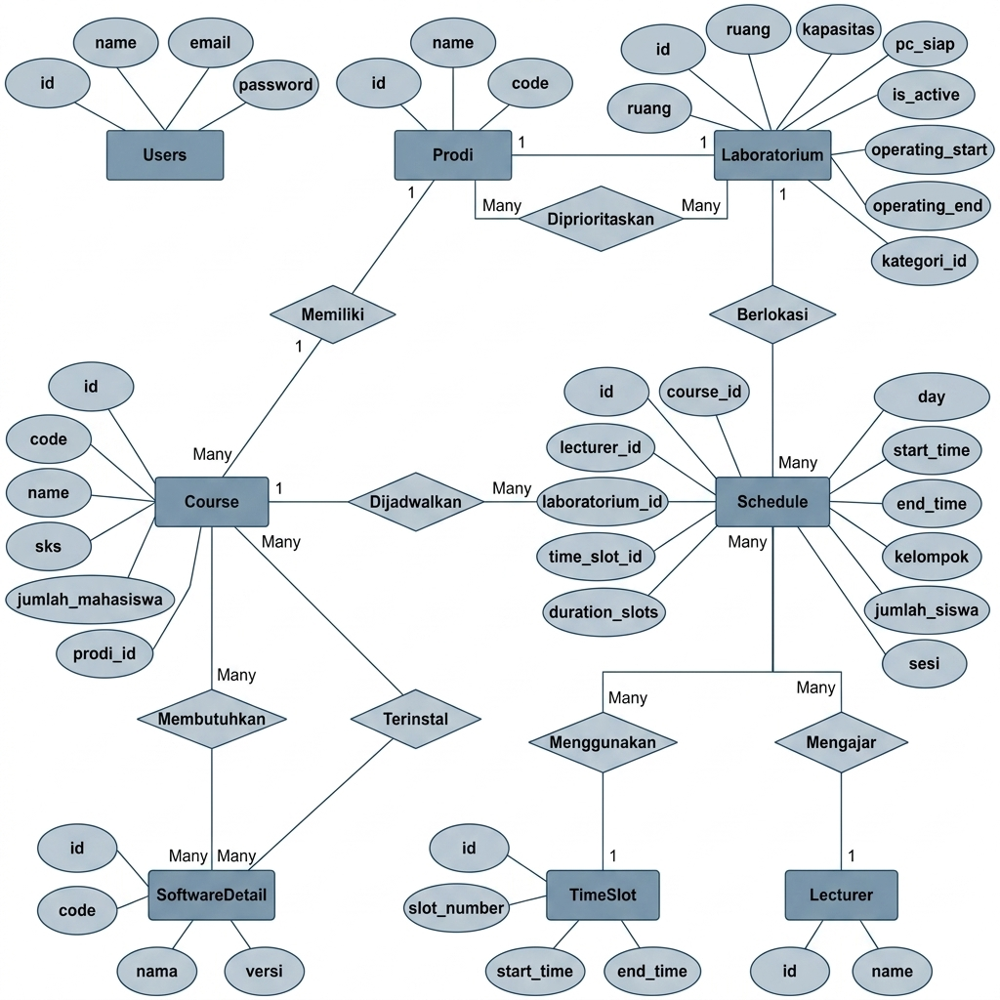

Gambar X\. _Entity Relationship Diagram_ Sistem Penjadwalan Otomatis SIOPAL

ERD di dalam sistem SIOPAL mencerminkan tata logis dari _database_ yang diterapkan untuk mengatur data penjadwalan laboratorium komputer. ERD ini menggambarkan tujuh entitas utama beserta tiga tabel pivot, karakteristik yang mereka miliki, serta keterkaitan di antara entitas yang membentuk basis data relasional. Entitas kunci meliputi: **Laboratorium** (`laboratoria`) yang menyimpan data lab beserta kapasitas dan jam operasional, **Mata Kuliah** (`courses`) yang menyimpan data mata kuliah praktikum beserta bobot SKS, **Jadwal** (`schedules`) yang menghubungkan mata kuliah, laboratorium, dan slot waktu, **Slot Waktu** (`time_slots`) yang membagi waktu per 50 menit dari 07:00 hingga 21:00, **Program Studi** (`prodis`), **Detail Software** (`software_details`), dan **Dosen** (`lecturers`).

Relasi antar entitas ditunjukkan melalui hubungan yang jelas: satu **Program Studi** memiliki banyak **Mata Kuliah** (relasi _one-to-many_); satu **Mata Kuliah** dapat membutuhkan banyak **Software** dan sebaliknya (relasi _many-to-many_ melalui tabel `course_software`); satu **Laboratorium** dapat memiliki banyak **Software** terinstal dan sebaliknya (relasi _many-to-many_ melalui tabel `lab_software`); satu **Laboratorium** dapat memprioritaskan banyak **Program Studi** dan sebaliknya (relasi _many-to-many_ melalui tabel `lab_prodi_priority`); serta satu **Jadwal** menghubungkan satu **Mata Kuliah**, satu **Laboratorium**, satu **Dosen**, dan satu **Slot Waktu** (relasi _many-to-one_). Dengan adanya ERD ini, pengembang dapat memahami bagaimana data saling terhubung dan bagaimana informasi bergerak dalam sistem untuk menjaga integritas data serta mempermudah implementasi fitur penjadwalan otomatis.

2. ## **Implementasi Sistem** {#implementasi-sistem}

Pada sub-bab ini diuraikan proses implementasi rancangan sistem ke dalam perangkat lunak. Pembahasan mencakup persiapan lingkungan pengembangan, arsitektur komponen perangkat lunak, serta penjelasan alur logika dari setiap komponen utama yang berperan dalam fitur penjadwalan otomatis.

1. ### **Lingkungan Pengembangan** {#lingkungan-pengembangan}

Implementasi sistem SIOPAL dilakukan menggunakan lingkungan pengembangan sebagai berikut:

Tabel 12\. Lingkungan Pengembangan

| No  | Komponen                | Spesifikasi                            |
| :-: | ----------------------- | -------------------------------------- |
|  1  | Bahasa Pemrograman      | PHP 8.2                                |
|  2  | _Framework_ Backend     | Laravel 12                             |
|  3  | _Admin Panel Builder_   | Filament 3                             |
|  4  | Basis Data              | MySQL 8.0                              |
|  5  | _Package Manager_       | Composer (PHP), NPM (JavaScript)       |
|  6  | _Development Server_    | `php artisan serve` (Laravel built-in) |
|  7  | _IDE_                   | Visual Studio Code                     |
|  8  | _Import/Export Library_ | Maatwebsite Excel (Laravel Excel)      |

Framework Laravel dipilih karena menyediakan Eloquent ORM yang mendukung teknik _query filtering_ sebagaimana menjadi fokus utama penelitian ini. Sementara itu, Filament digunakan sebagai _admin panel builder_ yang memungkinkan pembangunan antarmuka administratif secara cepat sesuai dengan prinsip metodologi RAD. Library Maatwebsite Excel digunakan untuk menangani proses _import_ data penjadwalan dari berkas Excel pada fitur _import_ massal.

2. ### **Arsitektur Komponen Perangkat Lunak** {#arsitektur-komponen}

Fitur penjadwalan otomatis SIOPAL diimplementasikan menggunakan pola arsitektur _Service-Page-Import_ yang memisahkan tanggung jawab ke dalam tiga komponen utama. Pemisahan ini mengikuti prinsip _Separation of Concerns_ agar logika bisnis, logika presentasi, dan logika pemrosesan data tetap terorganisasi.

Tabel 13\. Komponen Utama Fitur Penjadwalan Otomatis

| No  | Komponen               | Berkas                                  | Tanggung Jawab                                                                                             |
| :-: | ---------------------- | --------------------------------------- | ---------------------------------------------------------------------------------------------------------- |
|  1  | **SchedulingService**  | `app/Services/SchedulingService.php`    | Logika inti penjadwalan: _constraint filtering_, deteksi konflik, dan kalkulasi slot waktu                 |
|  2  | **ScheduleWizard**     | `app/Filament/Pages/ScheduleWizard.php` | Antarmuka pengguna (_wizard_) untuk input satuan dan _import_ massal, menggunakan Filament Page + Livewire |
|  3  | **BulkScheduleImport** | `app/Imports/BulkScheduleImport.php`    | Pemrosesan _import_ massal dari berkas Excel dengan pengurutan SKS dan pelacakan slot _in-memory_          |

Hubungan antar komponen dapat digambarkan sebagai berikut: **ScheduleWizard** berperan sebagai antarmuka yang menerima masukan dari pengguna, kemudian memanggil **SchedulingService** untuk menjalankan logika _constraint filtering_ pada mode input satuan. Pada mode _import_ massal, **ScheduleWizard** memanggil **BulkScheduleImport** yang di dalamnya juga menggunakan fungsi-fungsi dari **SchedulingService** (khususnya konfigurasi _break times_).

3. ### **Implementasi _Constraint Filtering_ pada SchedulingService** {#implementasi-scheduling-service}

`SchedulingService` merupakan kelas layanan (_service class_) yang mengenkapsulasi seluruh logika penjadwalan otomatis. Kelas ini mengimplementasikan enam tahap _constraint filtering_ secara berurutan, di mana setiap tahap mengeliminasi kandidat yang tidak memenuhi syarat.

**a. Konfigurasi _Break Times_ Dinamis**

Langkah pertama dalam `SchedulingService` adalah mendefinisikan konfigurasi jam istirahat (_break times_). Sistem menerapkan dua konfigurasi berbeda: konfigurasi _default_ untuk mata kuliah 2 SKS, dan konfigurasi khusus untuk mata kuliah 3 SKS atau lebih pada sesi siang. Pada konfigurasi khusus, jam istirahat sore digeser dari pukul 15:50–16:20 menjadi pukul 15:00–15:30 agar slot pukul 15:30 dapat digunakan sebagai waktu mulai untuk jadwal 3 SKS (150 menit) yang berakhir tepat pukul 18:00, yaitu sebelum jam istirahat malam.

Penentuan konfigurasi _break times_ yang digunakan dilakukan melalui metode `getBreakTimes()`, yang menerima parameter jumlah SKS dan sesi waktu. Metode ini mengembalikan konfigurasi khusus apabila SKS bernilai 3 atau lebih **dan** sesi bernilai "siang"; selain itu, metode ini mengembalikan konfigurasi _default_.

**b. Tahap 1 dan 2: Filter Kapasitas dan Ketersediaan _Software_ (_Database Layer_)**

Metode `getAvailableLabs()` mengimplementasikan dua tahap _filtering_ pada lapisan basis data. Tahap pertama menggunakan klausa `where('is_active', true)` untuk memastikan hanya laboratorium aktif yang dipertimbangkan, dilanjutkan dengan `where('pc_siap', '>=', $studentCount)` untuk mengeliminasi laboratorium yang kapasitas PC-nya kurang dari jumlah mahasiswa.

Tahap kedua menerapkan _query_ `whereHas()` untuk memeriksa ketersediaan _software_. Metode ini mengambil daftar ID _software_ yang dibutuhkan mata kuliah melalui relasi `requiredSoftware()`, kemudian memfilter laboratorium yang memiliki **seluruh** _software_ tersebut. Teknik `whereHas()` dengan operator `>=` dan parameter `$requiredCount` memastikan bahwa sebuah laboratorium hanya lolos apabila jumlah _software_ yang cocok sama dengan atau melebihi jumlah _software_ yang dibutuhkan.

Setelah kedua tahap _filtering_ pada lapisan basis data selesai, hasil _query_ dimuat beserta relasi yang diperlukan menggunakan teknik _Eager Loading_ (`with(['priorityProdis', 'kategori'])`) untuk mencegah masalah _N+1 Query_. Selanjutnya, hasil diurutkan berdasarkan prioritas program studi menggunakan `sortByDesc()` pada Laravel Collection.

**c. Tahap 3: Deteksi Konflik Jadwal (_Slot Availability_)**

Metode `getAvailableSlots()` bertanggung jawab untuk menemukan slot waktu berturutan yang belum ditempati pada laboratorium dan hari tertentu. Proses ini terdiri dari dua sub-langkah.

Sub-langkah pertama dilakukan oleh metode `getOccupiedSlotNumbers()`, yang mengambil seluruh jadwal yang sudah ada di laboratorium dan hari yang dimaksud menggunakan _query_ Eloquent. Untuk setiap jadwal, metode ini menghitung semua nomor slot (_slot numbers_) yang ditempati berdasarkan `slot_number` awal dan `duration_slots`. Hasilnya berupa array nomor slot yang sudah terisi.

Sub-langkah kedua memfilter seluruh slot waktu menggunakan Collection `filter()`. Untuk setiap slot kandidat, sistem memeriksa apakah slot tersebut beserta sejumlah slot berikutnya (sesuai SKS) seluruhnya tersedia. Pemeriksaan dilakukan dengan iterasi dari `slot_number` awal hingga `slot_number + slotsNeeded - 1`, di mana setiap nomor slot dicek apakah terdapat dalam array slot yang sudah terisi. Jika **salah satu** slot dalam rentang tersebut sudah terisi, maka kandidat tersebut dinyatakan bentrok dan dieliminasi.

**d. Tahap 4, 5, dan 6: Filter Sesi, _Break Times_, dan Prioritas (_Application Layer_)**

Tiga tahap terakhir diimplementasikan pada lapisan aplikasi menggunakan Collection `filter()` dan pengurutan.

Tahap keempat (filter sesi waktu) membandingkan waktu mulai setiap slot dengan rentang sesi yang dipilih pengguna. Tiga rentang sesi yang didefinisikan adalah: pagi (07:00–12:20), siang (12:30–18:20), dan malam (18:30–22:00). Slot yang waktu mulainya berada di luar rentang sesi yang dipilih akan dieliminasi.

Tahap kelima (filter _break times_) menerapkan teknik _overlap detection_. Untuk setiap slot kandidat, sistem menghitung waktu selesai berdasarkan waktu mulai ditambah durasi (SKS × 50 menit). Kemudian, untuk setiap interval istirahat, sistem memeriksa kondisi tumpang tindih menggunakan formula: **tumpang tindih terjadi apabila waktu mulai slot kurang dari waktu selesai istirahat DAN waktu selesai slot lebih dari waktu mulai istirahat**. Slot yang tumpang tindih dengan interval istirahat mana pun dieliminasi.

Tahap keenam (pengurutan prioritas) mengurutkan hasil rekomendasi sehingga laboratorium yang merupakan prioritas untuk program studi mata kuliah terkait ditampilkan di posisi teratas. Pengurutan dilakukan menggunakan `usort()` dengan dua kriteria: status prioritas (menurun) dan waktu mulai (menaik).

4. ### **Implementasi Antarmuka Penjadwalan Otomatis (ScheduleWizard)** {#implementasi-schedule-wizard}

`ScheduleWizard` merupakan halaman Filament yang berfungsi sebagai antarmuka utama fitur penjadwalan otomatis. Komponen ini dibangun menggunakan Filament Page dengan Livewire untuk mendukung interaktivitas _real-time_ tanpa memuat ulang halaman. Halaman ini menyediakan dua mode operasi: **input satuan** melalui formulir _wizard_, dan **_import_ massal** melalui unggahan berkas Excel.

**a. Mode Input Satuan**

Pada mode input satuan, pengguna mengisi formulir yang terdiri dari enam komponen masukan: Program Studi, Mata Kuliah, Dosen Pengampu, Jumlah Siswa, Kode Kelompok, dan Sesi Waktu. Komponen-komponen masukan ini dibangun menggunakan Filament Form Builder (`Select`, `TextInput`) dengan fitur `live()` yang memungkinkan pembaruan data secara reaktif. Sebagai contoh, ketika pengguna memilih Program Studi, daftar Mata Kuliah secara otomatis diperbarui untuk hanya menampilkan mata kuliah milik program studi tersebut.

Setelah formulir diisi, pengguna menekan tombol "Cari Slot Tersedia" yang memanggil metode `findAvailableSlots()`. Metode ini menjalankan alur berikut:

1. Mengambil data mata kuliah beserta relasi _software_ yang dibutuhkan menggunakan _Eager Loading_.
2. Memfilter laboratorium aktif yang kapasitas PC-nya mencukupi jumlah siswa.
3. Memfilter laboratorium berdasarkan ketersediaan _software_ yang dibutuhkan.
4. Untuk setiap kombinasi laboratorium dan hari (Senin–Jumat), memanggil `SchedulingService` untuk mendapatkan slot waktu yang tersedia.
5. Memfilter slot berdasarkan rentang sesi waktu yang dipilih.
6. Memfilter slot berdasarkan _break times_ dinamis (dengan mempertimbangkan SKS dan sesi).
7. Mengurutkan hasil agar laboratorium prioritas ditampilkan terlebih dahulu.

Hasil rekomendasi ditampilkan dalam bentuk kartu-kartu (_cards_) yang dikelompokkan per hari. Setiap kartu menampilkan nama laboratorium, kapasitas PC, waktu mulai dan selesai, serta indikator apakah laboratorium tersebut merupakan prioritas untuk program studi terkait. Pengguna kemudian dapat memilih salah satu kartu rekomendasi untuk membuat jadwal.

Saat pengguna memilih rekomendasi, metode `createSchedule()` dipanggil. Metode ini melakukan pengecekan konflik ulang (_double-check_) menggunakan `SchedulingService::hasConflict()` untuk memastikan slot belum terisi oleh pengguna lain di antara waktu pencarian dan konfirmasi. Apabila tidak terjadi konflik, jadwal disimpan ke basis data.

**b. Mode _Import_ Massal**

Pada mode _import_ massal, pengguna mengunggah berkas Excel melalui komponen `FileUpload` dari Filament. Setelah berkas diunggah, pengguna menekan tombol "Proses" yang memanggil metode `processImport()`. Metode ini membuat _instance_ `BulkScheduleImport` dan menjalankan proses _import_ menggunakan library Maatwebsite Excel.

Hasil pemrosesan ditampilkan dalam tabel pratinjau (_preview_) dengan paginasi sebelum disimpan ke basis data. Setiap baris dalam tabel pratinjau menampilkan status: **OK** (berhasil diplot), **Warning** (berhasil diplot namun terdapat ketidaksesuaian data, misalnya SKS tidak cocok), atau **Error** (gagal diplot karena tidak tersedia slot). Pengguna dapat meninjau seluruh hasil sebelum mengonfirmasi penyimpanan.

5. ### **Implementasi _Import_ Massal (BulkScheduleImport)** {#implementasi-bulk-import}

`BulkScheduleImport` merupakan kelas yang mengimplementasikan antarmuka `ToCollection` dan `WithHeadingRow` dari library Maatwebsite Excel. Kelas ini bertanggung jawab untuk memproses berkas Excel dan secara otomatis menempatkan setiap jadwal ke laboratorium dan slot waktu yang tersedia.

**a. Tahap Pengumpulan dan Pengurutan Data**

Proses _import_ massal dimulai dengan dua tahap berurutan. Tahap pertama (_first pass_) membaca seluruh baris Excel dan mengembangkannya (_expand_) menjadi entri jadwal individual. Satu baris Excel dapat menghasilkan beberapa jadwal apabila kolom "pagi" atau "malam" bernilai lebih dari satu. Misalnya, satu baris dengan pagi=2 dan malam=1 akan menghasilkan tiga entri jadwal. Setiap entri diberi kode kelompok unik berdasarkan kode mata kuliah dan nomor urut.

Tahap kedua mengurutkan seluruh entri jadwal berdasarkan nilai SKS secara menurun (_descending_). Teknik pengurutan ini merupakan implementasi dari heuristik _Constraint Satisfaction Problem_ yang dikenal sebagai _Most Constrained Variable_ (MCV). Mata kuliah dengan SKS tinggi membutuhkan lebih banyak slot berturutan (contoh: 3 SKS = 3 slot berturutan × 50 menit = 150 menit), sehingga lebih sulit ditempatkan dibandingkan mata kuliah dengan SKS rendah. Dengan memproses mata kuliah ber-SKS tinggi terlebih dahulu, peluang keberhasilan penempatan secara keseluruhan meningkat.

**b. Algoritma Pencarian Slot (_Triple Nested Loop_)**

Untuk setiap entri jadwal, metode `findAvailableSlot()` menjalankan pencarian slot menggunakan tiga lapis iterasi bersarang (_triple nested loop_):

1. **Lapis pertama (Hari):** Iterasi pada lima hari kerja (Senin–Jumat) dengan distribusi merata. Metode `getDayOrder()` mengurutkan hari berdasarkan jumlah jadwal yang sudah ditempatkan pada hari tersebut, sehingga hari dengan beban paling sedikit dicoba terlebih dahulu.

2. **Lapis kedua (Slot Waktu):** Iterasi pada daftar waktu mulai yang relevan sesuai sesi. Untuk sesi pagi/siang, tersedia 13 waktu mulai (07:00 hingga 17:10). Untuk sesi malam, tersedia 3 waktu mulai (18:30 hingga 20:10). Pada setiap slot, dilakukan pengecekan apakah blok jadwal (waktu mulai hingga waktu selesai) melewati jam istirahat menggunakan metode `crossesBreak()`. Metode ini menggunakan konfigurasi _break times_ dinamis dari `SchedulingService::getBreakTimes()`.

3. **Lapis ketiga (Laboratorium):** Iterasi pada daftar laboratorium aktif yang telah diurutkan berdasarkan prioritas program studi. Laboratorium yang merupakan prioritas untuk program studi terkait dicoba terlebih dahulu. Untuk setiap laboratorium, dilakukan pengecekan ketersediaan slot menggunakan metode `isSlotAvailable()`.

Apabila slot tersedia ditemukan pada kombinasi hari-slot-laboratorium tertentu, pencarian dihentikan dan _assignment_ dikembalikan. Apabila seluruh kombinasi telah dicoba tanpa menemukan slot yang tersedia, entri jadwal dicatat sebagai gagal beserta alasan kegagalannya.

**c. Optimasi Performa: Pelacakan Slot _In-Memory_**

Salah satu teknik optimasi utama pada `BulkScheduleImport` adalah pelacakan slot waktu _in-memory_ menggunakan array PHP. Tanpa teknik ini, setiap kali sistem memeriksa ketersediaan slot, diperlukan _query_ ke basis data. Hal ini berpotensi menghasilkan ribuan _query_ apabila jumlah jadwal dalam berkas Excel besar (misalnya: 50 jadwal × 10 laboratorium × 5 hari = 2.500 pemeriksaan).

Teknik ini diimplementasikan melalui properti `$usedSlotNumbers` yang menyimpan nomor-nomor slot yang sudah digunakan per kombinasi laboratorium dan hari (dengan format kunci `"{labId}_{day}"`). Pada pemeriksaan pertama untuk suatu kombinasi laboratorium-hari, data diambil dari basis data melalui metode `getOccupiedSlotNumbersFromDB()` dan disimpan ke array. Pada pemeriksaan selanjutnya untuk kombinasi yang sama, data dibaca langsung dari array _in-memory_ tanpa melakukan _query_ tambahan ke basis data.

Ketika suatu slot berhasil ditempatkan, metode `markSlotUsed()` menambahkan nomor-nomor slot yang ditempati ke array _in-memory_, sehingga pemeriksaan berikutnya akan mengetahui bahwa slot tersebut sudah terisi — meskipun data belum disimpan ke basis data. Pendekatan ini mengurangi jumlah _query_ basis data secara signifikan, dari potensi ribuan _query_ menjadi hanya puluhan _query_ (satu kali per kombinasi laboratorium-hari yang unik).

3. ## **Hasil Penelitian** {#hasil-penelitian}

Pada sub-bab ini disajikan hasil akhir dari pengembangan fitur penjadwalan otomatis pada sistem SIOPAL. Hasil ditampilkan dalam bentuk antarmuka perangkat lunak (_user interface_) yang telah dibangun menggunakan framework Filament pada platform Laravel. Setiap halaman dijelaskan secara naratif mencakup fungsi utama, interaksi pengguna, dan proses yang berlangsung di baliknya.

1. ### **Halaman Dashboard** {#halaman-dashboard}

**[MASUKKAN SCREENSHOT HALAMAN DASHBOARD DI SINI]**

Gambar X\. Halaman Dashboard SIOPAL

Halaman Dashboard merupakan halaman utama yang ditampilkan setelah administrator berhasil melakukan _login_ ke dalam sistem. Halaman ini menyajikan ringkasan statistik operasional laboratorium dalam bentuk _widget_ kartu (_stat cards_) yang terdiri dari lima indikator utama: jumlah laboran yang terdaftar, jumlah laboratorium yang tersedia, jumlah inventaris PC, jumlah inventaris Non-PC, dan jumlah perangkat lunak (_software_) yang tercatat.

Data pada masing-masing kartu statistik diambil secara _real-time_ dari basis data melalui _query_ Eloquent yang dihitung pada kelas `StatsOverviewWidget`. Sebagai contoh, jumlah PC diperoleh dengan memfilter tabel `inventories` berdasarkan tipe `PCDetail`, sedangkan jumlah _software_ diperoleh dengan memfilter berdasarkan tipe `SoftwareDetail`. Pendekatan ini memastikan bahwa data yang ditampilkan selalu mutakhir tanpa memerlukan proses sinkronisasi manual.

Selain kartu statistik, Dashboard juga menampilkan _widget_ kalender akademik yang membantu administrator memantau jadwal perkuliahan secara visual. Seluruh _widget_ pada Dashboard dilindungi oleh sistem otorisasi berbasis _Gate_, sehingga hanya pengguna dengan hak akses yang sesuai yang dapat melihat masing-masing _widget_.

2. ### **Halaman Kelola Data Laboratorium** {#halaman-laboratorium}

**[MASUKKAN SCREENSHOT HALAMAN DAFTAR LABORATORIUM DI SINI]**

Gambar X\. Halaman Daftar Laboratorium

Halaman Kelola Data Laboratorium menampilkan daftar seluruh laboratorium komputer yang terdaftar dalam sistem. Tabel utama menampilkan kolom-kolom: Ruang Laboratorium, Kategori Laboratorium, dan Kapasitas. Pengguna dapat melakukan pencarian berdasarkan nama ruang, memfilter berdasarkan kategori laboratorium, serta melakukan operasi _Create_, _Read_, _Update_, dan _Delete_ (CRUD) pada setiap data laboratorium.

**[MASUKKAN SCREENSHOT FORMULIR EDIT/TAMBAH LABORATORIUM DI SINI]**

Gambar X\. Formulir Tambah/Edit Data Laboratorium

Formulir pengelolaan data laboratorium terbagi menjadi tiga seksi. Seksi pertama ("Informasi Dasar") mencakup kategori laboratorium, nama ruang, kapasitas ruangan, jumlah PC siap pakai, jumlah PC _backup_, dan keterangan. Seksi kedua ("Pengaturan Penjadwalan") mencakup _toggle_ status aktif laboratorium, jam operasional mulai, dan jam operasional selesai — ketiga atribut ini berperan langsung sebagai parameter _constraint_ dalam algoritma penjadwalan otomatis (sebagaimana diuraikan pada Sub-bab 4.2). Seksi ketiga ("Prioritas Program Studi") memungkinkan administrator menetapkan program studi mana yang diprioritaskan untuk laboratorium tersebut menggunakan komponen _multi-select_.

3. ### **Halaman Kelola Data Mata Kuliah** {#halaman-mata-kuliah}

**[MASUKKAN SCREENSHOT HALAMAN DAFTAR MATA KULIAH DI SINI]**

Gambar X\. Halaman Daftar Mata Kuliah

Halaman Kelola Data Mata Kuliah menampilkan seluruh mata kuliah praktikum yang terdaftar dalam sistem. Tabel utama menampilkan informasi kode mata kuliah, nama mata kuliah, program studi, bobot SKS, jumlah mahasiswa, dan semester. Pengguna dapat melakukan pencarian dan filter berdasarkan program studi serta semester.

Pada formulir pengelolaan mata kuliah, terdapat komponen penting yang berkaitan langsung dengan fitur penjadwalan otomatis, yaitu _multi-select_ **Kebutuhan _Software_**. Komponen ini memungkinkan administrator menentukan _software_ apa saja yang dibutuhkan oleh suatu mata kuliah. Data kebutuhan _software_ ini disimpan pada tabel pivot `course_software` dan menjadi parameter kunci dalam tahap _filtering_ ketersediaan _software_ pada algoritma penjadwalan (Step 2 dalam diagram _Eloquent Query Filtering_). Tanpa konfigurasi ini, sistem tidak dapat memvalidasi apakah laboratorium tertentu telah memiliki _software_ yang diperlukan.

4. ### **Halaman Penjadwalan Otomatis (_Schedule Wizard_)** {#halaman-schedule-wizard}

**[MASUKKAN SCREENSHOT HALAMAN SCHEDULE WIZARD — FORMULIR INPUT DI SINI]**

Gambar X\. Halaman Penjadwalan Otomatis — Formulir Input

Halaman Penjadwalan Otomatis merupakan halaman inti dari fitur yang menjadi fokus penelitian ini. Halaman ini dibangun sebagai Filament Page dengan komponen Livewire yang memungkinkan interaksi _real-time_. Formulir input terdiri dari enam komponen masukan yang disusun dalam satu baris horizontal: Program Studi, Mata Kuliah, Dosen Pengampu, Jumlah Siswa, Kode Kelompok, dan Sesi Waktu.

Interaksi pengguna pada formulir ini bersifat **reaktif** (_reactive_). Ketika pengguna memilih Program Studi, daftar Mata Kuliah secara otomatis diperbarui untuk hanya menampilkan mata kuliah milik program studi yang dipilih. Demikian pula, Kode Kelompok secara otomatis digabungkan dengan kode program studi untuk membentuk kode kelompok lengkap (misalnya "A11.0001"). Fitur reaktif ini dimungkinkan oleh properti `live()` pada Filament Form Builder yang memanfaatkan Livewire untuk komunikasi _server-side_ tanpa memuat ulang halaman.

Setelah mengisi formulir, pengguna menekan tombol "Cari Slot Tersedia". Sistem kemudian menjalankan enam tahap _Eloquent Query Filtering_ sebagaimana telah diuraikan pada Sub-bab 4.2.3, dan menampilkan hasilnya dalam bentuk kartu-kartu rekomendasi.

**[MASUKKAN SCREENSHOT HALAMAN SCHEDULE WIZARD — HASIL REKOMENDASI (KARTU-KARTU) DI SINI]**

Gambar X\. Halaman Penjadwalan Otomatis — Hasil Rekomendasi Jadwal

Hasil rekomendasi ditampilkan dalam struktur tab per hari (Senin hingga Jumat). Pada setiap tab, tersedia kartu-kartu yang masing-masing merepresentasikan satu opsi jadwal yang valid. Setiap kartu menampilkan informasi: nama laboratorium, kapasitas PC, rentang waktu (jam mulai hingga jam selesai), serta indikator prioritas berupa ikon bintang (⭐) apabila laboratorium tersebut merupakan prioritas untuk program studi terkait. Kartu-kartu diurutkan dengan laboratorium prioritas di posisi teratas, diikuti oleh laboratorium lainnya yang diurutkan berdasarkan waktu mulai paling awal.

Saat pengguna mengklik salah satu kartu, sistem melakukan _double-check_ konflik jadwal sebelum menyimpan data ke basis data, untuk mengantisipasi kemungkinan perubahan data oleh pengguna lain di antara waktu pencarian dan konfirmasi.

5. ### **Halaman _Import_ Massal via Excel** {#halaman-import-massal}

**[MASUKKAN SCREENSHOT HALAMAN SCHEDULE WIZARD — MODAL IMPORT EXCEL (PILIH FILE + TOMBOL PROSES) DI SINI]**

Gambar X\. Halaman Penjadwalan Otomatis — _Import_ Massal via Excel

Di halaman Penjadwalan Otomatis yang sama, terdapat fitur _import_ massal yang diakses melalui tombol di bagian atas halaman. Fitur ini memungkinkan administrator mengunggah berkas Excel yang berisi daftar mata kuliah beserta jumlah kelompok untuk sesi pagi dan malam. Setelah berkas diunggah dan tombol "Proses" ditekan, sistem menjalankan kelas `BulkScheduleImport` yang membaca seluruh baris, mengurutkan berdasarkan SKS, dan secara otomatis menempatkan setiap jadwal menggunakan algoritma _triple nested loop_.

**[MASUKKAN SCREENSHOT HALAMAN SCHEDULE WIZARD — TABEL PREVIEW HASIL IMPORT (DENGAN STATUS OK/WARNING/ERROR) DI SINI]**

Gambar X\. Tabel Pratinjau Hasil _Import_ Massal

Hasil pemrosesan ditampilkan dalam tabel pratinjau dengan paginasi sebelum disimpan ke basis data. Setiap baris menampilkan kode mata kuliah, nama mata kuliah, kelompok, sesi, SKS, laboratorium yang ditetapkan, hari, rentang waktu, dan status. Status dibedakan menjadi tiga kategori visual: **OK** (hijau) untuk jadwal yang berhasil ditempatkan dan datanya sesuai, **Warning** (kuning) untuk jadwal yang berhasil ditempatkan namun terdapat ketidaksesuaian data (misalnya SKS di Excel berbeda dengan SKS di basis data), dan **Error** (merah) untuk jadwal yang gagal ditempatkan karena tidak tersedia slot yang memenuhi seluruh _constraint_.

Di bagian atas tabel pratinjau, ditampilkan ringkasan statistik yang mencakup jumlah total jadwal, jumlah berhasil, jumlah _warning_, dan jumlah gagal. Administrator dapat meninjau seluruh hasil sebelum menekan tombol "Confirm Import" untuk menyimpan jadwal ke basis data, atau "Cancel" untuk membatalkan seluruh proses.

6. ### **Halaman Tabel Jadwal (_Timetable_)** {#halaman-timetable}

**[MASUKKAN SCREENSHOT HALAMAN SCHEDULE TIMETABLE — TAMPILAN GRID PER LABORATORIUM DI SINI]**

Gambar X\. Halaman Tabel Jadwal (_Timetable_) per Laboratorium

Halaman Tabel Jadwal menyajikan visualisasi jadwal praktikum dalam format tabel _grid_ yang terorganisasi per laboratorium. Administrator dapat memilih laboratorium melalui _dropdown_ di bagian atas halaman. Setelah laboratorium dipilih, sistem menampilkan tabel dengan sumbu horizontal berupa hari (Senin sampai Jumat) dan sumbu vertikal berupa slot waktu (07:00 hingga 21:00 dengan interval 50 menit). Slot yang sudah terisi jadwal ditandai dengan warna dan menampilkan informasi ringkas mencakup nama mata kuliah dan kode kelompok.

Visualisasi tabel ini memudahkan administrator untuk melihat secara sekilas tingkat okupansi laboratorium pada setiap hari, mengidentifikasi slot waktu yang masih kosong, serta memverifikasi bahwa tidak terjadi tumpang tindih jadwal. Halaman ini juga menyediakan fitur _export_ jadwal ke format Excel untuk keperluan dokumentasi, serta fitur _import_ jadwal dari Excel yang telah memiliki format laboratorium per _sheet_.

7. ### **Halaman Kelola Jadwal (_Schedule Resource_)** {#halaman-schedule-resource}

**[MASUKKAN SCREENSHOT HALAMAN DAFTAR JADWAL (TABEL) DI SINI]**

Gambar X\. Halaman Daftar Jadwal

Halaman Kelola Jadwal menampilkan seluruh data jadwal dalam format tabel dengan fitur pencarian, pengurutan, dan filter. Tabel ini menampilkan kolom-kolom: hari, laboratorium, mata kuliah, dosen, waktu mulai-selesai, kelompok, jumlah siswa, dan sesi. Administrator dapat memfilter jadwal berdasarkan hari, laboratorium, dan sesi waktu.

Selain operasi CRUD standar (tambah, lihat, ubah, hapus), halaman ini juga menyediakan _bulk actions_ untuk menghapus beberapa jadwal sekaligus. Formulir tambah/edit jadwal terintegrasi dengan `SchedulingService` — ketika administrator memilih laboratorium dan hari, sistem secara otomatis menampilkan hanya slot waktu yang tersedia, sehingga mencegah konflik jadwal bahkan pada mode input manual.

---

**Checklist Screenshot yang Perlu Ditangkap:**

- [ ] 📸 **Screenshot 1 — Dashboard**: Buka halaman utama (`/admin`) setelah login. Pastikan kelima kartu statistik terlihat (Total Laboran, Total Laboratorium, Total PC, Total Non-PC, Total Software) beserta widget kalender.

- [ ] 📸 **Screenshot 2 — Daftar Laboratorium**: Buka menu "MASTER DATA" → "Data Laboratorium". Tangkap tampilan tabel daftar laboratorium.

- [ ] 📸 **Screenshot 3 — Formulir Laboratorium**: Buka formulir tambah/edit laboratorium. Pastikan ketiga seksi terlihat: "Informasi Dasar", "Pengaturan Penjadwalan" (toggle aktif, jam operasional), dan "Prioritas Program Studi".

- [ ] 📸 **Screenshot 4 — Daftar Mata Kuliah**: Buka menu "MASTER DATA" → "Data Mata Kuliah". Tangkap tampilan tabel. Jika memungkinkan, tangkap juga formulir edit yang menampilkan _multi-select_ kebutuhan _software_.

- [ ] 📸 **Screenshot 5 — Schedule Wizard (Formulir Input)**: Buka menu "Penjadwalan" → "Penjadwalan Otomatis". Tangkap tampilan formulir input dengan semua field terisi (prodi, matkul, dosen, jumlah siswa, kelompok, sesi).

- [ ] 📸 **Screenshot 6 — Schedule Wizard (Hasil Rekomendasi)**: Setelah menekan "Cari Slot Tersedia", tangkap tampilan kartu-kartu rekomendasi pada salah satu tab hari. Pastikan ada beberapa kartu yang terlihat, termasuk minimal satu dengan indikator prioritas (⭐).

- [ ] 📸 **Screenshot 7 — Schedule Wizard (Modal Import)**: Klik tombol "Import Excel" di bagian atas, unggah file Excel contoh, lalu tangkap tampilan modal upload.

- [ ] 📸 **Screenshot 8 — Schedule Wizard (Preview Import)**: Setelah menekan "Proses", tangkap tabel preview dengan status OK/Warning/Error yang terlihat, beserta ringkasan statistik di bagian atas.

- [ ] 📸 **Screenshot 9 — Schedule Timetable (Grid)**: Buka menu "Penjadwalan" → "Tabel Jadwal". Pilih salah satu laboratorium dan tangkap tampilan grid jadwal per hari × slot waktu. Pastikan ada beberapa slot terisi.

- [ ] 📸 **Screenshot 10 — Daftar Jadwal (Schedule Resource)**: Buka menu "Penjadwalan" → "Data Jadwal". Tangkap tampilan tabel daftar jadwal beserta filter yang tersedia.

4. ## **Hasil Pengujian** {#hasil-pengujian}

Pada sub-bab ini diuraikan hasil pengujian yang dilakukan terhadap fitur penjadwalan otomatis pada sistem SIOPAL. Pengujian dilakukan menggunakan dua pendekatan: _Black Box Testing_ untuk menguji fungsionalitas antarmuka pengguna, dan Uji Algoritma Penjadwalan untuk memvalidasi kebenaran logika _Eloquent Query Filtering_ dalam menghindari konflik jadwal.

1. ### **Uji Fungsionalitas (_Black Box Testing_)** {#blackbox-testing}

Pengujian _Black Box Testing_ dilakukan dengan cara memberikan berbagai masukan (_input_) pada antarmuka sistem dan mengamati apakah keluaran (_output_) yang dihasilkan sesuai dengan hasil yang diharapkan, tanpa meninjau struktur kode internal (I. Wahyudi et al., 2023). Pengujian ini difokuskan pada fitur penjadwalan otomatis dan komponen-komponen pendukungnya.

**a. Pengujian Fungsionalitas Antarmuka**

Tabel berikut menunjukkan hasil pengujian fungsionalitas dasar pada antarmuka halaman Penjadwalan Otomatis (_Schedule Wizard_).

Tabel 14\. Hasil _Black Box Testing_ — Fungsionalitas Antarmuka

| No  | Skenario Uji                                         | Langkah Pengujian                                                | Hasil yang Diharapkan                                                                               | Hasil Aktual                                                     |  Status  |
| :-: | ---------------------------------------------------- | ---------------------------------------------------------------- | --------------------------------------------------------------------------------------------------- | ---------------------------------------------------------------- | :------: |
|  1  | Membuka halaman Penjadwalan Otomatis                 | Klik menu "Penjadwalan" → "Penjadwalan Otomatis"                 | Halaman _wizard_ ditampilkan dengan formulir input lengkap                                          | Halaman _wizard_ ditampilkan dengan formulir input lengkap       | ✅ Valid |
|  2  | Memilih Program Studi memperbarui daftar Mata Kuliah | Pilih salah satu Program Studi pada _dropdown_                   | Daftar Mata Kuliah diperbarui secara reaktif hanya menampilkan mata kuliah milik prodi yang dipilih | Daftar Mata Kuliah otomatis diperbarui sesuai prodi yang dipilih | ✅ Valid |
|  3  | Menekan "Cari Slot" tanpa mengisi formulir lengkap   | Klik tombol "Cari Slot Tersedia" tanpa memilih Mata Kuliah       | Sistem menampilkan pesan peringatan (_warning notification_)                                        | Notifikasi "Pilih mata kuliah terlebih dahulu" muncul            | ✅ Valid |
|  4  | Menekan "Cari Slot" tanpa mengisi jumlah siswa       | Pilih Prodi, Mata Kuliah, dan Sesi, namun kosongkan Jumlah Siswa | Sistem menampilkan pesan peringatan                                                                 | Notifikasi "Masukkan jumlah siswa terlebih dahulu" muncul        | ✅ Valid |
|  5  | Menekan "Cari Slot" tanpa memilih sesi waktu         | Isi formulir lengkap kecuali Sesi Waktu                          | Sistem menampilkan pesan peringatan                                                                 | Notifikasi "Pilih sesi waktu terlebih dahulu" muncul             | ✅ Valid |
|  6  | Kode Kelompok otomatis terbentuk                     | Pilih Prodi (kode: A11) dan isi Kode Kelompok "0001"             | Kelompok Otomatis terisi "A11.0001"                                                                 | Kelompok terisi "A11.0001" secara otomatis                       | ✅ Valid |

**b. Pengujian Validasi _Constraint_ Penjadwalan**

Tabel berikut menunjukkan hasil pengujian untuk setiap _constraint_ yang diterapkan oleh algoritma _Eloquent Query Filtering_. Setiap skenario dirancang untuk menguji apakah satu _constraint_ tertentu berfungsi dengan benar.

Tabel 15\. Hasil _Black Box Testing_ — Validasi _Constraint_ Penjadwalan

| No  | _Constraint_ yang Diuji | Skenario Uji                                           | Input                                                     | Hasil yang Diharapkan                                                                        | Hasil Aktual                                                                           |  Status  |
| :-: | ----------------------- | ------------------------------------------------------ | --------------------------------------------------------- | -------------------------------------------------------------------------------------------- | -------------------------------------------------------------------------------------- | :------: |
|  1  | Kapasitas Lab           | Memasukkan jumlah siswa melebihi kapasitas seluruh lab | Jumlah Siswa: 999                                         | Tidak ada rekomendasi yang muncul; notifikasi "Tidak ada slot tersedia"                      | Notifikasi muncul: "Lab dengan kapasitas >= 999 PC dan slot sesi pagi tidak ditemukan" | ✅ Valid |
|  2  | Kapasitas Lab           | Memasukkan jumlah siswa dalam rentang kapasitas        | Jumlah Siswa: 30                                          | Rekomendasi hanya menampilkan lab dengan `pc_siap` ≥ 30                                      | Hanya lab dengan PC ≥ 30 yang muncul dalam rekomendasi                                 | ✅ Valid |
|  3  | Ketersediaan _Software_ | Memilih mata kuliah yang membutuhkan _software_ khusus | Mata Kuliah: (matkul dengan kebutuhan Adobe Premiere Pro) | Rekomendasi hanya menampilkan lab yang memiliki Adobe Premiere Pro terinstal                 | Hanya lab dengan _software_ yang sesuai yang ditampilkan                               | ✅ Valid |
|  4  | Ketersediaan _Software_ | Memilih mata kuliah tanpa kebutuhan _software_         | Mata Kuliah: (matkul tanpa _software requirement_)        | Seluruh lab aktif dengan kapasitas mencukupi ditampilkan                                     | Semua lab aktif yang kapasitasnya mencukupi muncul                                     | ✅ Valid |
|  5  | Anti-Bentrok            | Membuat jadwal pada slot yang sudah terisi             | Laboratorium dan slot waktu yang sudah ada jadwalnya      | Slot yang sudah terisi tidak muncul dalam rekomendasi                                        | Slot yang sudah terisi tidak ditampilkan                                               | ✅ Valid |
|  6  | Sesi Waktu              | Memilih sesi "Pagi" dan memverifikasi rentang waktu    | Sesi: Pagi                                                | Rekomendasi hanya menampilkan slot dengan waktu mulai antara 07:00 – 12:20                   | Seluruh slot yang muncul berada dalam rentang pagi (07:00–12:00)                       | ✅ Valid |
|  7  | Sesi Waktu              | Memilih sesi "Malam" dan memverifikasi rentang waktu   | Sesi: Malam                                               | Rekomendasi hanya menampilkan slot dengan waktu mulai ≥ 18:30                                | Seluruh slot yang muncul berada dalam rentang malam (18:30–21:00)                      | ✅ Valid |
|  8  | _Break Times_           | Memilih mata kuliah 3 SKS sesi Siang                   | SKS: 3, Sesi: Siang                                       | Tidak ada slot yang jadwalnya melewati jam istirahat (12:00–12:30, 15:00–15:30, 18:00–18:30) | Semua slot yang ditampilkan tidak melewati jam istirahat                               | ✅ Valid |

**c. Pengujian Fitur _Import_ Massal**

Tabel berikut menunjukkan hasil pengujian pada fitur _import_ massal via Excel.

Tabel 16\. Hasil _Black Box Testing_ — Fitur _Import_ Massal

| No  | Skenario Uji                                 | Input                                                                            | Hasil yang Diharapkan                                                              | Hasil Aktual                                                                                      |  Status  |
| :-: | -------------------------------------------- | -------------------------------------------------------------------------------- | ---------------------------------------------------------------------------------- | ------------------------------------------------------------------------------------------------- | :------: |
|  1  | _Import_ berkas Excel valid                  | Berkas Excel berisi 10 permintaan jadwal dengan data lengkap                     | Tabel pratinjau menampilkan 10 baris dengan status "OK" atau "Warning"             | Tabel pratinjau menampilkan seluruh baris terproses dengan status sesuai                          | ✅ Valid |
|  2  | _Import_ berkas Excel dengan SKS tidak cocok | Berkas Excel berisi mata kuliah dengan SKS 3, namun di basis data tercatat SKS 2 | Baris tersebut berstatus "Warning" dengan pesan "SKS tidak cocok"                  | Status "Warning" muncul dengan pesan "SKS tidak cocok: Excel=3, Database=2"                       | ✅ Valid |
|  3  | _Import_ pada kondisi lab penuh              | Berkas Excel berisi banyak jadwal melebihi kapasitas slot yang tersedia          | Baris yang tidak dapat ditempatkan berstatus "Error" dengan pesan alasan kegagalan | Status "Error" muncul dengan pesan "Semua lab penuh untuk 2 slot berturutan"                      | ✅ Valid |
|  4  | Pengurutan SKS pada _import_                 | Berkas Excel berisi campuran mata kuliah 2 SKS dan 3 SKS                         | Mata kuliah 3 SKS diproses terlebih dahulu sebelum mata kuliah 2 SKS               | Urutan pemrosesan sesuai: 3 SKS diproses duluan; terlihat dari posisi assignment di lab prioritas | ✅ Valid |

**d. Pengujian Skenario Batas (_Edge Cases_)**

Tabel berikut menunjukkan hasil pengujian untuk skenario-skenario batas yang menguji ketahanan sistem.

Tabel 17\. Hasil _Black Box Testing_ — Skenario Batas

| No  | Skenario Uji                          | Input                                                        | Hasil yang Diharapkan                                           | Hasil Aktual                                                                 |  Status  |
| :-: | ------------------------------------- | ------------------------------------------------------------ | --------------------------------------------------------------- | ---------------------------------------------------------------------------- | :------: |
|  1  | _Double-click_ pada kartu rekomendasi | Klik cepat dua kali pada satu kartu rekomendasi              | Jadwal hanya tersimpan satu kali; klik kedua mendeteksi konflik | Satu jadwal tersimpan; klik kedua memunculkan notifikasi "Slot sudah terisi" | ✅ Valid |
|  2  | Lab non-aktif tidak muncul            | Nonaktifkan satu lab, lalu cari slot                         | Lab yang dinonaktifkan tidak muncul dalam rekomendasi           | Lab non-aktif tidak ditampilkan                                              | ✅ Valid |
|  3  | Mata kuliah tanpa prodi               | Mencari slot untuk mata kuliah yang tidak terhubung ke prodi | Rekomendasi muncul tanpa indikator prioritas                    | Rekomendasi muncul normal tanpa indikator bintang (⭐)                       | ✅ Valid |
|  4  | Berkas Excel kosong                   | Mengunggah berkas Excel tanpa baris data                     | Notifikasi bahwa tidak ada data untuk diimport                  | Tabel pratinjau kosong, ringkasan menampilkan total: 0                       | ✅ Valid |

**e. Ringkasan Hasil _Black Box Testing_**

Tabel 18\. Ringkasan Hasil _Black Box Testing_

| Kategori Pengujian       | Jumlah Skenario | Berhasil (Valid) | Gagal (Invalid) | Persentase Keberhasilan |
| ------------------------ | :-------------: | :--------------: | :-------------: | :---------------------: |
| Fungsionalitas Antarmuka |        6        |        6         |        0        |          100%           |
| Validasi _Constraint_    |        8        |        8         |        0        |          100%           |
| _Import_ Massal          |        4        |        4         |        0        |          100%           |
| Skenario Batas           |        4        |        4         |        0        |          100%           |
| **Total**                |     **22**      |      **22**      |      **0**      |        **100%**         |

Berdasarkan Tabel 18, seluruh 22 skenario _Black Box Testing_ menghasilkan status **Valid** dengan tingkat keberhasilan **100%**. Hasil ini menunjukkan bahwa fitur penjadwalan otomatis pada sistem SIOPAL telah berfungsi sesuai dengan spesifikasi kebutuhan yang telah ditetapkan.

2. ### **Uji Algoritma Penjadwalan** {#uji-algoritma}

Selain pengujian fungsionalitas antarmuka, dilakukan pula pengujian secara khusus terhadap algoritma penjadwalan otomatis untuk memvalidasi bahwa logika _Eloquent Query Filtering_ berhasil menyelesaikan _Constraint Satisfaction Problem_ (CSP) dan menghasilkan jadwal yang bebas dari konflik (_clash-free_).

**a. Validasi Anti-Bentrok (_Clash Detection_)**

Pengujian anti-bentrok dilakukan dengan skenario membuat jadwal pada laboratorium yang sama dan hari yang sama secara berulang. Pada setiap iterasi, sistem harus mampu mendeteksi slot-slot yang telah ditempati dan hanya merekomendasikan slot yang masih kosong. Proses validasi ini dilakukan melalui metode `getOccupiedSlotNumbers()` pada `SchedulingService`, yang mengambil seluruh nomor slot yang sudah terisi dari basis data.

Pengujian menunjukkan bahwa:

- Setelah jadwal pertama dibuat pada slot 1–2 (07:00–08:40) di Lab A pada hari Senin, pencarian ulang pada Lab A hari Senin **tidak lagi menampilkan** slot 1 dan slot 2 sebagai slot awal yang tersedia.
- Apabila mata kuliah membutuhkan 3 slot berturutan (3 SKS), dan slot 3–5 sudah terisi, maka slot 2 juga **tidak muncul** sebagai slot awal karena blok 2–4 tidak seluruhnya kosong.
- Sistem mampu membedakan slot yang terisi pada hari berbeda. Slot 1 di Lab A pada hari Senin tidak memengaruhi ketersediaan slot 1 di Lab A pada hari Selasa.

**b. Validasi _Break Times_ dan _Overlap Detection_**

Pengujian _break times_ difokuskan pada skenario mata kuliah dengan SKS tinggi (3 SKS atau lebih) yang berpotensi melewati jam istirahat. Algoritma _overlap detection_ diuji dengan cara:

1. Membuat permintaan jadwal 3 SKS (150 menit) pada sesi siang.
2. Memverifikasi bahwa slot dengan waktu mulai 14:10 **tidak ditampilkan**, karena jadwal akan berakhir pada 16:40 yang melewati jam istirahat sore (15:00–15:30 untuk konfigurasi 3 SKS siang).
3. Memverifikasi bahwa slot dengan waktu mulai 15:30 **ditampilkan**, karena jadwal akan berakhir pada 18:00 tepat sebelum jam istirahat malam.

Hasil pengujian menunjukkan bahwa formula _overlap detection_ (`start < breakEnd AND end > breakStart`) berhasil mengidentifikasi seluruh potensi tumpang tindih dengan jam istirahat.

**c. Validasi _Import_ Massal dan Konsistensi Data**

Pengujian algoritma _import_ massal dilakukan dengan mengunggah berkas Excel berisi sejumlah permintaan jadwal dan memverifikasi bahwa:

1. **Pengurutan SKS berfungsi**: Mata kuliah dengan 3 SKS diproses sebelum mata kuliah 2 SKS, sehingga mendapatkan prioritas dalam pemilihan laboratorium dan slot.
2. **Pelacakan _in-memory_ konsisten**: Apabila jadwal A ditempatkan pada Lab X hari Senin slot 1–2, maka jadwal B berikutnya tidak akan ditempatkan pada slot yang sama meskipun data belum disimpan ke basis data. Hal ini divalidasi melalui properti `$usedSlotNumbers` yang diperbarui setelah setiap penempatan.
3. **Distribusi hari merata**: Metode `getDayOrder()` diuji dengan memverifikasi bahwa jadwal tidak terkonsentrasi pada satu hari saja. Hasil pengujian menunjukkan bahwa jadwal terdistribusi secara proporsional ke seluruh hari kerja.
4. **Tidak terjadi bentrok**: Setelah proses _import_ massal selesai dan jadwal disimpan ke basis data, dilakukan verifikasi silang (_cross-check_) pada halaman Tabel Jadwal (_Timetable_) untuk memastikan tidak terdapat dua jadwal yang menempati slot yang sama pada laboratorium dan hari yang sama. Hasil verifikasi menunjukkan **0 (nol) bentrok** pada seluruh jadwal yang berhasil ditempatkan.

**d. Ringkasan Hasil Uji Algoritma**

Tabel 19\. Ringkasan Hasil Uji Algoritma Penjadwalan

| No  | Aspek Pengujian                 | Kondisi yang Diuji                                                     | Hasil                                                         |  Status  |
| :-: | ------------------------------- | ---------------------------------------------------------------------- | ------------------------------------------------------------- | :------: |
|  1  | Anti-Bentrok (_Slot Exclusion_) | Slot yang sudah terisi dikecualikan dari rekomendasi                   | Tidak ada slot terisi yang muncul sebagai rekomendasi         | ✅ Valid |
|  2  | _Consecutive Slots_             | Blok slot berturutan yang sebagian terisi dieliminasi                  | Slot awal yang bloknya tidak utuh kosong tidak muncul         | ✅ Valid |
|  3  | _Break Times Overlap_           | Jadwal yang melewati jam istirahat dieliminasi                         | Tidak ada jadwal yang melewati interval istirahat             | ✅ Valid |
|  4  | _Dynamic Break_ (3 SKS Siang)   | Jam istirahat sore bergeser untuk 3+ SKS siang                         | Slot 15:30 tersedia untuk 3 SKS siang (berakhir 18:00)        | ✅ Valid |
|  5  | _SKS Sorting_ (Bulk Import)     | Mata kuliah SKS tinggi diproses terlebih dahulu                        | Urutan pemrosesan sesuai SKS menurun                          | ✅ Valid |
|  6  | _In-Memory Tracking_            | Penempatan baru tidak menyebabkan bentrok dengan penempatan sebelumnya | 0 bentrok terdeteksi pada seluruh hasil import                | ✅ Valid |
|  7  | Distribusi Hari                 | Jadwal terdistribusi merata ke seluruh hari kerja                      | Distribusi proporsional (tidak terkonsentrasi pada satu hari) | ✅ Valid |
|  8  | Verifikasi Silang _Timetable_   | Validasi akhir pada tampilan grid tidak menunjukkan tumpang tindih     | 0 tumpang tindih pada seluruh laboratorium dan hari           | ✅ Valid |

Berdasarkan Tabel 19, seluruh 8 aspek pengujian algoritma penjadwalan menghasilkan status **Valid**. Hal ini membuktikan bahwa teknik _Eloquent Query Filtering_ yang diterapkan berhasil menyelesaikan _Constraint Satisfaction Problem_ dalam penjadwalan otomatis laboratorium komputer, dengan menghasilkan jadwal yang memenuhi seluruh _constraint_ wajib dan bebas dari konflik.

3. ### **User Acceptance Testing (UAT)** {#uat}

Setelah fitur penjadwalan otomatis dinyatakan valid secara fungsional melalui _Black Box Testing_ dan Uji Algoritma, tahap selanjutnya adalah pengujian penerimaan pengguna (_User Acceptance Testing_/UAT). Pengujian ini bertujuan untuk mengukur tingkat penerimaan dan kepuasan pengguna akhir terhadap fitur penjadwalan otomatis pada sistem SIOPAL.

Pengujian UAT dilakukan dengan menyebarkan kuesioner secara daring kepada **35 orang responden** yang terdiri dari **Staff Laboratorium** (Administrator/Laboran) dan **Non-Lab** (Dosen/Kaprodi/pihak terkait yang menerima output jadwal) di lingkungan Fakultas Ilmu Komputer Universitas Dian Nuswantoro (UDINUS). Seluruh responden diminta untuk mencoba langsung fitur penjadwalan otomatis — termasuk _Schedule Wizard_, _Timetable Visual_, _Import_ massal via Excel, dan _Export_ jadwal ke Excel — sebelum mengisi kuesioner.

Kuesioner terdiri dari **19 pertanyaan** yang mencakup lima aspek penilaian: Fungsionalitas (4 soal), Kemudahan Penggunaan (4 soal), Keandalan (3 soal), Efisiensi (3 soal), serta Kesesuaian Kebutuhan & Kepuasan (5 soal). Penilaian menggunakan **skala Likert 1–5** (Sangat Tidak Setuju hingga Sangat Setuju) dengan sumber referensi (Aliyah et al., 2025).

Adapun bobot penilaian skala Likert yang digunakan dalam kuesioner ini adalah sebagai berikut:

Tabel 20\. Bobot Penilaian Skala Likert

| Bobot | Keterangan |
| :---: | :--- |
| 1 | Sangat Tidak Setuju (STS) |
| 2 | Tidak Setuju (TS) |
| 3 | Cukup Setuju (CS) |
| 4 | Setuju (S) |
| 5 | Sangat Setuju (SS) |

Pada tabel di bawah ini menyajikan daftar pertanyaan evaluasi kuesioner berdasarkan (Aliyah et al., 2025) yang mencakup 5 variabel pengujian, yaitu: (1) Fungsionalitas, (2) Kemudahan Penggunaan, (3) Keandalan, (4) Efisiensi, dan (5) Kesesuaian Kebutuhan & Kepuasan. Berikut daftar pertanyaan P1 – P19 pada kuesioner:

Tabel 21\. Daftar Pertanyaan Kuesioner UAT

| No | Variabel (Aspek) | Pertanyaan | Kode |
| :---: | :--- | :--- | :---: |
| 1 | Fungsionalitas | Fitur penjadwalan otomatis (_Schedule Wizard_) dapat merekomendasikan laboratorium yang sesuai dengan kebutuhan _software_ mata kuliah. | P1 |
| 2 | | Fitur penjadwalan otomatis dapat merekomendasikan slot waktu yang tidak bertabrakan (bentrok) dengan jadwal yang sudah ada. | P2 |
| 3 | | Fitur _import_ massal jadwal via Excel dapat memproses banyak permintaan jadwal sekaligus dan menampilkan hasil _preview_ dengan benar. | P3 |
| 4 | | Fitur _export_ jadwal ke Excel menghasilkan file yang sesuai dengan data jadwal di dalam sistem (data yang ditampilkan akurat). | P4 |
| 5 | Kemudahan Penggunaan | Antarmuka halaman Penjadwalan Otomatis (_Schedule Wizard_) mudah dipahami dan dioperasikan. | P5 |
| 6 | | Formulir input jadwal (Program Studi, Mata Kuliah, Dosen, Jumlah Siswa, Sesi Waktu) mudah diisi dan responsif. | P6 |
| 7 | | Tampilan kartu rekomendasi jadwal (Laboratorium, Hari, Waktu) mudah dibaca dan informatif. | P7 |
| 8 | | Tampilan _Timetable Visual_ (jadwal dalam bentuk tabel per laboratorium per hari) mudah dipahami dan mempermudah pengecekan jadwal. | P8 |
| 9 | Keandalan | Sistem tidak pernah merekomendasikan jadwal yang bentrok (tumpang tindih) dengan jadwal yang sudah ada pada laboratorium dan waktu yang sama. | P9 |
| 10 | | Sistem menampilkan pesan/notifikasi yang jelas apabila terjadi kesalahan atau tidak ada slot waktu yang tersedia. | P10 |
| 11 | | Hasil penjadwalan konsisten — apabila dilakukan pencarian ulang dengan input yang sama, hasilnya tetap akurat dan tidak berubah secara tidak wajar. | P11 |
| 12 | Efisiensi | Proses pencarian rekomendasi jadwal berjalan cepat (tidak membutuhkan waktu _loading_ yang lama). | P12 |
| 13 | | Proses _import_ dan _export_ jadwal via Excel berjalan cepat dan lancar tanpa kendala. | P13 |
| 14 | | Fitur penjadwalan otomatis ini dapat mengurangi waktu dan usaha yang diperlukan dibanding menyusun jadwal secara manual. | P14 |
| 15 | Kesesuaian Kebutuhan & Kepuasan | Fitur penjadwalan otomatis ini sesuai dengan kebutuhan operasional penjadwalan laboratorium sehari-hari. | P15 |
| 16 | | Informasi yang ditampilkan pada jadwal (nama mata kuliah, dosen, laboratorium, kelompok, waktu) sudah lengkap dan sesuai kebutuhan. | P16 |
| 17 | | Fitur pengelolaan periode akademik (_Academic Period_) mempermudah pengelolaan jadwal per semester. | P17 |
| 18 | | Secara keseluruhan, saya puas dengan fitur penjadwalan otomatis yang disediakan oleh sistem SIOPAL. | P18 |
| 19 | | Saya merekomendasikan fitur penjadwalan otomatis SIOPAL untuk digunakan secara operasional di Laboratorium Komputer FIK UDINUS. | P19 |

**a. Hasil Pengolahan Data Kuesioner**

Proses pengolahan data dilakukan dengan menghitung frekuensi jawaban, total skor, dan persentase untuk setiap butir pertanyaan. Rumus yang digunakan:

$$\text{Jumlah skor ideal} = 5 \times 35 = 175$$

$$P = \frac{\text{Jumlah skor}}{\text{Skor ideal}} \times 100\%$$

Berikut adalah hasil pengolahan data per butir pertanyaan:

---

**Aspek 1: Fungsionalitas**

**P1. Fitur penjadwalan otomatis (_Schedule Wizard_) dapat merekomendasikan laboratorium yang sesuai dengan kebutuhan _software_ mata kuliah.**

Tabel 22\. Penilaian Fitur penjadwalan otomatis (_Schedule Wizard_) dapat merekomendasikan laboratorium yang sesuai dengan kebutuhan _software_ mata kuliah.

| Kategori Jawaban Responden | Frekuensi Jawaban | Skor | Total Skor |
| :--- | :---: | :---: | :---: |
| Sangat Setuju | 24 | 120 | **164** |
| Setuju | 11 | 44 | |
| Cukup Setuju | 0 | 0 | |
| Tidak Setuju | 0 | 0 | |
| Sangat Tidak Setuju | 0 | 0 | |
| **Persentase** | **164/175 × 100%** | | **93,7%** |

Dari hasil persentase yang didapatkan bahwa tanggapan dari responden terhadap fitur penjadwalan otomatis (_Schedule Wizard_) dapat merekomendasikan laboratorium yang sesuai dengan kebutuhan _software_ mata kuliah mendapatkan hasil **93,7%**, yang termasuk dalam kategori **Sangat Layak**.

**P2. Fitur penjadwalan otomatis dapat merekomendasikan slot waktu yang tidak bertabrakan (bentrok) dengan jadwal yang sudah ada.**

Tabel 23\. Penilaian Fitur penjadwalan otomatis dapat merekomendasikan slot waktu yang tidak bertabrakan (bentrok) dengan jadwal yang sudah ada.

| Kategori Jawaban Responden | Frekuensi Jawaban | Skor | Total Skor |
| :--- | :---: | :---: | :---: |
| Sangat Setuju | 23 | 115 | **163** |
| Setuju | 12 | 48 | |
| Cukup Setuju | 0 | 0 | |
| Tidak Setuju | 0 | 0 | |
| Sangat Tidak Setuju | 0 | 0 | |
| **Persentase** | **163/175 × 100%** | | **93,1%** |

Dari hasil persentase yang didapatkan bahwa tanggapan dari responden terhadap fitur penjadwalan otomatis dapat merekomendasikan slot waktu yang tidak bertabrakan (bentrok) dengan jadwal yang sudah ada mendapatkan hasil **93,1%**, yang termasuk dalam kategori **Sangat Layak**.

**P3. Fitur _import_ massal jadwal via Excel dapat memproses banyak permintaan jadwal sekaligus dan menampilkan hasil _preview_ dengan benar.**

Tabel 24\. Penilaian Fitur _import_ massal jadwal via Excel dapat memproses banyak permintaan jadwal sekaligus dan menampilkan hasil _preview_ dengan benar.

| Kategori Jawaban Responden | Frekuensi Jawaban | Skor | Total Skor |
| :--- | :---: | :---: | :---: |
| Sangat Setuju | 19 | 95 | **159** |
| Setuju | 16 | 64 | |
| Cukup Setuju | 0 | 0 | |
| Tidak Setuju | 0 | 0 | |
| Sangat Tidak Setuju | 0 | 0 | |
| **Persentase** | **159/175 × 100%** | | **90,9%** |

Dari hasil persentase yang didapatkan bahwa tanggapan dari responden terhadap fitur _import_ massal jadwal via Excel dapat memproses banyak permintaan jadwal sekaligus dan menampilkan hasil _preview_ dengan benar mendapatkan hasil **90,9%**, yang termasuk dalam kategori **Sangat Layak**.

**P4. Fitur _export_ jadwal ke Excel menghasilkan file yang sesuai dengan data jadwal di dalam sistem (data yang ditampilkan akurat).**

Tabel 25\. Penilaian Fitur _export_ jadwal ke Excel menghasilkan file yang sesuai dengan data jadwal di dalam sistem (data yang ditampilkan akurat).

| Kategori Jawaban Responden | Frekuensi Jawaban | Skor | Total Skor |
| :--- | :---: | :---: | :---: |
| Sangat Setuju | 24 | 120 | **164** |
| Setuju | 11 | 44 | |
| Cukup Setuju | 0 | 0 | |
| Tidak Setuju | 0 | 0 | |
| Sangat Tidak Setuju | 0 | 0 | |
| **Persentase** | **164/175 × 100%** | | **93,7%** |

Dari hasil persentase yang didapatkan bahwa tanggapan dari responden terhadap fitur _export_ jadwal ke Excel menghasilkan file yang sesuai dengan data jadwal di dalam sistem (data yang ditampilkan akurat) mendapatkan hasil **93,7%**, yang termasuk dalam kategori **Sangat Layak**.

---

**Aspek 2: Kemudahan Penggunaan**

**P5. Antarmuka halaman Penjadwalan Otomatis (_Schedule Wizard_) mudah dipahami dan dioperasikan.**

Tabel 26\. Penilaian Antarmuka halaman Penjadwalan Otomatis (_Schedule Wizard_) mudah dipahami dan dioperasikan.

| Kategori Jawaban Responden | Frekuensi Jawaban | Skor | Total Skor |
| :--- | :---: | :---: | :---: |
| Sangat Setuju | 24 | 120 | **164** |
| Setuju | 11 | 44 | |
| Cukup Setuju | 0 | 0 | |
| Tidak Setuju | 0 | 0 | |
| Sangat Tidak Setuju | 0 | 0 | |
| **Persentase** | **164/175 × 100%** | | **93,7%** |

Dari hasil persentase yang didapatkan bahwa tanggapan dari responden terhadap antarmuka halaman Penjadwalan Otomatis (_Schedule Wizard_) mudah dipahami dan dioperasikan mendapatkan hasil **93,7%**, yang termasuk dalam kategori **Sangat Layak**.

**P6. Formulir input jadwal (Program Studi, Mata Kuliah, Dosen, Jumlah Siswa, Sesi Waktu) mudah diisi dan responsif.**

Tabel 27\. Penilaian Formulir input jadwal (Program Studi, Mata Kuliah, Dosen, Jumlah Siswa, Sesi Waktu) mudah diisi dan responsif.

| Kategori Jawaban Responden | Frekuensi Jawaban | Skor | Total Skor |
| :--- | :---: | :---: | :---: |
| Sangat Setuju | 20 | 100 | **160** |
| Setuju | 15 | 60 | |
| Cukup Setuju | 0 | 0 | |
| Tidak Setuju | 0 | 0 | |
| Sangat Tidak Setuju | 0 | 0 | |
| **Persentase** | **160/175 × 100%** | | **91,4%** |

Dari hasil persentase yang didapatkan bahwa tanggapan dari responden terhadap formulir input jadwal (Program Studi, Mata Kuliah, Dosen, Jumlah Siswa, Sesi Waktu) mudah diisi dan responsif mendapatkan hasil **91,4%**, yang termasuk dalam kategori **Sangat Layak**.

**P7. Tampilan kartu rekomendasi jadwal (Laboratorium, Hari, Waktu) mudah dibaca dan informatif.**

Tabel 28\. Penilaian Tampilan kartu rekomendasi jadwal (Laboratorium, Hari, Waktu) mudah dibaca dan informatif.

| Kategori Jawaban Responden | Frekuensi Jawaban | Skor | Total Skor |
| :--- | :---: | :---: | :---: |
| Sangat Setuju | 22 | 110 | **162** |
| Setuju | 13 | 52 | |
| Cukup Setuju | 0 | 0 | |
| Tidak Setuju | 0 | 0 | |
| Sangat Tidak Setuju | 0 | 0 | |
| **Persentase** | **162/175 × 100%** | | **92,6%** |

Dari hasil persentase yang didapatkan bahwa tanggapan dari responden terhadap tampilan kartu rekomendasi jadwal (Laboratorium, Hari, Waktu) mudah dibaca dan informatif mendapatkan hasil **92,6%**, yang termasuk dalam kategori **Sangat Layak**.

**P8. Tampilan _Timetable Visual_ (jadwal dalam bentuk tabel per laboratorium per hari) mudah dipahami dan mempermudah pengecekan jadwal.**

Tabel 29\. Penilaian Tampilan _Timetable Visual_ (jadwal dalam bentuk tabel per laboratorium per hari) mudah dipahami dan mempermudah pengecekan jadwal.

| Kategori Jawaban Responden | Frekuensi Jawaban | Skor | Total Skor |
| :--- | :---: | :---: | :---: |
| Sangat Setuju | 24 | 120 | **164** |
| Setuju | 11 | 44 | |
| Cukup Setuju | 0 | 0 | |
| Tidak Setuju | 0 | 0 | |
| Sangat Tidak Setuju | 0 | 0 | |
| **Persentase** | **164/175 × 100%** | | **93,7%** |

Dari hasil persentase yang didapatkan bahwa tanggapan dari responden terhadap tampilan _Timetable Visual_ (jadwal dalam bentuk tabel per laboratorium per hari) mudah dipahami dan mempermudah pengecekan jadwal mendapatkan hasil **93,7%**, yang termasuk dalam kategori **Sangat Layak**.

---

**Aspek 3: Keandalan**

**P9. Sistem tidak pernah merekomendasikan jadwal yang bentrok (tumpang tindih) dengan jadwal yang sudah ada pada laboratorium dan waktu yang sama.**

Tabel 30\. Penilaian Sistem tidak pernah merekomendasikan jadwal yang bentrok (tumpang tindih) dengan jadwal yang sudah ada pada laboratorium dan waktu yang sama.

| Kategori Jawaban Responden | Frekuensi Jawaban | Skor | Total Skor |
| :--- | :---: | :---: | :---: |
| Sangat Setuju | 24 | 120 | **164** |
| Setuju | 11 | 44 | |
| Cukup Setuju | 0 | 0 | |
| Tidak Setuju | 0 | 0 | |
| Sangat Tidak Setuju | 0 | 0 | |
| **Persentase** | **164/175 × 100%** | | **93,7%** |

Dari hasil persentase yang didapatkan bahwa tanggapan dari responden terhadap sistem tidak pernah merekomendasikan jadwal yang bentrok (tumpang tindih) dengan jadwal yang sudah ada pada laboratorium dan waktu yang sama mendapatkan hasil **93,7%**, yang termasuk dalam kategori **Sangat Layak**.

**P10. Sistem menampilkan pesan/notifikasi yang jelas apabila terjadi kesalahan atau tidak ada slot waktu yang tersedia.**

Tabel 31\. Penilaian Sistem menampilkan pesan/notifikasi yang jelas apabila terjadi kesalahan atau tidak ada slot waktu yang tersedia.

| Kategori Jawaban Responden | Frekuensi Jawaban | Skor | Total Skor |
| :--- | :---: | :---: | :---: |
| Sangat Setuju | 21 | 105 | **161** |
| Setuju | 14 | 56 | |
| Cukup Setuju | 0 | 0 | |
| Tidak Setuju | 0 | 0 | |
| Sangat Tidak Setuju | 0 | 0 | |
| **Persentase** | **161/175 × 100%** | | **92,0%** |

Dari hasil persentase yang didapatkan bahwa tanggapan dari responden terhadap sistem menampilkan pesan/notifikasi yang jelas apabila terjadi kesalahan atau tidak ada slot waktu yang tersedia mendapatkan hasil **92,0%**, yang termasuk dalam kategori **Sangat Layak**.

**P11. Hasil penjadwalan konsisten — apabila dilakukan pencarian ulang dengan input yang sama, hasilnya tetap akurat dan tidak berubah secara tidak wajar.**

Tabel 32\. Penilaian Hasil penjadwalan konsisten — apabila dilakukan pencarian ulang dengan input yang sama, hasilnya tetap akurat dan tidak berubah secara tidak wajar.

| Kategori Jawaban Responden | Frekuensi Jawaban | Skor | Total Skor |
| :--- | :---: | :---: | :---: |
| Sangat Setuju | 20 | 100 | **160** |
| Setuju | 15 | 60 | |
| Cukup Setuju | 0 | 0 | |
| Tidak Setuju | 0 | 0 | |
| Sangat Tidak Setuju | 0 | 0 | |
| **Persentase** | **160/175 × 100%** | | **91,4%** |

Dari hasil persentase yang didapatkan bahwa tanggapan dari responden terhadap hasil penjadwalan konsisten — apabila dilakukan pencarian ulang dengan input yang sama, hasilnya tetap akurat dan tidak berubah secara tidak wajar mendapatkan hasil **91,4%**, yang termasuk dalam kategori **Sangat Layak**.

---

**Aspek 4: Efisiensi**

**P12. Proses pencarian rekomendasi jadwal berjalan cepat (tidak membutuhkan waktu loading yang lama).**

Tabel 33\. Penilaian Proses pencarian rekomendasi jadwal berjalan cepat (tidak membutuhkan waktu loading yang lama).

| Kategori Jawaban Responden | Frekuensi Jawaban | Skor | Total Skor |
| :--- | :---: | :---: | :---: |
| Sangat Setuju | 22 | 110 | **162** |
| Setuju | 13 | 52 | |
| Cukup Setuju | 0 | 0 | |
| Tidak Setuju | 0 | 0 | |
| Sangat Tidak Setuju | 0 | 0 | |
| **Persentase** | **162/175 × 100%** | | **92,6%** |

Dari hasil persentase yang didapatkan bahwa tanggapan dari responden terhadap proses pencarian rekomendasi jadwal berjalan cepat (tidak membutuhkan waktu loading yang lama) mendapatkan hasil **92,6%**, yang termasuk dalam kategori **Sangat Layak**.

**P13. Proses _import_ dan _export_ jadwal via Excel berjalan cepat dan lancar tanpa kendala.**

Tabel 34\. Penilaian Proses _import_ dan _export_ jadwal via Excel berjalan cepat dan lancar tanpa kendala.

| Kategori Jawaban Responden | Frekuensi Jawaban | Skor | Total Skor |
| :--- | :---: | :---: | :---: |
| Sangat Setuju | 24 | 120 | **164** |
| Setuju | 11 | 44 | |
| Cukup Setuju | 0 | 0 | |
| Tidak Setuju | 0 | 0 | |
| Sangat Tidak Setuju | 0 | 0 | |
| **Persentase** | **164/175 × 100%** | | **93,7%** |

Dari hasil persentase yang didapatkan bahwa tanggapan dari responden terhadap proses _import_ dan _export_ jadwal via Excel berjalan cepat dan lancar tanpa kendala mendapatkan hasil **93,7%**, yang termasuk dalam kategori **Sangat Layak**.

**P14. Fitur penjadwalan otomatis ini dapat mengurangi waktu dan usaha yang diperlukan dibanding menyusun jadwal secara manual.**

Tabel 35\. Penilaian Fitur penjadwalan otomatis ini dapat mengurangi waktu dan usaha yang diperlukan dibanding menyusun jadwal secara manual.

| Kategori Jawaban Responden | Frekuensi Jawaban | Skor | Total Skor |
| :--- | :---: | :---: | :---: |
| Sangat Setuju | 22 | 110 | **162** |
| Setuju | 13 | 52 | |
| Cukup Setuju | 0 | 0 | |
| Tidak Setuju | 0 | 0 | |
| Sangat Tidak Setuju | 0 | 0 | |
| **Persentase** | **162/175 × 100%** | | **92,6%** |

Dari hasil persentase yang didapatkan bahwa tanggapan dari responden terhadap fitur penjadwalan otomatis ini dapat mengurangi waktu dan usaha yang diperlukan dibanding menyusun jadwal secara manual mendapatkan hasil **92,6%**, yang termasuk dalam kategori **Sangat Layak**.

---

**Aspek 5: Kesesuaian & Kepuasan**

**P15. Fitur penjadwalan otomatis ini sesuai dengan kebutuhan operasional penjadwalan laboratorium sehari-hari.**

Tabel 36\. Penilaian Fitur penjadwalan otomatis ini sesuai dengan kebutuhan operasional penjadwalan laboratorium sehari-hari.

| Kategori Jawaban Responden | Frekuensi Jawaban | Skor | Total Skor |
| :--- | :---: | :---: | :---: |
| Sangat Setuju | 21 | 105 | **161** |
| Setuju | 14 | 56 | |
| Cukup Setuju | 0 | 0 | |
| Tidak Setuju | 0 | 0 | |
| Sangat Tidak Setuju | 0 | 0 | |
| **Persentase** | **161/175 × 100%** | | **92,0%** |

Dari hasil persentase yang didapatkan bahwa tanggapan dari responden terhadap fitur penjadwalan otomatis ini sesuai dengan kebutuhan operasional penjadwalan laboratorium sehari-hari mendapatkan hasil **92,0%**, yang termasuk dalam kategori **Sangat Layak**.

**P16. Informasi yang ditampilkan pada jadwal (nama mata kuliah, dosen, laboratorium, kelompok, waktu) sudah lengkap dan sesuai kebutuhan.**

Tabel 37\. Penilaian Informasi yang ditampilkan pada jadwal (nama mata kuliah, dosen, laboratorium, kelompok, waktu) sudah lengkap dan sesuai kebutuhan.

| Kategori Jawaban Responden | Frekuensi Jawaban | Skor | Total Skor |
| :--- | :---: | :---: | :---: |
| Sangat Setuju | 22 | 110 | **162** |
| Setuju | 13 | 52 | |
| Cukup Setuju | 0 | 0 | |
| Tidak Setuju | 0 | 0 | |
| Sangat Tidak Setuju | 0 | 0 | |
| **Persentase** | **162/175 × 100%** | | **92,6%** |

Dari hasil persentase yang didapatkan bahwa tanggapan dari responden terhadap informasi yang ditampilkan pada jadwal (nama mata kuliah, dosen, laboratorium, kelompok, waktu) sudah lengkap dan sesuai kebutuhan mendapatkan hasil **92,6%**, yang termasuk dalam kategori **Sangat Layak**.

**P17. Fitur pengelolaan periode akademik (_Academic Period_) mempermudah pengelolaan jadwal per semester.**

Tabel 38\. Penilaian Fitur pengelolaan periode akademik (_Academic Period_) mempermudah pengelolaan jadwal per semester.

| Kategori Jawaban Responden | Frekuensi Jawaban | Skor | Total Skor |
| :--- | :---: | :---: | :---: |
| Sangat Setuju | 24 | 120 | **164** |
| Setuju | 11 | 44 | |
| Cukup Setuju | 0 | 0 | |
| Tidak Setuju | 0 | 0 | |
| Sangat Tidak Setuju | 0 | 0 | |
| **Persentase** | **164/175 × 100%** | | **93,7%** |

Dari hasil persentase yang didapatkan bahwa tanggapan dari responden terhadap fitur pengelolaan periode akademik (_Academic Period_) mempermudah pengelolaan jadwal per semester mendapatkan hasil **93,7%**, yang termasuk dalam kategori **Sangat Layak**.

**P18. Secara keseluruhan, saya puas dengan fitur penjadwalan otomatis yang disediakan oleh sistem SIOPAL.**

Tabel 39\. Penilaian Secara keseluruhan, saya puas dengan fitur penjadwalan otomatis yang disediakan oleh sistem SIOPAL.

| Kategori Jawaban Responden | Frekuensi Jawaban | Skor | Total Skor |
| :--- | :---: | :---: | :---: |
| Sangat Setuju | 22 | 110 | **162** |
| Setuju | 13 | 52 | |
| Cukup Setuju | 0 | 0 | |
| Tidak Setuju | 0 | 0 | |
| Sangat Tidak Setuju | 0 | 0 | |
| **Persentase** | **162/175 × 100%** | | **92,6%** |

Dari hasil persentase yang didapatkan bahwa tanggapan dari responden terhadap secara keseluruhan, saya puas dengan fitur penjadwalan otomatis yang disediakan oleh sistem SIOPAL mendapatkan hasil **92,6%**, yang termasuk dalam kategori **Sangat Layak**.

**P19. Saya merekomendasikan fitur penjadwalan otomatis SIOPAL untuk digunakan secara operasional di Laboratorium Komputer FIK UDINUS.**

Tabel 40\. Penilaian Saya merekomendasikan fitur penjadwalan otomatis SIOPAL untuk digunakan secara operasional di Laboratorium Komputer FIK UDINUS.

| Kategori Jawaban Responden | Frekuensi Jawaban | Skor | Total Skor |
| :--- | :---: | :---: | :---: |
| Sangat Setuju | 22 | 110 | **162** |
| Setuju | 13 | 52 | |
| Cukup Setuju | 0 | 0 | |
| Tidak Setuju | 0 | 0 | |
| Sangat Tidak Setuju | 0 | 0 | |
| **Persentase** | **162/175 × 100%** | | **92,6%** |

Dari hasil persentase yang didapatkan bahwa tanggapan dari responden terhadap saya merekomendasikan fitur penjadwalan otomatis SIOPAL untuk digunakan secara operasional di Laboratorium Komputer FIK UDINUS mendapatkan hasil **92,6%**, yang termasuk dalam kategori **Sangat Layak**.

---

**b. Rekapitulasi Hasil UAT**

Gambaran hasil pengolahan data seluruh jawaban responden sebagaimana berikut:

Tabel 41\. Rekapitulasi Hasil Jawaban Responden UAT

| No | Aspek | Soal | Skor | Persentase (%) |
| :---: | :--- | :---: | :---: | :---: |
| **1** | **Fungsionalitas** | P1 | 164 | 93,7% |
|  |  | P2 | 163 | 93,1% |
|  |  | P3 | 159 | 90,9% |
|  |  | P4 | 164 | 93,7% |
| **2** | **Kemudahan Penggunaan** | P5 | 164 | 93,7% |
|  |  | P6 | 160 | 91,4% |
|  |  | P7 | 162 | 92,6% |
|  |  | P8 | 164 | 93,7% |
| **3** | **Keandalan** | P9 | 164 | 93,7% |
|  |  | P10 | 161 | 92,0% |
|  |  | P11 | 160 | 91,4% |
| **4** | **Efisiensi** | P12 | 162 | 92,6% |
|  |  | P13 | 164 | 93,7% |
|  |  | P14 | 162 | 92,6% |
| **5** | **Kesesuaian & Kepuasan** | P15 | 161 | 92,0% |
|  |  | P16 | 162 | 92,6% |
|  |  | P17 | 164 | 93,7% |
|  |  | P18 | 162 | 92,6% |
|  |  | P19 | 162 | 92,6% |
| **Total** | | | **3084** | |
| **Skor Ideal** | | | **3325** | |
| **Rata-Rata Keseluruhan** | | | | **92,8%** |

Berdasarkan Tabel 41, diperoleh total skor **3084** dari skor ideal **3325** (5 × 19 × 35), sehingga rata-rata persentase keseluruhan mencapai **92,8%**.

**c. Hasil Akhir Pengolahan Data per Aspek**

Tabel 42\. Hasil Akhir Pengolahan Data UAT per Aspek

| No | Aspek yang Dinilai | Indikator | Jumlah Soal | Skor | Skor Ideal | Persentase (%) |
| :---: | :--- | :--- | :---: | :---: | :---: | :---: |
| 1 | Penerimaan Sistem | Fungsionalitas | 4 | 650 | 700 | 92,9% |
| 2 | Penerimaan Sistem | Kemudahan Penggunaan | 4 | 650 | 700 | 92,9% |
| 3 | Penerimaan Sistem | Keandalan | 3 | 485 | 525 | 92,4% |
| 4 | Penerimaan Sistem | Efisiensi | 3 | 488 | 525 | 93,0% |
| 5 | Penerimaan Sistem | Kesesuaian & Kepuasan | 5 | 811 | 875 | 92,7% |

Berdasarkan Tabel 42, kelima aspek penilaian menunjukkan persentase yang konsisten tinggi dengan uraian sebagai berikut:

* Untuk aspek **Fungsionalitas**, persentase mencapai **92,9%**, menunjukkan bahwa responden sangat setuju fitur penjadwalan otomatis — termasuk rekomendasi lab berdasarkan _software_, deteksi bentrok, serta fitur _import_ dan _export_ Excel — telah berfungsi dengan baik dan akurat.
* Untuk aspek **Kemudahan Penggunaan**, persentase mencapai **92,9%**, menunjukkan bahwa responden sangat setuju bahwa antarmuka _Schedule Wizard_, formulir input, tampilan kartu rekomendasi, dan _Timetable Visual_ mudah dipahami dan dioperasikan.
* Untuk aspek **Keandalan**, persentase mencapai **92,4%**, menunjukkan bahwa responden sangat yakin sistem tidak pernah merekomendasikan jadwal bentrok, menampilkan notifikasi yang jelas, dan menghasilkan hasil yang konsisten.
* Untuk aspek **Efisiensi**, persentase mencapai **93,0%**, menunjukkan bahwa responden merasakan manfaat kecepatan proses pencarian, kelancaran _import/export_, dan pengurangan waktu penyusunan jadwal secara signifikan dibanding cara manual.
* Untuk aspek **Kesesuaian Kebutuhan & Kepuasan**, persentase tertinggi yaitu **92,7%**, menunjukkan bahwa responden sangat puas dengan keseluruhan fitur dan merekomendasikan sistem SIOPAL untuk digunakan secara operasional.

**d. Visualisasi Grafik Hasil UAT**

Dari hasil pengolahan di atas, disajikan dalam bentuk grafik sebagai berikut:

**1. Grafik Hasil Pengolahan Data Per Aspek**

```
100,0% |
       |   92,9%      92,9%      92,4%      93,0%      92,7%
 80,0% |  [██████]   [██████]   [██████]   [██████]   [██████]
       |  [██████]   [██████]   [██████]   [██████]   [██████]
 60,0% |  [██████]   [██████]   [██████]   [██████]   [██████]
       |  [██████]   [██████]   [██████]   [██████]   [██████]
 40,0% |  [██████]   [██████]   [██████]   [██████]   [██████]
       |  [██████]   [██████]   [██████]   [██████]   [██████]
 20,0% |  [██████]   [██████]   [██████]   [██████]   [██████]
       |  [██████]   [██████]   [██████]   [██████]   [██████]
  0,0% +-----------------------------------------------------------
        Fungsional  Usability  Keandalan  Efisiensi  Kesesuaian
```

Gambar X\. Grafik Hasil Pengolahan Data UAT per Aspek

**2. Grafik Total Tingkat Penerimaan**

```
Persentase | [██████████████████████████████████████████████████████] 92,8%
           +-------------------------------------------------------------------
           0,0%       20,0%       40,0%       60,0%       80,0%       100,0%
```

Gambar X\. Grafik Tingkat Penerimaan Keseluruhan Fitur Penjadwalan Otomatis SIOPAL

**e. Kesimpulan Hasil UAT**

Berdasarkan visualisasi grafik di atas, dapat disimpulkan bahwa tanggapan seluruh 35 responden terhadap fitur penjadwalan otomatis pada sistem SIOPAL sangat positif.

* Pada aspek **Fungsionalitas**, persentase mencapai **92,9%**, menunjukkan bahwa seluruh fitur inti — rekomendasi lab berbasis _software_, deteksi bentrok otomatis, _import_ massal, dan _export_ Excel — telah berfungsi sesuai kebutuhan operasional.
* Pada aspek **Kemudahan Penggunaan**, persentase **92,9%** mencerminkan bahwa antarmuka sistem dinilai intuitif dan mudah dioperasikan.
* Pada aspek **Keandalan**, persentase **92,4%** mengonfirmasi bahwa sistem telah andal dalam mencegah jadwal bentrok dan memberikan umpan balik yang informatif.
* Pada aspek **Efisiensi**, persentase **93,0%** menandakan bahwa fitur ini berhasil mengurangi waktu dan usaha penyusunan jadwal secara signifikan.
* Pada aspek **Kesesuaian & Kepuasan**, persentase tertinggi **92,7%** menunjukkan bahwa responden puas dan merekomendasikan fitur ini untuk digunakan secara operasional.

Dengan rata-rata persentase keseluruhan sebesar **92,8%** yang berada pada kategori **Sangat Layak** (81%–100%), maka fitur penjadwalan otomatis pada Website SIOPAL dinyatakan **diterima** oleh pengguna dan **layak untuk diimplementasikan** secara operasional di Laboratorium Komputer Fakultas Ilmu Komputer Universitas Dian Nuswantoro. Hasil ini sesuai dengan batas minimum keberhasilan yang ditetapkan pada Bab 3, yaitu skor > 61% (kategori "Layak").

4. ### **Pembahasan** {#pembahasan}

Berdasarkan seluruh hasil pengujian yang telah diuraikan di atas, dapat disimpulkan bahwa fitur penjadwalan otomatis pada sistem SIOPAL telah memenuhi seluruh kriteria keberhasilan yang ditetapkan. Dari total **30 skenario pengujian** (22 _Black Box Testing_ + 8 Uji Algoritma), seluruhnya menghasilkan status **Valid** dengan tingkat keberhasilan **100%**. Ditambah dengan hasil _User Acceptance Testing_ (UAT) yang melibatkan 35 responden dan menunjukkan tingkat penerimaan sebesar **92,8%** (kategori **Sangat Layak**), fitur ini terbukti tidak hanya valid secara teknis tetapi juga diterima dengan baik oleh pengguna akhir.

Keberhasilan ini tidak terlepas dari pendekatan _layered filtering_ yang memisahkan proses _constraint checking_ ke dalam dua lapisan: lapisan basis data (menggunakan Eloquent `where()` dan `whereHas()`) dan lapisan aplikasi (menggunakan Collection `filter()`). Pendekatan ini memberikan dua keuntungan utama:

1. **Keandalan (_Reliability_)**: Setiap _constraint_ diperiksa secara independen dan berurutan, sehingga tidak ada _constraint_ yang terlewatkan. Apabila suatu kandidat gagal pada satu tahap, kandidat tersebut langsung dieliminasi tanpa perlu diperiksa pada tahap selanjutnya. Hal ini dikonfirmasi oleh hasil UAT pada aspek Keandalan yang mencapai **92,4%**.

2. **Efisiensi (_Efficiency_)**: _Constraint_ statis (kapasitas dan _software_) dievaluasi pada tingkat basis data, sehingga jumlah data yang perlu diproses di sisi aplikasi sudah berkurang sejak awal. Khusus pada mode _import_ massal, teknik pelacakan _in-memory_ (`$usedSlotNumbers`) mengurangi jumlah _query_ basis data secara signifikan. Aspek Efisiensi pada UAT memperoleh persentase **93,0%**, membuktikan bahwa pengguna merasakan manfaat nyata dari optimasi ini.

Teknik _Eloquent Query Filtering_ terbukti efektif sebagai metode penyelesaian _Constraint Satisfaction Problem_ dalam domain penjadwalan laboratorium, di mana jumlah variabel dan domain masih berada dalam skala yang dapat ditangani oleh pendekatan _Generate-and-Test_ dengan _forward checking_ secara berurutan, tanpa memerlukan algoritma _backtracking_ yang lebih kompleks.

# **BAB V** **KESIMPULAN DAN PENELITIAN SELANJUTNYA** {#bab-v}

1. ## **Kesimpulan** {#kesimpulan}

Berdasarkan hasil perancangan, implementasi, dan pengujian yang telah diuraikan pada Bab IV, penelitian ini menghasilkan kesimpulan sebagai berikut:

1. **Penerapan metode _Rapid Application Development_ (RAD) berhasil mendukung pengembangan fitur penjadwalan otomatis secara terstruktur dan adaptif.** Metode RAD diterapkan melalui lima tahapan: _Business Modelling_ untuk mengidentifikasi delapan aturan bisnis (_constraints_) penjadwalan laboratorium; _Data Modelling_ untuk merancang tujuh entitas utama, tiga tabel pivot, dan _Entity Relationship Diagram_; _Process Modelling_ untuk menyusun diagram alur enam tahap _Eloquent Query Filtering_; _Application Generation_ untuk mengimplementasikan sistem menggunakan Laravel 12 dan Filament 3; serta _Testing and Turnover_ untuk memvalidasi sistem melalui _Black Box Testing_ dan _User Acceptance Testing_ (UAT). Pendekatan RAD memungkinkan keterlibatan langsung administrator laboratorium sebagai pengambil keputusan pada setiap tahapan, sehingga fitur yang dihasilkan sesuai dengan kebutuhan operasional. Dengan demikian, tujuan penelitian pertama telah tercapai.

2. **Rancangan arsitektur data dan model Eloquent berhasil merepresentasikan empat _constraints_ utama penjadwalan laboratorium.** Keempat _constraints_ tersebut dimodelkan melalui: (a) atribut `pc_siap` pada tabel `laboratoria` untuk _constraint_ kapasitas; (b) tabel pivot `course_software` dan `lab_software` untuk _constraint_ ketersediaan _software_; (c) atribut `operating_start` dan `operating_end` pada tabel `laboratoria` untuk _constraint_ jam operasional; serta (d) relasi antara tabel `schedules`, `time_slots`, dan `laboratoria` untuk _constraint_ ketersediaan waktu. Selain empat _constraints_ utama, rancangan basis data juga mengakomodasi _constraints_ tambahan berupa _break times_, sesi waktu, dan prioritas lab-prodi melalui tabel `lab_prodi_priority`. Hasil ini menjawab rumusan masalah kedua secara lengkap.

3. **Algoritma _query filtering_ Eloquent berlapis berhasil diimplementasikan untuk menyelesaikan _Constraint Satisfaction Problem_ dan menghasilkan rekomendasi slot waktu yang valid.** Implementasi dilakukan melalui enam tahap _filtering_ berurutan yang terbagi dalam dua lapisan: lapisan basis data menggunakan Eloquent `where()` dan `whereHas()` untuk filter kapasitas dan _software_, serta lapisan aplikasi menggunakan Laravel Collection `filter()` untuk filter konflik jadwal, sesi waktu, _break times_, dan pengurutan prioritas. Sistem menyediakan dua mode input: (a) input satuan melalui antarmuka _wizard_ yang menampilkan rekomendasi dalam bentuk kartu interaktif, dan (b) _import_ massal melalui berkas Excel yang menggunakan teknik pengurutan SKS (_Most Constrained Variable heuristic_), algoritma _triple nested loop_, dan pelacakan slot _in-memory_ untuk optimasi performa. Kedua mode berhasil menghasilkan jadwal yang bebas konflik (_clash-free_). Dengan demikian, tujuan penelitian ketiga telah tercapai.

4. **Pengujian _Black Box Testing_ dan _User Acceptance Testing_ (UAT) memvalidasi bahwa seluruh fungsionalitas fitur penjadwalan otomatis berjalan sesuai spesifikasi dan diterima oleh pengguna.** Pengujian _Black Box Testing_ dilakukan melalui 22 skenario uji yang mencakup empat kategori: fungsionalitas antarmuka (6 skenario), validasi _constraint_ penjadwalan (8 skenario), fitur _import_ massal (4 skenario), dan skenario batas (4 skenario). Seluruh skenario menghasilkan status **Valid** dengan tingkat keberhasilan **100%**. Uji algoritma penjadwalan melalui 8 aspek pengujian — termasuk validasi anti-bentrok, _overlap detection_ pada _break times_, dan verifikasi silang pada _timetable_ — juga seluruhnya menghasilkan status Valid. Selain itu, pengujian UAT terhadap 35 responden menghasilkan rata-rata persentase penerimaan sebesar **92,8%** (kategori **Sangat Layak**), dengan aspek Efisiensi memperoleh persentase tertinggi (**93,0%**). Total 30 skenario pengujian teknis dan hasil UAT yang positif mengonfirmasi bahwa sistem telah memenuhi seluruh _constraints_ yang ditetapkan, diterima oleh pengguna, dan siap diimplementasikan secara operasional. Hasil ini menjawab rumusan masalah keempat.

2. ## **Penelitian Selanjutnya** {#penelitian-selanjutnya}

Berdasarkan keterbatasan yang dijumpai selama pengembangan dan pengujian sistem SIOPAL, terdapat beberapa saran dan rekomendasi untuk penelitian dan pengembangan selanjutnya:

1. **Penerapan Algoritma Heuristik Kompleks**: Mengintegrasikan metode heuristik yang lebih kompleks seperti *Genetic Algorithm*, *Simulated Annealing*, atau *Tabu Search* untuk mempercepat proses pencarian pada dataset penjadwalan berskala besar serta menangani kendala dinamis (seperti preferensi jam mengajar dosen) secara otomatis.
2. **Integrasi dengan Sistem Kalender Eksternal & Notifikasi Real-time**: Menambahkan fitur sinkronisasi dengan Google Calendar atau Microsoft Outlook, serta sistem notifikasi otomatis melalui Email atau WhatsApp Gateway untuk menyebarluaskan hasil revisi jadwal secara langsung kepada dosen dan mahasiswa.
3. **Penyempurnaan Modul Asisten Laboratorium**: Mengembangkan modul pencocokan otomatis antara jadwal praktikum laboratorium yang telah terbuat dengan jadwal ketersediaan waktu luang asisten laboratorium (*helper/assistant matching*).
4. **Analisis Utilitas Ruang**: Mengembangkan fitur visualisasi grafik dan analisis utilitas laboratorium guna memantau efektivitas penggunaan ruangan, serta memberikan rekomendasi alokasi pemeliharaan perangkat keras dan lunak berbasis data pemakaian riil.

